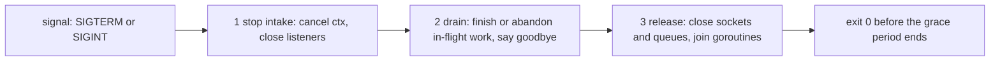
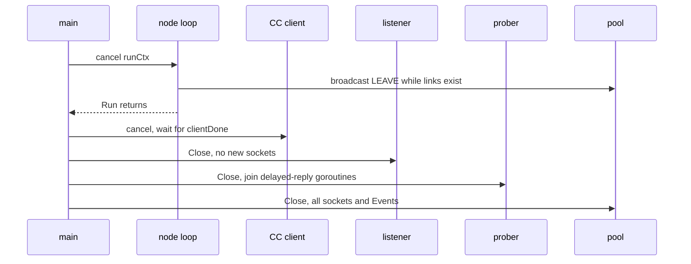
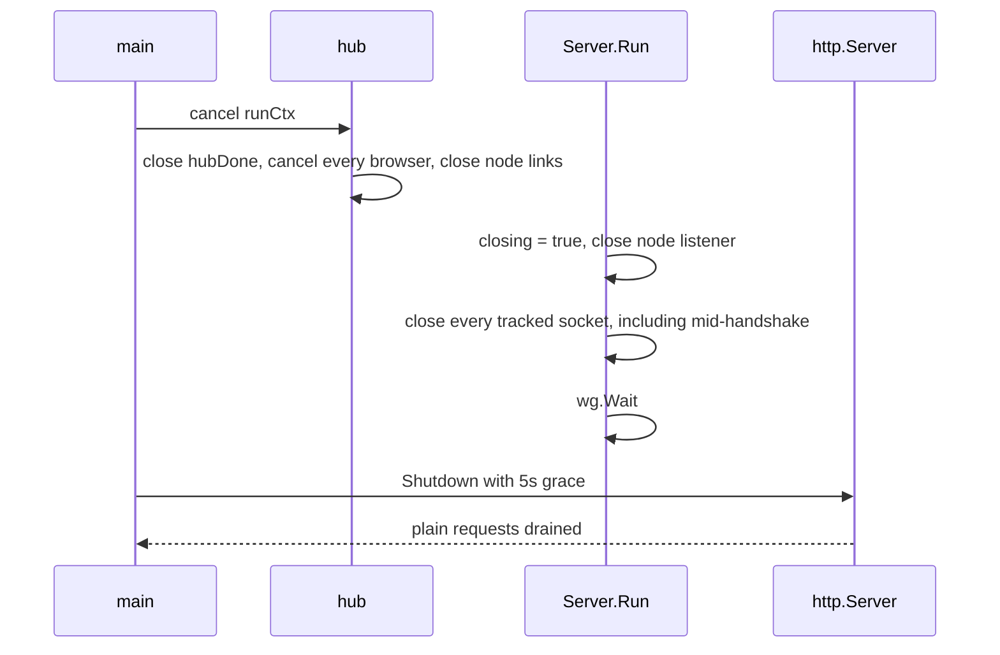

# Graceful Shutdown & Teardown Ordering

A process with listeners, connections, queues and goroutines cannot "just
exit" cleanly. Each component has users. Close one before its users stop, and
they block, panic on a closed channel, or send into nothing. The fix is a
**teardown order**: roughly the reverse of the data flow.

Prerequisites: [Context & Cancellation Propagation](./context-cancellation),
[TCP Teardown & Half-Open Sockets](./tcp-teardown-and-half-open-sockets).

## Core Mental Model

Shutdown has three phases:



Rules of thumb:

| Rule | Why |
|---|---|
| Producers stop before consumers | a consumer closed first leaves producers blocked |
| Say goodbye while sockets still exist | LEAVE after the pool closes goes nowhere |
| Close a channel only from its single sender | a send on a closed channel panics |
| Every goroutine you start, you join | otherwise it outlives the function and races with teardown |
| Bound every wait | a peer that never answers must not hold shutdown hostage |
| Finish before the orchestrator's `SIGKILL` | Compose waits `stop_grace_period`, then kills |

## Under the Hood

### Signals to context

```go
// cmd/swarm-node/main.go:57
ctx, stop := signal.NotifyContext(context.Background(), syscall.SIGINT, syscall.SIGTERM)
err = run(ctx, cfg, os.Stderr, nil)
stop()
```

`NotifyContext` turns the first signal into `ctx.Done()`. Calling `stop()`
restores the default disposition, so a **second** Ctrl-C kills the process
outright. That is the escape hatch when graceful shutdown hangs.

### What "close" does to a TCP socket

| Action | On the wire | Peer sees |
|---|---|---|
| `close(fd)` with receive queue empty | `FIN` after unsent data | `read` returns 0 (`io.EOF`) |
| `close(fd)` with unread data in the receive queue | `RST` | `ECONNRESET` |
| `SO_LINGER` on with timeout 0, then close | `RST`, unsent data discarded | `ECONNRESET` |
| process exits, any reason | kernel closes every fd: `FIN` or `RST` as above | same |
| `ln.Close()` on a listener | queued, un-accepted connections are reset | `ECONNRESET` on the client |

Go never sets `SO_LINGER` by default. `(*net.TCPConn).SetLinger(0)` is how to
get the abortive close. This repo does not use it.

Closing a `net.Conn` from another goroutine unblocks a `Read` or `Write` on it
with `net.ErrClosed`. That is the standard way to stop a reader goroutine.
Closing a `net.Listener` does the same for `Accept`.

### `http.Server.Shutdown`

`Shutdown(ctx)`:

1. closes all listeners,
2. closes idle keep-alive connections,
3. waits for active requests to finish, or for `ctx` to expire,
4. **ignores hijacked connections** (WebSockets). They must be closed by the
   code that hijacked them.

`Serve` returns `http.ErrServerClosed` as soon as `Shutdown` starts. That is
not an error.

### Joining with WaitGroup, safely

`wg.Add` racing with `wg.Wait` is a bug. The CC guards `Add` with a `closing`
flag under a mutex, so no goroutine is started once teardown has begun:

```go
// pkg/controlcenter/server.go:277
func (s *Server) spawn(fn func()) {
	s.mu.Lock()
	if s.closing {
		s.mu.Unlock()
		return
	}
	s.wg.Add(1)
	s.mu.Unlock()
	go func() {
		defer s.wg.Done()
		fn()
	}()
}
```

## Why It Matters in This Swarm

### swarm-node



Order from `cmd/swarm-node/main.go:321-332`, reasoning at
`cmd/swarm-node/main.go:268-275`:

- **Node first**, so LEAVE (`pkg/cluster/node.go:596`) goes out on live links. Peers learn "left", not
  "suspect", and skip the failure-detector delay.
- **Listener before pool**, so no new socket is admitted into a closing pool.
- **Prober before pool**, because the prober's delayed PONG goroutines send
  through the pool.
- **Pool last**. It owns every socket.

Compose gives 3s (`docker-compose.yml:44`) before `SIGKILL`.

### control-center



- **The hub goes first** (`pkg/controlcenter/hub.go:81-93`), because it owns the
  WebSockets that `http.Server.Shutdown` would ignore
  (`cmd/control-center/main.go:78-81`).
- **`hubDone` is closed before browsers are cancelled** (`hub.go:84`). A writer
  woken by the cancel checks `hubDone` to pick close code `1001 going away`
  instead of `1008 too slow`.
- **Sockets are tracked from `Accept`** (`pkg/controlcenter/server.go:258`), not
  from handshake success. A node stuck mid-HELLO would otherwise keep
  `wg.Wait` blocked until its 3s handshake deadline.
- **Every channel send to the hub selects on `hubDone`** (`pkg/controlcenter/server.go:244-254`),
  so nothing blocks on a hub that is gone.
- **`http.Server.Shutdown` last** with `shutdownGrace = 5s`
  (`cmd/control-center/main.go:37`).

Compose gives the CC `stop_grace_period: 10s` (`docker-compose.yml:62`), so
the 5s drain always finishes before `SIGKILL`. The two numbers must stay in
that order.

### Why kill is not graceful

CHAOS kill calls `os.Exit(1)` (`cmd/swarm-node/main.go:245`) and skips all of
the above on purpose: no LEAVE, no deferred functions. The kernel still closes
the sockets, so peers get a `FIN` (or `RST`), but the membership layer must find the death
by itself. See
[Cooperative vs Uncooperative Failure Injection](./cooperative-vs-uncooperative-failure-injection).

## Common Failure Modes & Edge Cases

| Symptom | Cause |
|---|---|
| `docker stop` takes exactly the grace period, exit 137 | shutdown hung, or the signal never reached the binary ([PID 1](./container-images-and-pid-1)) |
| `panic: send on closed channel` during shutdown | a channel closed by someone other than its sender, or before its senders stopped |
| `panic: sync: WaitGroup is reused before previous Wait has returned` or a negative counter | `wg.Add` after `wg.Wait` began. Guard `Add` with a closing flag. |
| Peers mark a stopped node `suspect`, then `dead` | LEAVE never sent: pool closed before the node loop, or the process was killed |
| Shutdown hangs with open WebSockets | relying on `http.Server.Shutdown` for hijacked connections |
| Shutdown hangs in `Accept` | listener never closed. `Accept` does not watch any context. |
| Client sees `connection reset by peer` on shutdown | listener closed with connections still in the accept queue, or a socket closed with unread data |
| Log line "shutdown complete" missing | `SIGKILL` arrived first. The grace period is shorter than the drain. |
| Goroutine leak reported by a test | a goroutine started without a join, for example a sender not counted in `wg` |

## Related

- [The Control Center](/architecture/control-center)
- [Container Images & PID 1](./container-images-and-pid-1)
- [Deadlines & I/O Timeouts](./deadlines-and-io-timeouts)
