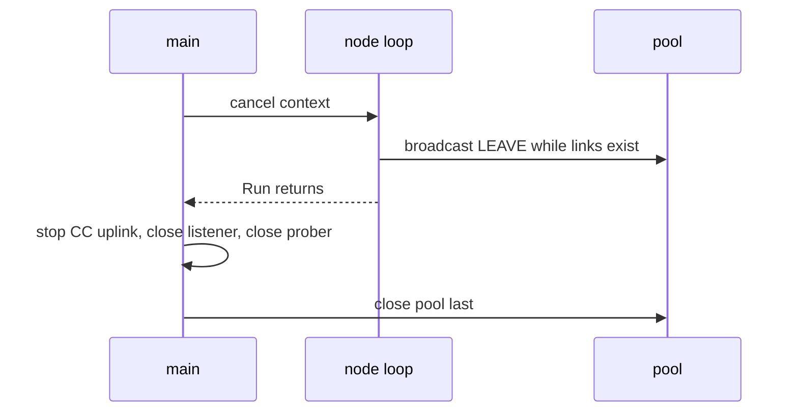

# Graceful Shutdown & Teardown Ordering

A graceful shutdown finishes or hands off current work, tells others you are leaving, and then
releases resources. The order matters: close things **in reverse order of dependency**. Anything
that still uses a resource must stop before that resource is closed. It is like closing a shop:
lock the front door first, serve the customers already inside, and only then turn off the
lights. Turn off the lights first and people trip over things.

## How swarm-net uses it

- **Signals become a cancelled context** (`signal.NotifyContext` in
  `backend/cmd/swarm-node/main.go`).
- **Node loop first.** `shutdown` in `backend/pkg/cluster/node.go` broadcasts LEAVE while
  connections are still open, so peers learn "left" at once instead of waiting for the failure
  detector. It then waits for its probe and task goroutines.
- **Listener before pool,** so no new socket is accepted into a closing pool.
- **Prober before pool,** because the prober sends its replies through the pool.
- **Pool last.** It owns every socket.
- **Control Center:** the hub stops first because it owns the WebSockets, which
  `http.Server.Shutdown` does not track. Then `Shutdown` gets a 5 s grace
  (`backend/cmd/control-center/main.go`). Compose allows 10 s before `SIGKILL`, so the drain
  always finishes.

CHAOS kill skips all of this on purpose, to look like a crash. See
[Cooperative vs Uncooperative Failure Injection](./cooperative-vs-uncooperative-failure-injection).

## Common pitfalls

- **Closing the pool before sending LEAVE.** Peers see a crash and run a needless election.
- **A grace period longer than Docker's stop timeout.** The process is killed mid-drain.
- **Blocking sends to a goroutine that already exited.** Shutdown hangs. Select on a done
  channel too.
- **Forgetting hijacked connections.** `http.Server.Shutdown` ignores WebSockets, so close them
  yourself.

## Further reading

- [Context & Cancellation](./context-cancellation)
- [Container Images & PID 1](./container-images-and-pid-1)
- [TCP Teardown & Half-Open Sockets](./tcp-teardown-and-half-open-sockets)
