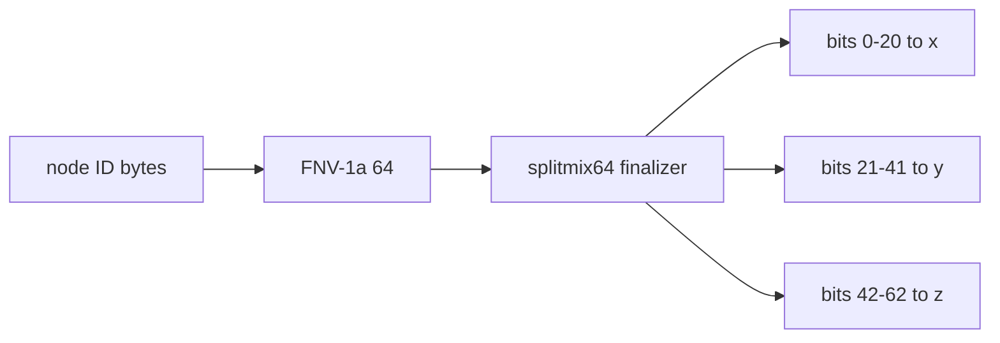

# Hash Mixing: Why FNV Needs a Finalizer

swarm-net places each node from a hash of its ID, so the spot is stable with no stored state.
The first version used FNV-1a alone, and Compose replicas ended up on one line.

## Core Mental Model

A hash used as **random bits** needs **avalanche**: flipping one input bit should flip each
output bit with probability 1/2. A hash used only for **bucket lookup** gets away with much
less.



Each 21-bit field becomes one coordinate:

$$coord = 5 + \frac{field}{2^{21} - 1} \times 90$$

If one input change reaches only a few output bits, most fields stay the same, and so do most
coordinates.

## Under the Hood

**FNV-1a, one byte at a time:**

$$h \leftarrow (h \oplus b) \times P \bmod 2^{64}, \qquad P = 2^{40} + 2^{8} + \mathtt{0xb3}$$

Change only the **last** byte by $\delta$ (at most 8 bits). The output then differs by about
$\delta \times P = \delta \cdot \mathtt{0xb3} + (\delta \ll 8) + (\delta \ll 40)$:

- Multiplication carries only move **up**, never down.
- So the change lands in the low ~16 bits and in a band from bit 40, and not much else.

Measured for `swarm-net-node-1` vs `swarm-net-node-2` (XOR of the two hashes):

```text
xor raw=0000000000000000000000010000000000000000000000000000111110111101
xor mix=1111011000010100000000010000001101111011000001100111000110101110
```

Raw: 11 bits differ, all in bits 0-11 plus bit 40. With the finalizer: 28 of 64, close to the
32 expected from a good mix.

What that does to positions (`raw` = fields of the plain FNV-1a hash):

```text
swarm-net-node-1   raw=(69.1 85.7 89.9)  mixed=(43.1 19.3 75.5)
swarm-net-node-2   raw=(69.1 63.2 89.9)  mixed=(38.7 41.6 17.8)
swarm-net-node-3   raw=(69.0 40.7 89.9)  mixed=(53.1 37.7 36.3)
swarm-net-node-5   raw=(69.0 85.7 89.9)  mixed=(40.5 55.2 58.7)
```

- Raw: `x` moves by 0.1 at most and `z` not at all, so every replica sits on one line.
  node-1 and node-5 are 0.1 units apart.
- Mixed: spread on all three axes.

**The splitmix64 finalizer** (the same shape as MurmurHash3's `fmix64`, with different
shifts and constants) alternates two steps:

| Step | Effect |
|---|---|
| `z ^= z >> s` | moves high bits **down**, which multiplication cannot do |
| `z *= odd constant` | moves every bit **up** and mixes |

Both steps are bijections on 64-bit values (xor-shift is invertible, and an odd multiplier has
an inverse mod $2^{64}$). So the finalizer adds no new collisions: two IDs collide after mixing
only if FNV already collided.

## Why It Matters in This Swarm

- `backend/pkg/geo/geo.go`: `DefaultPosition` hashes the ID with FNV-1a, runs `mix64`, and
  cuts three 21-bit fields.
- `backend/pkg/geo/geo_test.go`: `TestDefaultPositionSpreadsSimilarNames` requires 12
  similar IDs to be at least 3 units apart and to span at least 40 units on every axis.
  `TestDefaultPositionGolden` pins `swarm-net-node-1` at `(43.078932, 19.334290, 75.466986)`.
- `frontend/app.js`: `defaultPos` repeats the same maths with `BigInt`, masking to 64 bits
  after each multiply. The golden test is the contract between the two.
- The spread matters beyond looks: nodes that share a position have equal delays, so their
  scores tie and the election falls back to ID order.

## Common Failure Modes & Edge Cases

| Symptom | Cause |
|---|---|
| replicas line up along one axis | no finalizer. Fields from a weak hash. |
| two nodes drawn on top of each other | IDs differ only in the last byte, and the raw hash barely changed |
| dashboard positions differ from the backend | the JS copy uses `Number`, which loses bits above $2^{53}$. Use `BigInt` and mask with $2^{64} - 1$. |
| JS copy differs only for non-ASCII IDs | hashing UTF-16 code units instead of UTF-8 bytes, as Go's `[]byte(id)` does |
| a very old browser shows a different layout | no `BigInt`, so `defaultPos` falls back to a 32-bit FNV-1a with no finalizer. It is only a guess until the CC reports `pos`. |
| positions change after a "harmless" refactor | the field layout or the constants changed. The golden test fails first. |
| using the hash as a secret or for load spreading under attack | FNV is not keyed. Anyone can choose IDs that collide. |

## Further Reading

- [Latency Simulation](/architecture/latency-simulation)
- [3D Perspective Projection and Depth Sorting](/concepts/3d-perspective-projection-and-depth-sorting)
