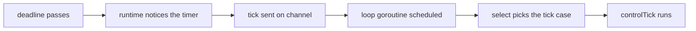
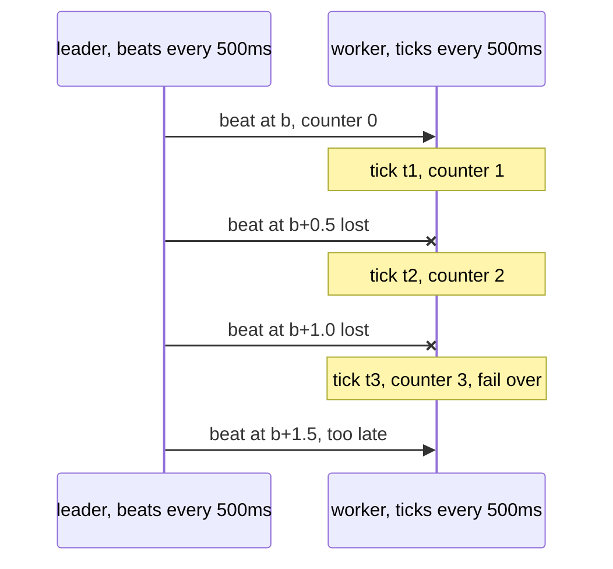

# Heartbeat Intervals, Jitter and Timers

A heartbeat detector is two numbers: an interval $T$ and a miss budget $K$. This page is what
those numbers actually mean once a Go runtime, a kernel and a CPU quota get involved, and the
inequalities between this swarm's timers that must hold.

Prerequisites: [Failure Detectors](/concepts/failure-detectors),
[The GMP Scheduler](/concepts/go-scheduler-gmp).

---

## Core Mental Model

### A tick is a lower bound

A `time.Ticker` with period $T$ fires **no earlier** than each deadline. It can fire later, by
any amount. So a detector built on ticks can be slow, never early.



Each arrow can add delay: a busy P, a GC pause, a CPU quota, or a `select` that picked
another ready case first.

### How many lost beats does K = 3 tolerate?

The worker resets its counter on a beat and fails over on the third tick without one
(`pkg/cluster/heartbeat.go:66`). Say the last beat arrived at time $b$ and the worker's ticks
land at $t_1 \in (b, b + T]$, $t_2 = t_1 + T$, $t_3 = t_1 + 2T$. Failover happens at $t_3$:

$$
t_3 \in (b + (K-1)T,\; b + KT] = (b + 1.0\,\text{s},\; b + 1.5\,\text{s}]
$$



| Beats lost in a row | Outcome |
|---|---|
| 1 | never a failover. The beat at $b + 2T$ lands before $t_3 > b + 2T$ |
| 2 | failover, unless $t_3$ lands exactly on $b + 3T$ and the beat wins the race |
| 3 or more | failover |

So "3 misses" really means "survives one lost beat". Network delay shifts every beat by the
same RTT, which does not change the count as long as it is steady.

### Synchronised ticks

`docker compose up` starts every node within a second or so. Every ticker is created at start,
so every node's ticks are phase-locked to its start time, and the probe rounds of all $N$ nodes
fire close together. Each round sends $N - 1$ PINGs at once.

$$
\text{PINGs in one burst} \approx N (N - 1)
$$

At $N = 50$ that is 2450 frames in the same few milliseconds, every second. A burst like that
is itself a latency spike, which a latency-based detector then reads as sickness. The usual
fix is **jitter**: randomise each period, or each node's start phase, by a small fraction.

---

## Under the Hood

### Where Go keeps timers

- Since Go 1.14, timers live in a **per-P heap** (a 4-ary min-heap ordered by deadline), not in
  one global timer goroutine.
- The scheduler checks the heap of the P it is running on when it looks for work
  (`checkTimers` from `schedule` and `findRunnable`) and steals from other Ps' heaps.
- When no goroutine is runnable, the M blocks in the netpoller with a timeout equal to the
  time until the next timer. On Linux that is `epoll_pwait(..., timeout_ms)`. See
  [The Netpoller](/concepts/go-netpoller).
- `sysmon` also wakes periodically and can notice overdue timers when every P is busy.

The resolution you get is therefore the scheduler's, not the timer's. A P stuck in a long
non-preemptible stretch delays its own timers until async preemption (about 10 ms) kicks in.

### What a Ticker does with a slow receiver

A `time.Ticker` **drops** ticks the receiver has not collected. At most one tick is ever
pending. Since Go 1.23 the channel is synchronous (`cap(t.C) == 0`) and a stale tick is never
delivered after `Stop` or `Reset`. The swarm builds with Go 1.27 (`go.mod`), so both hold.

Consequence for this swarm: if a worker's loop stalls for 5 s, it does not wake up to ten queued
ticks and accuse its leader ten times. It sees one tick. **A stalled observer slows down; it
does not false-fire.**

The test clock is deliberately different. `FakeClock` delivers **every** tick that fell due and
blocks until each is taken (`pkg/cluster/clock.go:45`), so tests are deterministic, but a test
cannot observe tick dropping.

### Sources of lateness, with sizes

| Source | Typical delay | Notes |
|---|---|---|
| loop busy with another event | microseconds to milliseconds | a large `MEMBERSHIP_DELTA` or a probe round result |
| `select` picked another ready case | one event | Go picks uniformly among ready cases |
| GC stop-the-world | usually well under 1 ms | the concurrent mark phase costs CPU, not a pause |
| Go async preemption | about 10 ms worst case | a tight loop without function calls |
| CFS quota throttling | up to the rest of the 100 ms period | cgroup v2 `cpu.max`, `quota period`, period default `100000` us |
| host overload, steal time | unbounded | a VM whose vCPU is descheduled |

CPU throttling is the one to remember. A container that burns its quota early in a period is
frozen, all threads, until the period ends. A 500 ms heartbeat can then arrive 90 ms late on
every tick, and a latency strategy sees the node's RTTs jump the same way. Check
`/sys/fs/cgroup/cpu.stat`:

```text
nr_periods 12000
nr_throttled 431
throttled_usec 18234000
```

A rising `nr_throttled` means ticks and replies are being held.

### The `select` race after a stall

When the worker loop resumes, its tick channel and its inbound queue may both be ready. `select`
chooses at random (`pkg/cluster/node.go:641`). If the tick wins, the counter goes up once before
the queued beat resets it. That costs at most one count per stall, which the budget absorbs.

### Timer creation on the loop

`sendDelayed` creates its timer **on the loop goroutine** and only then starts the goroutine
that waits on it (`pkg/cluster/heartbeat.go:179`). With a `FakeClock`, a timer that does not
exist yet when the test calls `Advance` never fires, so creating it inside the goroutine would
race the test.

---

## Why It Matters in This Swarm

### The timers

| Timer | Default | Code |
|---|---|---|
| heartbeat and failure-detector tick | 500 ms | `pkg/cluster/node.go:38` |
| probe round | 1 s | `pkg/cluster/node.go:24` |
| anti-entropy gossip | 2 s | `pkg/cluster/node.go:31` |
| STATE_SYNC resend | 2 s | `pkg/cluster/node.go:58` |
| election floor | 30 s | `pkg/cluster/node.go:25` |
| suspicion timeout | 3 s | `pkg/cluster/node.go:52` |
| tombstone TTL | 60 s | `pkg/cluster/node.go:55` |
| strategy probe timeout | 2 s | `pkg/health/latency.go:39` |
| node probe round budget | 4 s | `pkg/cluster/node.go:34` |
| socket idle timeout | 15 s | `pkg/network/conn.go:123` |
| CC keep-alive PING | 5 s | `pkg/controlcenter/server.go:21` |
| redial backoff | 200 ms, doubling, cap 10 s, +-25% jitter | `pkg/network/pool.go:35` |

### The inequalities

$$
K \cdot T_{hb} = 1.5\,\text{s} \;<\; T_{suspect} = 3\,\text{s}
$$

A silent leader is suspected at 1.5 s and confirmed at about 4.5 s.

$$
t_{strategy} = 2\,\text{s} \;<\; t_{round} = 4\,\text{s}
$$

The round budget must be the looser one, or every probe of a dead peer reports "cancelled" and
is never counted (`pkg/cluster/node.go:117`).

$$
T_{keepalive} = 5\,\text{s} \;<\; t_{idle} = 15\,\text{s}
$$

Otherwise the node reaps its own quiet Control Center link.

$$
t_{redial,1} \approx 200\,\text{ms} \ll T_{suspect}
$$

A link that blips and comes back is reconnected inside the suspicion window, so it costs
nothing.

### Resolution

Suspicion expiry and tombstone collection are checked on the 500 ms tick, so both are rounded up
to the next tick (`pkg/cluster/node.go:176`). That is why the failover bound has a $2 T_{hb}$
term. See [Failure Detection and Failover](/architecture/failure-detection-and-failover).

### Jitter in this swarm

| Timer | Jittered? |
|---|---|
| redial backoff | yes, +-25% |
| anti-entropy target | shuffled permutation, a different kind of de-synchronisation |
| heartbeat, probe, gossip, sync tickers | **no**. Their phase is each node's start time |

Nodes that start seconds apart are naturally out of phase. A swarm started all at once is not,
which is worth knowing before scaling $N$ up.

---

## Common Failure Modes & Edge Cases

### $K = 1$

Symptom: workers fail over whenever one beat is late. Cause: with $K = 1$ a failover fires on
the first tick after any beat, anywhere in $(0, T]$. One slow beat is a failover.

### Interval shorter than the scheduler's noise

Symptom: false failovers under load, none when idle. Cause: $T$ comparable to throttling or GC
delays. Keep $K \cdot T$ at least an order of magnitude above the worst observed tick lateness.

### Testing with a fake clock only

Symptom: a detector that passes every unit test fires falsely in production after a stall.
Cause: the fake clock delivers every tick, so a "count ticks" detector looks the same as a
"measure elapsed time" one. Only a real clock drops ticks.

### `time.After` in a loop

Symptom: memory growth or a timer per iteration in a `select` loop. Cause: `time.After` creates a
new timer on every call. Create one `Ticker` outside the loop, as `Run` does
(`pkg/cluster/node.go:623`).

### Herd after a restart

Symptom: latency spikes on every node at the same instant, once per probe interval, right after
`docker compose up`. Cause: phase-locked tickers. Stagger starts or add start-phase jitter.

### Throttled leader looks sick

Symptom: a leader loses its seat whenever its container is busy. Cause: CFS throttling delays
its PONGs, which raises every peer's RTT to it. Check `cpu.stat` before blaming the network.

---

## See Also

- [Failure Detectors](/concepts/failure-detectors) -- $K$, $T$ and the accuracy trade-off.
- [Failure Detection and Failover](/architecture/failure-detection-and-failover) -- the detector
  these timers drive.
- [Monotonic vs Wall Clocks](/concepts/monotonic-vs-wall-clocks) -- why tickers use the monotonic
  clock.
- [Backoff and Connection Storms](/concepts/backoff-and-connection-storms) -- jitter on the
  redial side.
- [The Go Netpoller](/concepts/go-netpoller) -- where an idle M sleeps until the next timer.
