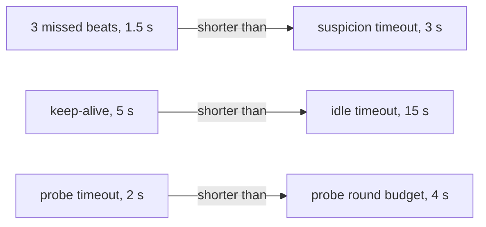

# Heartbeat Intervals, Jitter and Timers

A heartbeat is a leader saying "still here" on a fixed schedule. The worker counts its own
timer ticks. If several ticks pass with no beat, it decides the leader is gone. Think of a
lifeguard who waves every 30 seconds: if you miss three waves in a row, you go looking.

Two numbers define this detector: the interval $T$ and the miss budget $K$. A Go
`time.Ticker` never fires **before** its deadline. It can fire **after** it, when the CPU is
busy, GC is running, or the container has used up its CPU quota. So a tick-based detector
can be slow, but it is never early.

With $T = 500$ ms and $K = 3$, a worker fails over between 1.0 s and 1.5 s after the last
beat $b$ it received:

$$
t_{failover} \in \big(b + (K-1)T,\; b + KT\big]
$$

In practice, "3 misses" means "one lost beat is survived, two usually are not".

## How swarm-net uses it

- Leaders beat every 500 ms (`DefaultHeartbeatInterval`). Workers fail over after 3 silent
  ticks (`DefaultHeartbeatMisses`). Both are in `backend/pkg/cluster/node.go`.
- The sending and the silence check are `beat` and `checkLeaderSilence` in
  `backend/pkg/cluster/heartbeat.go`.
- Other timers: probe round 1 s, gossip 2 s, suspicion timeout 3 s, tombstone TTL 60 s
  (`backend/pkg/cluster/node.go`), socket idle timeout 15 s (`backend/pkg/network/conn.go`),
  Control Center keep-alive 5 s (`backend/pkg/controlcenter/server.go`).
- All cluster timers go through a `Clock` interface (`backend/pkg/cluster/clock.go`), so tests
  use a `FakeClock` and move time forward by hand.
- Only the redial backoff has jitter (+-25%, `backend/pkg/network/pool.go`). The tickers do not.

Some timers must stay shorter than others, or healthy things get killed:

## Common pitfalls

- **$K = 1$.** One slightly late beat causes a failover. Keep $K \cdot T$ far above the worst
  tick delay you see under load.
- **Idle timeout below the keep-alive.** A quiet but healthy link is closed for being quiet.
- **Everyone starts at once.** `docker compose up` starts all nodes together, so their tickers
  line up and every node probes at the same moment. That burst looks like a latency spike.
  Staggered starts or jitter spread it out.
- **CPU throttling looks like sickness.** A container that hits its CPU quota is frozen until
  the next period, so its beats and PONGs arrive late. Check `nr_throttled` in
  `/sys/fs/cgroup/cpu.stat` before blaming the network.

## Further reading

- [Failure Detectors](/concepts/failure-detectors)
- [Monotonic vs Wall Clocks](/concepts/monotonic-vs-wall-clocks)
- [Backoff and Connection Storms](/concepts/backoff-and-connection-storms)
