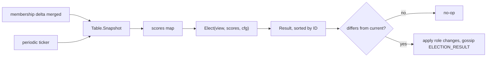

# Idempotence and Hysteresis

A control loop that reacts to the world has two ways to go wrong that have nothing to do with
computing the wrong answer. It can compute the *right* answer twice and act on it twice. And it
can compute a *slightly different* right answer every tick and act on each one, so the system
spends its life switching between two nearly-equal states.

The first is fixed by idempotence. The second is fixed by hysteresis. This swarm's election and
its worker re-homing both need both, and this page is about why the code is shaped the way it
is to get them.

---

## Core Mental Model

### Idempotence: doing it twice is doing it once

An operation is idempotent if $f(f(x)) = f(x)$. For a control loop, the useful form is: running
the decision routine again with the same inputs produces the same decision and no additional
side effects.

The design (`docs/WORKLOG.md` section 2.4) is event-driven with a periodic floor. In the code,
`evaluate` has four entry points (`pkg/cluster/node.go:1680`):

| Trigger | When | Why it exists |
|---|---|---|
| membership change | a delta merges, a peer comes or goes, a suspicion is confirmed | react to a join or a death promptly |
| probe round finished | every probe interval (1 s) | scores moved |
| `JOIN_ACK` rejection | a leader turned a worker away | follow the rejecter's hint |
| periodic floor | every 30 s | catch a change the event path missed |

Several can fire for the same change. A death gossips in, the event path elects, and a moment
later the probe round elects again on an unchanged view. If the second run could produce a different
answer, or if merely running it caused a re-home, the periodic floor would be a source of churn
rather than a safety net.



The property that makes the diagram safe is on the `Elect` box, not on the triggers.

### Hysteresis: better is not better enough

A thermostat set to 20 degrees does not turn the heater on at 19.99 and off at 20.01. It turns
on at 19.5 and off at 20.5. The gap is hysteresis, and without it the relay clicks
continuously around the setpoint.

Election ranks each node on its self-reported score: the median of its own latency EWMAs to its
peers (`selfScore`, `pkg/cluster/node.go:1646`). Those move by tenths of a millisecond every
probe (see [Latency as a Statistic](/concepts/latency-as-a-statistic)). Two candidates at 0.80 ms and
0.85 ms will swap order several times a second. Without damping, every swap is a re-election, a
`ELECTION_RESULT` broadcast, and a cluster-wide re-home of every worker attached to the loser.

$$\text{replace incumbent} \iff s_{incumbent} - s_{challenger} \geq m$$

where $m$ is the margin and lower scores are better. A challenger who is better by less than $m$
loses to the incumbent. The margin converts "better" into "better by enough to justify the
disruption of switching".

---

## Under the Hood

### `Elect` is a pure function, and that is the whole safety argument

```go
// pkg/cluster/election.go:126
func Elect(view View, scores map[protocol.NodeID]float64, cfg Config) Result {
```

The doc comment at `pkg/cluster/election.go:89` under "Why this is a pure function" lists the
consequences, and `pkg/cluster/election.go:95` names the one this page depends on: the same view
and scores produce the same leaders no matter which trigger invoked it. What "pure" means
concretely:

| It does not | Because otherwise |
|---|---|
| open a socket | the answer would depend on network state at call time |
| read a clock | two calls a millisecond apart could differ |
| mutate `Table` | the second trigger would see a different view than the first |
| range over a map | Go randomises map iteration, so order and therefore ties would vary |

The last one is enforced upstream: `View.Members` is ID-sorted (`pkg/cluster/member.go:102`),
and `Elect` reasons only against a `View` snapshot, never the live table
(`pkg/cluster/member.go:98`). Ties on score break on ID at `pkg/cluster/election.go:157`, so
two equal scores never leave the result to sort stability.

The output is also canonical: `Result.Leaders` is sorted by ID (`pkg/cluster/election.go:47`),
so "did the election change anything?" is a slice comparison. That comparison is what turns
idempotence of the *function* into idempotence of the *effect*: the caller applies role changes
only when the result differs, and a second trigger on the same inputs is a no-op all the way
down.

### The margin, mechanically

`applyHysteresis` at `pkg/cluster/election.go:217` runs after ranking. Its input is the seats
the ranking handed out and the list of eligible candidates; its job is to hand seats back to
incumbents who lost them by less than the margin.

```go
// pkg/cluster/election.go:259
if incumbent-challenger >= margin {
	continue // challenger keeps the seat
}
chosen[weakest] = inc // incumbent takes it back
```

Three details are load-bearing:

1. **Only newcomers can be displaced back.** The loop at `pkg/cluster/election.go:243` skips
   seats held by sitting leaders. Hysteresis protects incumbents from challengers; it never
   arbitrates between two incumbents.
2. **A dead incumbent gets no protection.** `pkg/cluster/election.go:230`: an incumbent whose
   score is invalid is never retained. Hysteresis resists noise, not evidence.
3. **The incumbent with the best claim goes first.** Displaced incumbents are processed in ID
   order and each targets the weakest newcomer, so the result is deterministic and the same on
   every node.

`Config.Hysteresis` (`pkg/cluster/election.go:32`) of zero means no damping **inside `Elect`**,
which the comment at `pkg/cluster/election.go:29` calls reasonable in tests and bad in
production. The default at `pkg/cluster/election.go:22` is 0.5.

At the node level, zero means **the default** (`pkg/cluster/node.go:218`). That rule was added
after a real bug: `cmd/swarm-node` set only the threshold, so production ran with no damping at
all. A node that really wants none must pass a tiny positive margin.

The same margin also rate-limits gossip. A node re-announces its own score only when it moved by
at least the margin (`updateSelfScore`, `pkg/cluster/node.go:1591`). A smaller wobble is not
worth a broadcast to every peer.

### The same idea for workers: `ShouldRehome`

A worker attached to leader A that sees leader B score marginally better faces the same
thermostat problem. Re-homing costs a `JOIN_CLUSTER`, a `JOIN_ACK`, a fresh `STATE_SYNC`, and a
`HEARTBEAT_ACK` that tells the old leader to drop the worker; doing that every time two EWMAs
cross is pure churn.

```go
// pkg/cluster/affinity.go:85
return health.Better(bestScore, curScore) && curScore-bestScore >= margin
```

`ShouldRehome` at `pkg/cluster/affinity.go:65` mirrors `applyHysteresis`, including its
exceptions. The comment at `pkg/cluster/affinity.go:55` names the two cases that bypass the
margin: the current leader is no longer a leader, or the current leader can no longer be
measured. Both hit the `return true` at `pkg/cluster/affinity.go:80`. Like the dead-incumbent
rule in election, these are not noise, and hysteresis must not turn into loyalty to a leader
that is gone.

`ChooseLeader` (`pkg/cluster/affinity.go:25`) is pure for the same reason `Elect` is
(`pkg/cluster/affinity.go:24`), so the worker's periodic re-evaluation is safe to run on every
tick: it produces the same `best` until the scores genuinely move.

### The unit problem

The margin is subtracted from scores, so it is in the score's unit. The comment at
`pkg/cluster/election.go:17` spells out the consequence:

| Strategy | Score unit | `Hysteresis = 0.5` means |
|---|---|---|
| `LatencyHealthStrategy` | milliseconds | half a millisecond of RTT |
| a hypothetical load strategy | fraction 0 to 1 | half of the entire range |
| a hypothetical packet-loss strategy | percent | half a percent |

Rule 2 of the `HealthStrategy` contract (`pkg/health/strategy.go:34`) says scores are only
comparable within one strategy instance. The margin inherits that restriction. A deployment that
swaps the strategy and leaves the margin at 0.5 has not "kept the same damping"; it has chosen a
margin that is either meaningless or total. There is no normalisation step that could fix this,
because the range of a latency distribution is not knowable in advance.

---

## Why It Matters in This Swarm

- **The periodic floor is only safe because `Elect` is pure.** Remove purity (a clock read, a
  probe inside `Elect`, an unsorted view) and the ticker becomes a churn generator. The
  idempotence property is tested, not asserted, per `pkg/cluster/election.go:98`.
- **Election results are broadcast, never applied.** A received `ELECTION_RESULT` is only
  recorded as the sender's claim (`pkg/cluster/node.go:1157`). Each node's roles come from its
  own `Elect`, so a re-delivered result cannot cause a second change. Role *claims* travel in
  membership records instead, ordered by `Seq`: see
  [Monotonic Merge and Incarnation](/concepts/monotonic-merge-and-incarnation).
- **Re-issued tasks on failover need the same property at the worker.** A promoted worker
  re-issues pending tasks, so a task may run twice. Leaders drop a duplicate `task_id`, but
  executors must still be idempotent. See
  [At-Least-Once Delivery](/concepts/at-least-once-delivery).
- **Hysteresis sets the floor on detection latency for slow degradation.** A leader whose
  score drifts from 0.8 to 1.2 ms over ten minutes is never replaced with a 0.5 margin if the
  challenger sits at 0.8. That is the intended trade: a 0.4 ms drift is not worth a re-home.

---

## Common Failure Modes & Edge Cases

### Leader flapping

Symptom: `ELECTION_RESULT` messages every few hundred milliseconds, two nodes alternating, all
workers re-homing on each swap, and task throughput collapsing because every worker is
perpetually in `JOIN_CLUSTER`. Cause: `Hysteresis` is zero or is smaller than the EWMA's
step-to-step jitter. The value has to exceed the noise floor of the score, which for latency on
a Docker bridge is a few tenths of a millisecond.

This happened for real. `cmd/swarm-node` passed only the threshold, `Elect` read the zero margin
as "no damping", and the convergence simulator measured about 35 re-elections per node per
minute. The fix maps zero to the default at the node level, and
`TestSwarmDoesNotThrashOnSubMarginJitter` (`pkg/cluster/converge_test.go:527`) now requires zero
re-elections over 60 s under sub-margin jitter. See
[Convergence Debugging](/architecture/convergence-debugging).

### Hysteresis that outlives the leader

Symptom: a dead node stays in the leader set for one extra election. Cause: a modified
`applyHysteresis` that retains incumbents without checking `IsValidScore`. The rule at
`pkg/cluster/election.go:230` exists for this, and `TestUnreachableIncumbentLosesItsSeat`
(`pkg/cluster/election_test.go:352`) is the test to run after any
change to the function.

### Strategy swap, margin unchanged

Symptom: after switching to a 0 to 1 load-fraction strategy, leadership never changes, or
changes on every tick. Cause: a 0.5 margin is half the scale, or, for a strategy in tiny units,
a rounding error. Re-derive the margin from the new strategy's noise floor.

### Two triggers, two side effects

Symptom: a single membership change produces two `ELECTION_RESULT` broadcasts with identical
contents. Cause: the caller applies the result unconditionally instead of comparing it to the
current leader set. `Elect` was idempotent; the apply step was not. Compare `Result.Leaders`
against the view's current leaders before acting.

### Ties resolved by iteration order

Symptom: two nodes with byte-identical views announce different leaders. Cause: a ranking loop
that ranges over the scores map, or a sort without the ID tie-break. Go's map iteration order is
randomised per range, so the two nodes are effectively rolling dice. The fix is the sorted view
and the ID tie-break at `pkg/cluster/election.go:157`, and the same tie rule in `ChooseLeader`.

---

## See Also

- [Latency as a Statistic](/concepts/latency-as-a-statistic) -- the EWMA and its noise floor,
  which is what the margin must exceed.
- [Interface Polymorphism](/concepts/interface-polymorphism) -- the `HealthStrategy` seam and
  why the margin's unit lives on the other side of it.
- [Gossip and Anti-Entropy](/concepts/gossip-and-anti-entropy) -- the merge rule, which is
  idempotence applied to membership.
- [Failure Detectors](/concepts/failure-detectors) -- the other control loop that needs damping.
