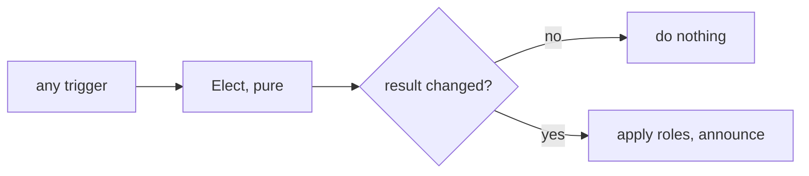

# Idempotence and Hysteresis

A control loop can misbehave even when it computes the right answer. It can act on the same
answer twice, or it can keep switching between two nearly equal answers. Two ideas fix this:

- **Idempotence:** doing it twice has the same effect as doing it once. Pressing an elevator
  button a second time does not call a second elevator.
- **Hysteresis:** only switch when the new option is better **by a margin**. A thermostat set
  to 20 degrees turns the heater on at 19.5 and off at 20.5, not on and off around 20.0.

For election, with lower scores being better and a margin $m$:

$$\text{replace the leader} \iff s_{leader} - s_{challenger} \geq m$$

## How swarm-net uses it

- Elections are triggered from several places: membership changes, finished probe rounds,
  join rejections, and a 30 s periodic floor (`evaluate` in `backend/pkg/cluster/node.go`).
  Several can fire for the same change.
- That is safe because `Elect` in `backend/pkg/cluster/election.go` is a **pure function**: no
  sockets, no clock, no map-order dependence, ties broken by node ID. Same inputs, same leaders.
- The node acts only when the result differs from the current leaders, so a repeated election
  is a no-op.
- `applyHysteresis` gives a seat back to a sitting leader that lost it by less than the margin.
  `DefaultHysteresis` is 0.5. A leader with no valid score gets no protection.
- Workers use the same idea: `ShouldRehome` in `backend/pkg/cluster/affinity.go` switches
  leaders only when the new one is better by the margin, or the current one is gone.
- A node re-announces its own score only when it moved by at least the margin
  (`updateSelfScore`), which also cuts gossip noise.

## Common pitfalls

- **Zero or tiny margin.** Two nodes at 0.80 ms and 0.85 ms swap places every probe, and every
  swap re-homes all their workers. This happened for real before the node started treating a
  zero margin as "use the default". The margin must exceed the score's normal jitter.
- **Keeping a dead leader.** Hysteresis should resist noise, not evidence. An unreachable
  leader must lose its seat at once.
- **Changing the strategy but not the margin.** The margin is in the score's units. 0.5 means
  half a millisecond for latency, but half the whole range for a 0-to-1 load score.
- **Acting unconditionally.** If the caller applies every result without comparing, two
  triggers still produce two announcements, even though `Elect` itself is idempotent.

## Further reading

- [Latency as a Statistic](/concepts/latency-as-a-statistic)
- [Interface Polymorphism](/concepts/interface-polymorphism)
- [At-Least-Once Delivery](/concepts/at-least-once-delivery) -- idempotence for tasks.
