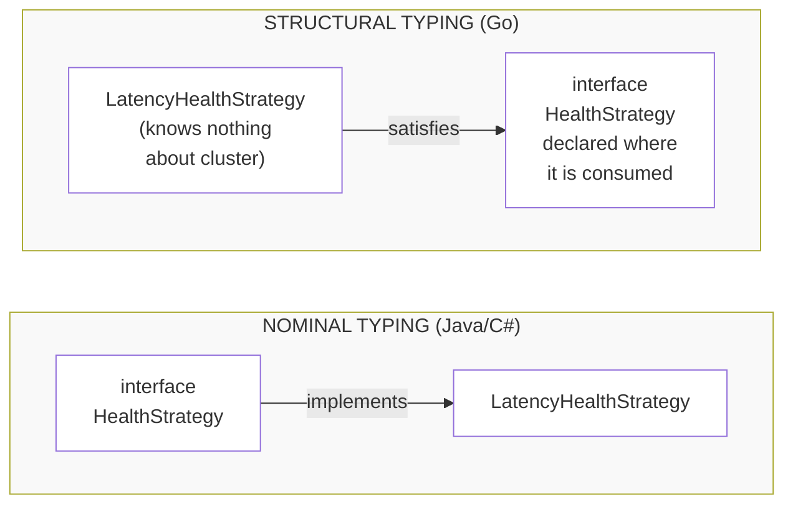
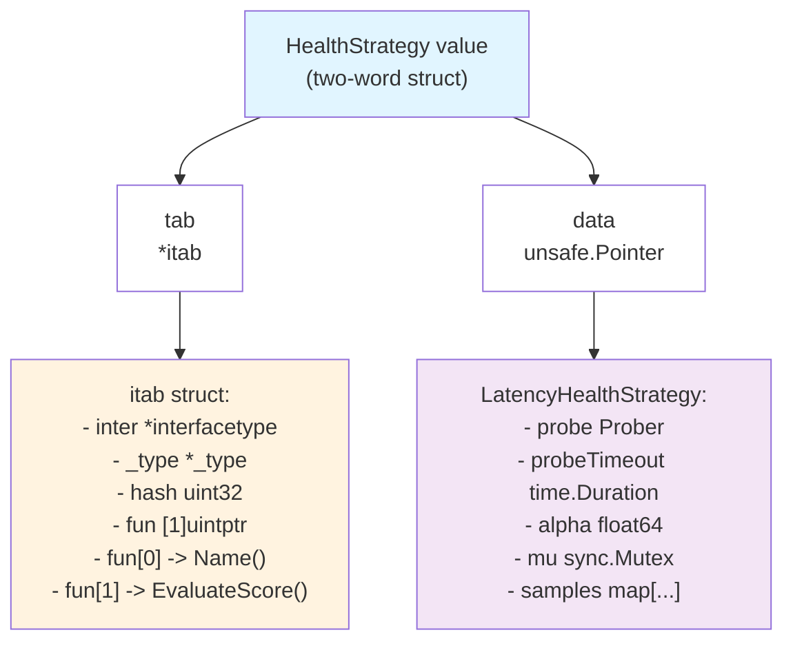

# Interface Polymorphism: The Seam That Makes Strategies Pluggable

`CLAUDE.md` specifies a `HealthStrategy` interface and says `LatencyHealthStrategy` must
ship "engineered so alternative metrics (e.g. CPU, Memory, Packet Loss) can be injected
without refactoring cluster logic." That sentence is a polymorphism requirement dressed
as a feature request, and getting it right is almost entirely a matter of what the
interface *promises* rather than what any implementation *does*.

This page is about both halves: the machine-level mechanics of a Go interface value, and
the design discipline that makes an interface survive the second implementation.

---

## 1. Core Mental Model

### Interfaces are satisfied implicitly

There is no `implements` keyword in Go. A type satisfies an interface when it has the
methods, and the compiler checks that at the point of *assignment*, not at the point of
declaration.

```go
// pkg/health/strategy.go
type HealthStrategy interface {
    Name() string
    EvaluateScore(ctx context.Context, target protocol.NodeAddress) (float64, error)
}
```

`LatencyHealthStrategy` never mentions `HealthStrategy`. It declares two methods with
matching signatures and is thereby a `HealthStrategy` -- retroactively, transitively, and
whether or not its author was thinking about the interface at all.

The consequence is not syntactic convenience. It is a reversal of which package depends
on which.



The implementer must import and name the interface (nominal typing). The consumer declares the shape it needs, and implementers never import the consumer (structural typing).

In a nominal language, `LatencyHealthStrategy` must import the interface and say
`implements HealthStrategy`. That is a compile-time edge from implementer -> interface,
and it means every implementation is coupled to an abstraction that somebody else owns.
A third-party CPU strategy cannot exist unless its author knew about your interface.

In Go, the interface belongs to the consumer. `pkg/cluster` is the package that needs to
rank peers, so conceptually the interface is *its* requirement. (`HealthStrategy` lives
in `pkg/health` here for a specific reason discussed in section 3, but the principle stands:
nothing in `pkg/health`'s implementations imports anything about clustering.)

What Go buys by this:

- **Retroactive satisfaction.** A type written before your interface existed can satisfy
  it. You can define an interface over `*os.File`, over a third-party client, over
  anything, without touching it.
- **Narrow interfaces are cheap.** Because declaring one costs nothing at the
  implementer's end, the idiomatic size is one to three methods. `io.Reader` has one.
  `HealthStrategy` has two, and the second one is the only one that does work.
- **Test doubles are free.** A fake needs only the methods, not a class hierarchy, not a
  mocking framework, not a generated stub.

What Go gives up: you cannot ask "what implements this?" without searching, and
accidental satisfaction is possible (a type with a `Name() string` method acquires half
a `HealthStrategy` by coincidence). The mitigation for the second is the compile-time
assertion idiom, which appears twice in this package:

```go
// pkg/health/latency.go
var _ HealthStrategy = (*LatencyHealthStrategy)(nil)
```

This declares a blank-identifier variable of the interface type, assigns a typed nil
pointer to it, and produces exactly zero bytes of runtime code. Its entire purpose is to
turn "I broke the interface" from a compile error *at some distant call site* into a
compile error *in the file that broke it*, naming the missing method.

---

## 2. Under the Hood

### An interface value is two words

At runtime, a non-empty interface value (`iface`) is a two-word struct:



The empty interface (`any`/`interface{}`) is a different two-word struct, `eface`, with
no method table because there are no methods to dispatch:


This is why `any` and a one-method interface are not the same representation, and why
converting between them is a real conversion, not a reinterpretation.

### The itab is built once and cached

`fun` is declared as `[1]uintptr` in the runtime source but is a variable-length trailing
array: one entry per interface method, in a deterministic order (sorted by method name,
which is why `Name` precedes `EvaluateScore` in the diagram above despite the declaration
order).

Where does an itab come from?

- For a conversion the compiler can see statically -- `var _ HealthStrategy =
  (*LatencyHealthStrategy)(nil)`, or passing a concrete `*LatencyHealthStrategy` to a
  parameter of interface type -- the linker emits the itab into the binary's read-only
  data. The "does this type satisfy this interface" method-set search happens **at
  compile time**. Cost at runtime: zero.
- For a conversion the compiler cannot see statically -- converting one interface to
  another at runtime, or a type assertion to an interface type -- the runtime calls
  `getitab`, which looks in a global hash table (`itabTable`) keyed by
  (interface type, concrete type) and builds + caches an entry on a miss.

The load-bearing fact, and the one most often garbled into folklore: **the method-set
search is not per call.** A method call through an interface is *never* a name lookup.
It is one memory load and one indirect call.

You can see this. Given:

```go
func rank(s HealthStrategy, ctx context.Context, t protocol.NodeAddress) (float64, error) {
    return s.EvaluateScore(ctx, t)
}
```

`go build -gcflags=-S` produces, for the call, roughly:

```
MOVQ    (AX), DX          ; load itab pointer's ... -> the itab
MOVQ    24(DX), DX        ; load fun[1] out of the itab  (indirect)
CALL    DX                ; indirect call through the loaded pointer
```

Contrast a direct call on a concrete type, which is a single `CALL` to a link-time-known
address, and is a candidate for inlining.

### What the indirection actually costs

Three things, in increasing order of importance:

1. **One extra load** to fetch `fun[n]`. The itab is hot and cached; this is
   sub-nanosecond.
2. **An indirect branch.** Modern CPUs predict indirect branches through a branch target
   buffer. When one call site sees one concrete type, prediction is near-perfect. When it
   sees several (a *megamorphic* site), mispredictions cost tens of cycles each.
3. **No inlining, and therefore no downstream optimisation.** This is the real cost. The
   compiler cannot inline through an indirect call whose target it does not know, so it
   also cannot constant-fold, cannot keep values in registers across the boundary, and
   must assume the callee can observe and mutate anything reachable -- which frequently
   forces arguments to escape to the heap.

Go does have a mitigation: **devirtualisation**. If the compiler can prove an interface
value holds one specific concrete type (usually through inlining the constructor), it
rewrites the indirect call into a direct one and may then inline it. `-gcflags=-m` prints
`devirtualizing s.EvaluateScore to *LatencyHealthStrategy` when this fires. Profile-guided
optimisation extends this to speculative devirtualisation at hot call sites. Neither is
something to *depend* on.

**Is this cost relevant here?** No, and the arithmetic says so plainly. `EvaluateScore`
performs a network probe bounded by `DefaultProbeTimeout = 2 * time.Second`
(`pkg/health/latency.go`), at a rate of roughly one probe per peer per interval. A
successful loopback probe is on the order of 10^5 nanoseconds. The dispatch overhead is on
the order of 10^0. It is a part in a hundred thousand.

Where it *would* matter: an interface call inside a per-byte or per-frame loop. If the
Phase 3 framing code dispatched a `Codec` interface per message on a hot connection, that
is a different conversation -- measure it, and consider a type switch on a closed set or a
generic instantiated per codec. Pluggability is bought with indirection, and you buy it
where the price is negligible relative to the work being done.

### Pointer vs value receivers, and the method-set trap

Given:

```go
func (s *LatencyHealthStrategy) Name() string { return "latency" }
```

the method set rules are:

| Declared receiver | In method set of `T` | In method set of `*T` |
|---|---|---|
| `func (t T) M()`  | yes | yes |
| `func (t *T) M()` | **no** | yes |

So `*LatencyHealthStrategy` satisfies `HealthStrategy`; `LatencyHealthStrategy` (the
value type) does not. This is why the assertion is written
`var _ HealthStrategy = (*LatencyHealthStrategy)(nil)` and not
`var _ HealthStrategy = LatencyHealthStrategy{}` -- the latter does not compile.

The classic trap is that this asymmetry is invisible until you try to store a value:

```go
s := LatencyHealthStrategy{}       // a value, not a pointer
var hs HealthStrategy = s          // COMPILE ERROR:
// cannot use s (variable of type LatencyHealthStrategy) as HealthStrategy value:
//   LatencyHealthStrategy does not implement HealthStrategy
//   (method EvaluateScore has pointer receiver)
```

The error message is unusually good; the confusion is that `s.EvaluateScore(...)` called
directly compiles *fine*, because Go inserts the `&s` for you when `s` is addressable.
That implicit address-of is a **call-site** convenience and is not available at the
conversion site, because an interface value stores a copy and there would be nothing
stable to take the address of.

Here the rule is forced anyway: `LatencyHealthStrategy` contains a `sync.Mutex`
(`pkg/health/latency.go`, the `mu` field). A value receiver would copy the mutex on every
call, giving each call its own lock and therefore no mutual exclusion at all -- a data
race that `go vet` flags (`passes lock by value`) and that `-race` would eventually catch
at runtime. Any type with mutable state or a lock takes pointer receivers, and then
consistency demands *all* its methods do.

### Nil interface vs interface holding a nil pointer

Two words means two ways to be "empty", and only one of them is `== nil`.

| Scenario | tab | data | hs == nil |
|---|---|---|---|
| var hs HealthStrategy | nil | nil | true |
| var hs HealthStrategy = (*LatencyHealthStrategy)(nil) | *itab (non-nil!) | nil | FALSE |

Note: When tab is non-nil, the interface knows its type and is not nil, even if the value pointer is nil.

An interface compares equal to `nil` only when **both** words are zero. Give it a type,
and it is not nil, no matter how nil the pointer inside it is.

This is the single most famous bug in Go, and its usual habitat is error returns:

```go
type probeError struct{ target string }

func (e *probeError) Error() string { return "probe failed: " + e.target }

// BROKEN: the concrete return type is *probeError, not error.
func evaluate(ok bool) error {
    var e *probeError      // e == nil
    if !ok {
        e = &probeError{target: "node-3:9000"}
    }
    return e               // converts *probeError -> error, ALWAYS non-nil interface
}

func main() {
    err := evaluate(true)  // nothing went wrong
    fmt.Println(err == nil) // prints: false
    fmt.Println(err)        // panics? no -- prints "probe failed: " (nil deref inside
                            // Error() if the method touched a field it didn't guard)
}
```

`evaluate` returned a nil `*probeError`, which the conversion to `error` wrapped in an
interface with a non-nil `tab`. Every `if err != nil` in the swarm is now true, forever,
on the success path. In a health package this is not a curiosity: it means every
successful probe is classified as a failure, `recordFailure` fires on every good sample,
and every peer's EWMA converges on the failure penalty. The swarm decides it is entirely
dead while working perfectly.

The fixes, in order of preference:

1. **Never declare a typed-nil error variable.** Return the concrete error inline, or
   return a bare `nil`:
   ```go
   func evaluate(ok bool) error {
       if !ok {
           return &probeError{target: "node-3:9000"}
       }
       return nil // an untyped nil: both interface words are zero
   }
   ```
2. **Never give a function a concrete pointer error return type** (`func f() *probeError`)
   that callers assign to `error`. The conversion happens at the caller and the bug moves
   with it.
3. `go vet`'s `nilness` analyser and staticcheck's `SA4023` catch several shapes of this.

The same trap applies to `HealthStrategy` itself. A `Config` field holding a typed-nil
strategy passes an `if cfg.Strategy != nil` guard and then panics -- or worse, doesn't
panic, because a method on a nil receiver that touches no fields runs happily and returns
a zero value. `Name()` on a nil `*LatencyHealthStrategy` returns `"latency"` without
incident, because its body is `return "latency"` and never dereferences `s`
(`pkg/health/latency.go`). A nil-safe `Name` next to a panicking `EvaluateScore` is a
particularly unpleasant way to learn this.

---

## 3. Why It Matters in This Swarm

### The interface is written for the second implementation

`pkg/health/doc.go:4-8` states the thesis directly:

> The point of this package is substitutability: LatencyHealthStrategy ships as the
> default, but CPU, memory, packet-loss or composite strategies must drop in without
> pkg/cluster learning anything new. Cluster logic therefore compares scores and never
> interprets them. Any code that assumes "score is milliseconds" is a bug against this
> contract.

The interface declaration is at `pkg/health/strategy.go:83`, and `EvaluateScore` at
`pkg/health/strategy.go:92`. The doc comment above it (`strategy.go:11-82`) is longer than
the code it documents, and that ratio is correct: an interface's semantics are not
expressible in its signature, and an implementer who reads only the signature will get it
wrong in the four specific ways enumerated there.

The four rules, and why each is a *polymorphism* rule rather than a *latency* rule:

| Rule | `strategy.go` | Why it is about substitutability |
|---|---|---|
| Lower is better; the score is a cost | :22 | A capacity metric (free memory, idle CPU) must be inverted **inside the strategy**, because the strategy is the only code that knows the units |
| Scores comparable only within one instance | :34 | ms vs a 0-1 fraction are both valid; mixing them silently elects whichever strategy has the smaller numbers |
| An error is not a score of zero | :51 | Every implementation must keep "unreachable" and "excellent" in different channels, or the consumer cannot tell them apart |
| A cancelled probe is not an unhealthy peer | :65 | Applies to every implementation; a CPU strategy cancelled at shutdown must not manufacture a missed beat either |

Rule 2 deserves emphasis because it is the one that makes the abstraction *honest*.
`strategy.go:39` spells the failure out:

```go
latencyStrategy.EvaluateScore(ctx, a) < cpuStrategy.EvaluateScore(ctx, b)
```

This compiles, runs, and is meaningless. It compares milliseconds against a fraction and
reliably picks the CPU-scored node because 0.3 < 4.1. The contract's answer is not to
normalise (`strategy.go:46` explains why a normaliser calibrated on a healthy swarm
compresses exactly the tail that election exists to detect) -- it is to state that the
consumer must rank a candidate set with **one strategy instance**, the same one, for
every candidate.

### `TestSubstitutability` is a compile-time proof, not ceremony

`pkg/health/strategy_test.go:21` defines `constantStrategy`, a type whose entire
implementation is "return a fixed 0-1 load fraction":

```go
type constantStrategy struct {
    name string
    load float64
    err  error
}

var _ HealthStrategy = (*constantStrategy)(nil)   // strategy_test.go:27
```

`TestSubstitutability` (`strategy_test.go:41`) then holds both it and a
`LatencyHealthStrategy` in a `[]HealthStrategy` and drives them identically.

It is tempting to dismiss a test that asserts "the interface is satisfied" as
tautological. It is not, and the reason is worth stating precisely: **the slice literal is
the artefact**, not the assertions inside the loop.

```go
strategies := []HealthStrategy{
    NewLatencyHealthStrategy(Config{Probe: fixedProber(1)}),
    &constantStrategy{name: "cpu", load: 0.25},
}
```

Writing that literal forces the compiler to check that a type whose units are *a fraction*
satisfies the same contract as a type whose units are *milliseconds*, and forces the test
body to be written without knowing which one it holds -- no type switch, no assertion back
to a concrete type. If someone later "improves" `HealthStrategy` by adding, say,
`ProbeTimeout() time.Duration` (meaningful for a latency prober, meaningless for a CPU
reader), or by changing `EvaluateScore` to return a `LatencyReport`, this file stops
compiling. The failure lands on the person making the change, at the moment they make it,
with the second implementation right there explaining what broke.

That is the engineering value: a single-implementation interface is an unvalidated guess
about what varies. The second implementation is what converts the guess into a checked
claim. `constantStrategy` costs nineteen lines and is the only thing standing between
this package and an interface that has quietly assumed latency the whole time.

The comment at `strategy_test.go:17-20` says exactly this, and is worth citing because it
is the intent, not an after-the-fact rationalisation.

### `Prober`: the seam that removes the clock and the socket

The second interface in this package is not an `interface` at all:

```go
// pkg/health/latency.go:26
type Prober func(ctx context.Context, target protocol.NodeAddress) (time.Duration, error)
```

Its doc comment (`latency.go:14-25`) states the two jobs it does. The forward-looking one:
Phase 3's real mesh transport does not exist yet, and injecting the measurement lets the
statistics be written and finished today, with Phase 3 swapping in a real transport by
**passing a different function** rather than by editing this file. `TCPConnectProber`
(`latency.go:432`) is the shipped default, and its own doc comment
(`latency.go:400-423`) is candid that connect time is answered by the peer's *kernel* and
therefore says nothing about whether the peer's Go runtime is scheduling anything -- which
is precisely what the interface being a seam lets you fix later without a refactor.

The immediate one is testability, and it is what makes the project's no-`time.Sleep` rule
achievable at all. From `pkg/health/latency_test.go:17-21`:

> Every prober here is synchronous and returns immediately. There is no time.Sleep
> anywhere in this file: sleeping to "let something happen" is how a test suite acquires
> flakes, and a latency package whose own tests are timing-dependent has no standing to
> lecture anyone about failure detection. The injectable Prober seam exists precisely so
> that the statistics can be tested without a clock or a socket.

Watch what the seam does to a test's structure:

| Aspect | Without the Seam | With the Seam |
|---|---|---|
| Test setup | Start real TCP listener, make it respond slowly | probe := fixedProber(10)<br/>s := NewLatencyHealthStrategy(Config{Probe: probe}) |
| Measurement | time.Sleep(50*time.Millisecond); probe; assert ~50ms +/- fudge | score, err := s.EvaluateScore(ctx, "peer:9000")<br/>assert score == 10.0 |
| Flakiness | Flaky on loaded runner | Deterministic |
| Speed | Slow (real milliseconds) | Instant |
| Assertion | Inequality | Equality |
| Timeout testing | Cannot test 30s timeout | Timeout tested in zero time |
| Dependencies | Clock, socket | Neither |

`fixedProber` (`latency_test.go:24`), `sequenceProber` (`:31`), `deadlineProber` (`:48`)
and `refusedProber` (`:55`) are each four lines,
and between them they let the suite assert the *exact* output of the EWMA recurrence,
drive a probe timeout without waiting two seconds, and simulate `ECONNREFUSED` without a
closed port. `deadlineProber` is the sharpest example: it returns `context.DeadlineExceeded`
immediately, which is exactly what a real prober returns after waiting -- "minus the
waiting", as its comment puts it (`latency_test.go:44-46`).

### Function type or one-method interface?

`Prober` is a `func` type; `HealthStrategy` is an `interface`. Both give you
substitutability. The choice between them is not stylistic:

**Use a function type when:**
- There is exactly one operation. A `Prober` probes. There is nothing else to ask it.
- Implementations are frequently closures over a little captured state.
  `TCPConnectProber(dialer)` returns a closure capturing `dialer` (`latency.go:432-436`);
  `sequenceProber` captures a mutex and an index. Neither wanted to be a named type.
- Callers should be able to pass a bare `func` literal without declaring a type. Every
  test prober in this package is a one-expression literal.

**Use an interface when:**
- There is more than one operation, or there will be. `HealthStrategy` has `Name` as well
  as `EvaluateScore`, and `Name` is what makes a chosen leader explicable in telemetry
  (`strategy.go:84-85`).
- Implementations carry substantial state with a lifecycle. `LatencyHealthStrategy` owns a
  mutex, a per-target map, and `Forget`/`Retain`/`Score`/`Samples` methods that are *not*
  part of the interface but are part of the type.
- You want the named-type documentation surface. Nobody writes an eighty-line contract
  comment on a `func` type, and this contract needed one.
- Callers may want to type-switch to detect optional capabilities (the
  `interface{ Unwrap() error }` pattern). A function type has no room for that.

The standard library uses both deliberately: `http.HandlerFunc` is an adapter that lets a
`func` satisfy the one-method `http.Handler`, giving you both spellings. That adapter
pattern is available here if `Prober` ever grows a second operation -- which would be the
signal it should have been an interface.

### Designing an interface you cannot later change

An exported interface is the hardest thing in a package to change, because every
implementation anywhere breaks when you add a method. Three decisions in this file were
made with that in mind.

**Why `EvaluateScore` takes a `context.Context`.** `CLAUDE.md`'s original sketch was:

```go
EvaluateScore(target NodeAddress) (float64, error)
```

`docs/WORKLOG.md` section 2.3 records the amendment and its reasoning: without a context, a probe
cannot be cancelled or bounded by its caller, the deadline hides inside each
implementation, and shutdown must wait out every in-flight probe. The worklog ties this to
the deadline discipline committed to in [The Netpoller](/concepts/go-netpoller) and
[Context & Cancellation](/concepts/context-cancellation).

The polymorphism argument is the decisive one. A parameter can be added to an interface
method only by breaking every implementation. If `ctx` is not in the signature from the
first day, then either every future strategy invents its own cancellation mechanism -- a
`Stop()` method, a channel field, a timeout in a constructor -- or the interface gets
amended later and every third-party implementation breaks at once. Cancellation is not a
latency concern; a CPU strategy that reads `/proc` under a stalled NFS mount needs it just
as much.

**Why the score stayed a bare `float64`.** `type Cost float64` would have been better
documentation -- it would put the lower-is-better direction in the type name, and would
make `latencyScore < cpuScore` at least visible in a diff. It was not adopted because the
signature is fixed by the contract in `CLAUDE.md` and by `docs/WORKLOG.md` section 2.3, which
records `(float64, error)` as decided.

The compensation is `Better` (`pkg/health/strategy.go:160`):

```go
func Better(a, b float64) bool {
    switch {
    case !IsValidScore(a):
        return false
    case !IsValidScore(b):
        return true
    default:
        return a < b
    }
}
```

Its doc comment (`strategy.go:150-159`) is explicit that its job is to state the direction
in exactly one place rather than have it re-derived at every ranking loop. A bare `a < b`
scattered across `pkg/cluster` is eight opportunities to invert the comparison. `Better`
is one. It also handles invalid scores explicitly rather than depending on NaN's
comparison behaviour being *remembered* by whoever writes the next loop -- the difference
between a property that holds and a property that happens to hold.

**Why `ScoreUnavailable` is a function.** `pkg/health/strategy.go:139`:

```go
func ScoreUnavailable() float64 { return math.NaN() }
```

The comment at `strategy.go:126-138` gives the reason: a package-level `var` is writable
from anywhere in the program, and one stray assignment would turn every failed probe into
whatever was assigned -- most likely `0`, i.e. "perfect health for every dead node". A func
cannot be reassigned. (`math.NaN()` itself cannot be a `const`, because NaN is not a
constant expression in Go, so a `var` was the only alternative.)

The NaN choice interacts with polymorphism directly. It is the failure value that *every*
implementation returns, so its properties are contract-wide:

- `0` wins every ranking -- catastrophic.
- `math.Inf(1)` loses every ranking, which is correct, but supplies a *valid comparable
  number*, so an ignored error stays invisible forever.
- NaN compares false against everything, so a naive `<` can never elect it, and NaN
  poisons arithmetic so it surfaces loudly at the first aggregation.

`TestUnavailableScoreCannotWinRanking` (`pkg/health/strategy_test.go:104`) pins this as a
property, including a full ranking loop "as pkg/cluster would write it"
(`strategy_test.go:120-136`) that must select `fast-c:9000` from a set containing two
unavailable scores. `IsValidScore` (`strategy.go:146`) additionally rejects +/-Inf, because
admitting +Inf into an EWMA makes every subsequent aggregate +Inf.

---

## 4. Common Failure Modes & Edge Cases

### Score-direction inversion -- the bug the contract exists to prevent

A future author writes a `CPUHealthStrategy` and returns *idle CPU percentage*, reasoning
that more idle capacity is better.

**Symptom:** the swarm consistently elects its most loaded nodes as leaders. Nothing
errors. Nothing logs. Dashboards show leaders with saturated CPU and workers idle, and the
cluster is slow in a way that looks like capacity planning rather than a bug. Every
failover picks the next-worst node. There is no crash to bisect and no error to grep.

**Why it is so hard to catch:** the interface is satisfied, the type checks, the tests for
the new strategy (which assert "idle CPU is reported correctly") all pass. The bug is in
the *semantics*, and semantics are not type-checked.

**Defences in place:** `strategy.go:22-32` names this as "the single assumption most likely
to be inverted by accident" and instructs that capacity-style metrics be inverted **inside
the strategy**, where the units are known. `Better` makes the direction reviewable in one
place. `TestBetterEncodesLowerIsBetter` (`strategy_test.go:90`) pins it.

**What is still missing:** nothing forces a new strategy to have a direction test.
`constantStrategy` returning a *load* fraction rather than an *idle* fraction
(`strategy_test.go:22-24` is explicit that it is load) is the closest thing to a worked
example in the repo.

### Interface pollution

Defining an interface with one implementation and no consumer that needs the abstraction.
Symptom: a codebase where every struct has a same-named interface next to it, `FooService`
/ `fooService`, and navigating from a call site to the code that runs requires a global
search. Every such interface also blocks devirtualisation, so you pay the indirect call
for an abstraction nobody uses.

The Go proverb is "the bigger the interface, the weaker the abstraction," and the
corollary is that an interface with one implementation is an *assumption* about what
varies, not a fact. `pkg/health` earns its interface because `CLAUDE.md` requires
pluggable metrics and because `constantStrategy` demonstrates a second shape. It would not
have earned one for `Config` or `ewmaState`.

### "Accept interfaces, return structs"

`NewLatencyHealthStrategy` returns `*LatencyHealthStrategy`, not `HealthStrategy`
(`pkg/health/latency.go:164`). This is deliberate and matters here.

Returning the concrete type keeps `Score`, `Samples`, `Forget` and `Retain`
(`latency.go:345`, `:357`, `:378`, `:390`) reachable. Those are real operations --
`Retain` is how membership logic keeps the samples map bounded by live membership -- and
none of them belongs in `HealthStrategy`, because none of them means anything for a CPU
strategy. If the constructor returned the interface, callers would have to type-assert
back to reach them, which is the leak described next.

The caller decides when to narrow:

```go
s := health.NewLatencyHealthStrategy(cfg) // *LatencyHealthStrategy: full surface
var hs health.HealthStrategy = s          // narrowed at the boundary where it's ranked
```

### The leaky abstraction: type-asserting back

```go
// In pkg/cluster. Compiles. Works. Ruins everything.
func rank(s health.HealthStrategy, peers []protocol.NodeAddress) protocol.NodeAddress {
    if lat, ok := s.(*health.LatencyHealthStrategy); ok {
        // "optimisation": read cached scores instead of probing
        ...
    }
}
```

The moment this exists, `pkg/cluster` depends on `LatencyHealthStrategy` and the
substitutability thesis is dead -- a CPU strategy takes the other branch and gets different
behaviour. Worse, the assertion arm is the one exercised in production, so the generic arm
rots untested.

Symptom: a new strategy "works" in unit tests and behaves differently in the running
swarm, with no code in the strategy to explain the difference.

This particular shortcut would also be wrong on its own terms: `Score`'s own doc comment
(`latency.go:339-344`) warns that it "reports history, and history with no fresh probe
behind it is exactly how a dead peer keeps its old good score."

The narrow, legitimate version of the pattern is the *optional capability* check -- a
second, small interface, asserted for, with a working fallback when absent:

```go
type Forgetter interface{ Forget(protocol.NodeAddress) }

if f, ok := s.(Forgetter); ok {
    f.Forget(departed) // best-effort cleanup; strategies without history need none
}
```

That is safe because both branches are correct, and neither changes *ranking*.

### Typed-nil in a strategy field

Covered mechanically in section 2. Operationally: a `Config` with a `Strategy HealthStrategy`
field assigned a typed-nil `*LatencyHealthStrategy` passes `!= nil`, then `Name()` returns
`"latency"` (nil-safe, `latency.go:191`) while `EvaluateScore` panics on `s.probe`.

Symptom: logs cheerfully announce `strategy=latency` immediately before a nil-pointer
panic inside the probe goroutine. The log line makes the strategy look present and
healthy, which sends the investigation in the wrong direction.

Note that `LatencyHealthStrategy` sidesteps the related "nil field" problem properly:
`NewLatencyHealthStrategy` substitutes `TCPConnectProber(nil)` when `cfg.Probe` is nil
(`latency.go:172-174`), so a zero `Config` is valid rather than a landmine.

### Accidental satisfaction

A type with `Name() string` and `EvaluateScore(context.Context, protocol.NodeAddress)
(float64, error)` satisfies `HealthStrategy` whether or not it means to. In a small
package this is unlikely; in a large one with generic names (`Name`, `Get`, `Close`) it is
not. The `var _ I = (*T)(nil)` assertion protects against the *opposite* error -- a type
that meant to satisfy and stopped -- and nothing protects against the accidental direction
except not naming methods after verbs with no object.

### Megamorphic dispatch, for completeness

If a hot loop calls through an interface that holds a different concrete type on each
iteration, indirect-branch prediction fails and each call costs tens of cycles. It is a
real effect and it is *not* a concern for `EvaluateScore` at probe rates, for the reason
computed in section 2. Stating the boundary is the point: the correct engineering answer to
"interfaces are slow" is arithmetic against the work being dispatched, not a rule.

---

## See also

- [Context & Cancellation Propagation](/concepts/context-cancellation) -- why `ctx` is in
  the signature, and the cancelled-probe-is-not-an-unhealthy-peer rule
- [Error Wrapping & Classification](/concepts/error-wrapping-and-classification) -- the
  sentinel errors this contract branches on, and why `ErrProbeTimeout` deliberately does
  not wrap `context.DeadlineExceeded`
- [Latency Measurement as a Statistic](/concepts/latency-as-a-statistic) -- what
  `LatencyHealthStrategy` actually computes behind the interface
- [Monotonic vs Wall Clocks](/concepts/monotonic-vs-wall-clocks) -- why a `Prober` must
  return a monotonic delta, and why a negative one is rejected
- [The GMP Scheduler](/concepts/go-scheduler-gmp) -- why connect time measured by the
  peer's kernel says nothing about whether the peer's goroutines are running
