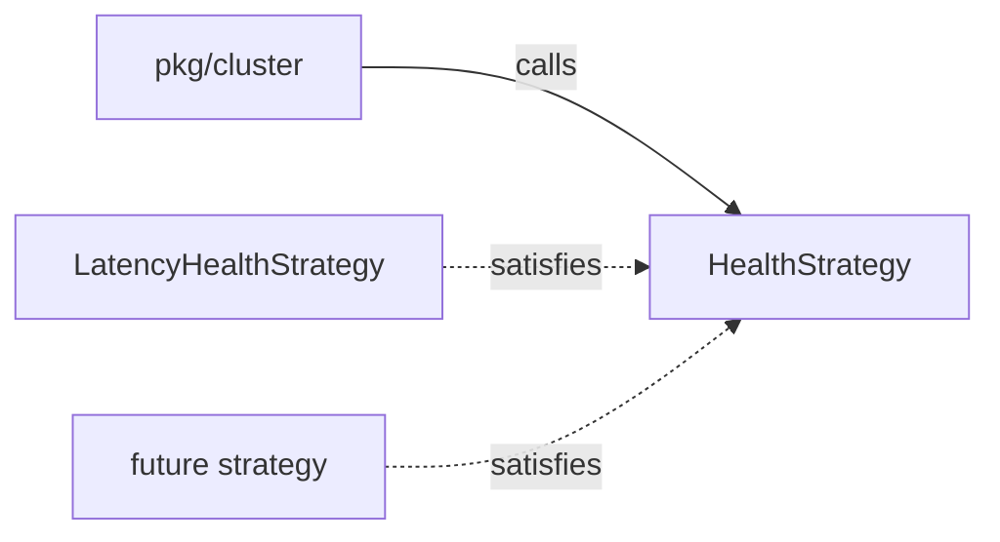

# Interface Polymorphism: The Seam That Makes Strategies Pluggable

An **interface** lists the methods a type must have. Any type with those methods satisfies it
automatically. There is no `implements` keyword. Code written against the interface works
with every type that fits, including ones written later.

Analogy: a wall socket. Your lamp does not care which power plant made the electricity, only
that the plug fits.

In swarm-net, the cluster needs "a score for each peer, lower is better". It should not care
whether that score is latency, CPU load or packet loss. The `HealthStrategy` interface is that
plug.

```go
// backend/pkg/health/strategy.go
type HealthStrategy interface {
    Name() string
    // EvaluateScore probes target and returns its cost (lower is better).
    EvaluateScore(ctx context.Context, target protocol.NodeAddress) (float64, error)
}

// backend/pkg/health/latency.go: compile-time check that the type fits.
var _ HealthStrategy = (*LatencyHealthStrategy)(nil)
```

## How swarm-net uses it

- `NodeConfig.Health` (`backend/pkg/cluster/node.go`) is a `health.HealthStrategy`. The
  cluster only calls the interface, never the concrete type.
- The default is `LatencyHealthStrategy` (`backend/pkg/health/latency.go`). Another strategy
  can be passed in without changing cluster code.
- The contract fixes the meaning of a score: lower is better, and `NaN`
  (`ScoreUnavailable`) means "no score". Callers compare with `health.Better`, not `<`.
- `Prober` is a function type (`backend/pkg/health/latency.go`), a second, smaller seam. Tests
  pass a fake prober. Production passes `MeshProber.Probe` from
  `backend/pkg/network/prober.go`.
- Other seams follow the same pattern: `Clock` (`backend/pkg/cluster/clock.go`) and
  `Transport` (`backend/pkg/network/transport.go`).



## Common pitfalls

- **Inverting the score direction.** A new strategy that returns "higher is better" elects
  the worst node. Follow the contract, and use `Better` for every comparison.
- **Type-asserting back to the concrete type.** `h.(*LatencyHealthStrategy)` inside the
  cluster quietly ties it to one strategy and breaks the seam.
- **Typed nil.** A nil `*LatencyHealthStrategy` stored in the interface is **not** a nil
  interface. `h != nil` is true, and the first call can panic.
- **Interfaces with one implementation "just in case".** Add an interface when there is a
  real second implementation (or a test double), not before.

## Further reading

- [Latency as a Statistic](/concepts/latency-as-a-statistic)
- [Idempotence and Hysteresis](/concepts/idempotence-and-hysteresis) -- why the margin depends
  on the strategy.
- Go FAQ: [Why is my nil error value not equal to nil?](https://go.dev/doc/faq#nil_error)
