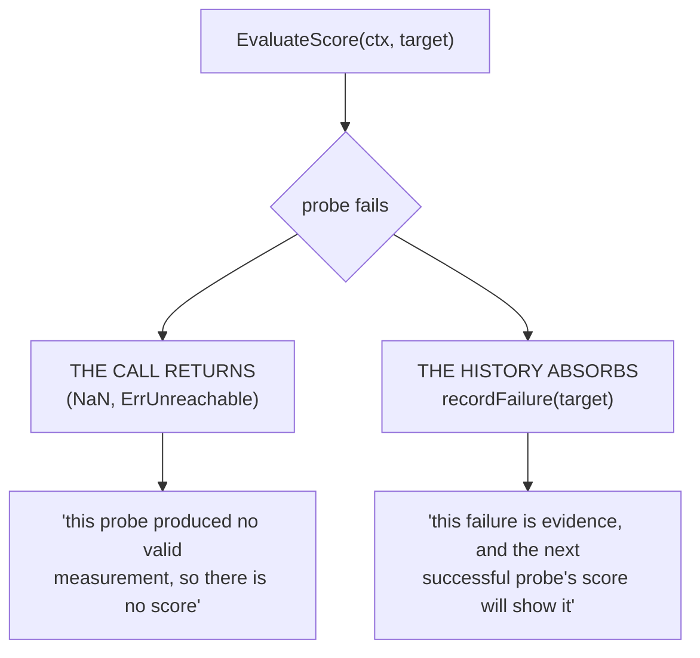
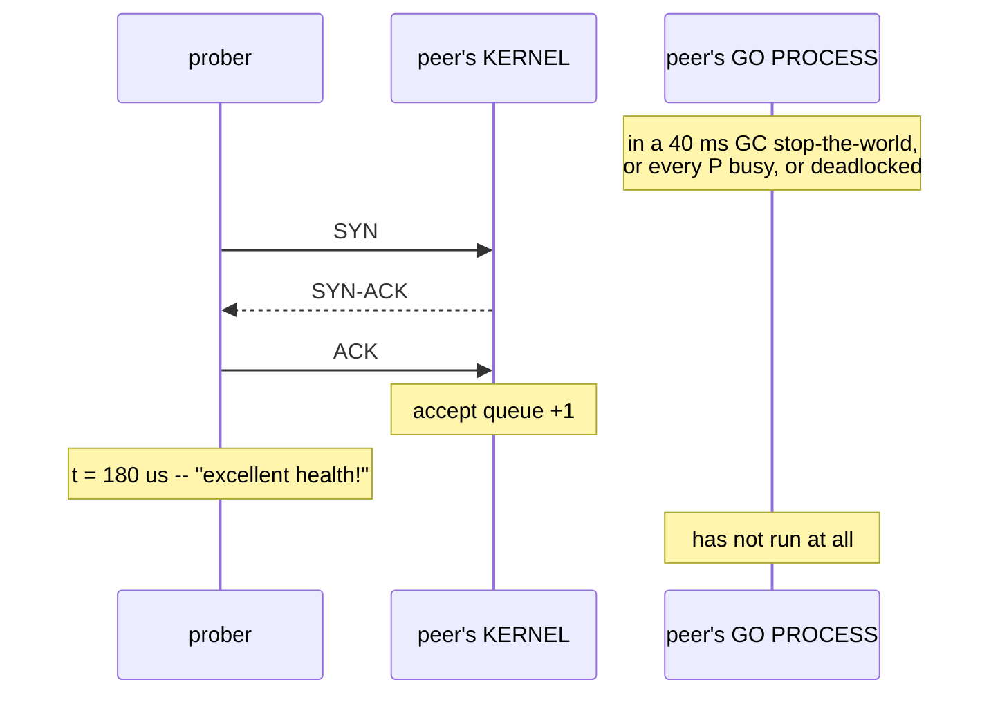
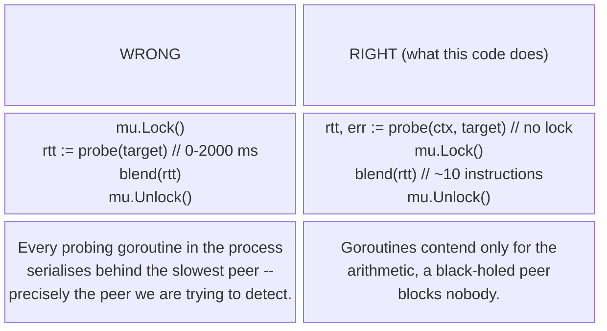

# Latency as a Statistic

`pkg/health` has one job: turn "how is that peer doing?" into a number that
[`pkg/cluster`](/architecture/overview) can sort. That sounds like a measurement problem. It is
almost entirely a *statistics* problem, and the three ways it goes wrong are not obvious:

1. **A single sample is not a measurement.** Latency is heavy-tailed. Any score derived from one
   probe makes leadership flap.
2. **The dataset lies about the sick peers.** The samples you never collected are exactly the ones
   that mattered -- Gil Tene's *coordinated omission*, applied to election rather than benchmarking.
   Left unhandled, **the sicker a peer gets, the better it looks**.
3. **The absence of a measurement needs a representation that cannot be mistaken for a good one.**
   A dead peer scored `0` wins every election in the swarm.

This page covers all three, plus the state-bounding and clock questions they drag in. It is the
statistical half of the [`HealthStrategy` contract](/concepts/interface-polymorphism); the
error-classification half lives in
[Error Wrapping & Classification](/concepts/error-wrapping-and-classification).

---

## Core Mental Model

### Latency is not a number, it is a distribution

Ask "what is the latency to `node-4`?" and the honest answer is a histogram, not a scalar. On a
Docker bridge with ten Go processes on one host, the shape is reliably right-skewed:

| Bucket (ms) | 0.4-0.8 | 0.8-1.0 | 1.0-2.0 | 2-5 | 5-12 | 12-40 |
|---|---|---|---|---|---|---|
| Relative density | very high | high | moderate | low | rare | very rare |

| Statistic | Value (ms) |
|---|---|
| median | 0.72 |
| **mean** | **0.94** |
| p99 | 5.1 |
| p99.9 | 38 |

The mean sits to the *right* of the median, dragged there by a tail it does not describe. "Average
latency 0.94 ms" is true and nearly useless -- no individual request has a meaningful chance of
taking 0.94 ms; requests take 0.7 ms or they take 12 ms. The mean is the one summary statistic that
describes neither mode of behaviour.

The tail is not noise. On this swarm each entry in it has a named cause:

| Tail source | Typical magnitude | Who is responsible |
|---|---|---|
| Go GC stop-the-world / assist | 0.1-2 ms | the peer's runtime, see [GMP](/concepts/go-scheduler-gmp) |
| Goroutine queued behind a busy P | us-ms | the peer's scheduler |
| Delayed ACK interacting with Nagle | up to 40 ms | both kernels, see [Stream Framing](/concepts/stream-framing) |
| Host CPU steal / noisy neighbour | ms | the machine |
| Retransmit after loss | RTO, >=200 ms | the network |

### Percentiles do not compose

Worth internalising before Phase 3 adds a multi-hop task path. If a task traverses worker -> leader
-> control-center and each hop independently has a p99 of 5 ms, the p99 of the whole is **not** 5 ms,
and is not 15 ms either.

Each hop is an independent chance to hit the tail, so the probability of *no* hop hitting its top 1%
is $0.99^{3} \approx 0.970$ -- about **3%** of composite operations exceed the sum of the per-hop
p99s' inputs. The composite's 99th percentile sits further out than any component's.

You cannot average, add, or otherwise arithmetic percentiles; you can only measure the composite end
to end. This is why this codebase measures the thing it cares about directly rather than assembling
it from component metrics.

### EWMA: the whole history in one float64

An exponentially weighted moving average keeps one number per peer and folds each new sample in:

$$v_{n} = \alpha s_{n} + (1 - \alpha) v_{n-1}$$

Unrolled, that is a weighted sum over every sample ever taken, with geometrically decaying weights:

$$v_{n} = \alpha s_{n} + \alpha(1-\alpha) s_{n-1} + \alpha(1-\alpha)^{2} s_{n-2} + \alpha(1-\alpha)^{3} s_{n-3} + \cdots$$

At $\alpha = 0.3$ the weight assigned to each past sample decays fast:

| Samples ago | 0 (now) | 1 | 2 | 3 | 4 | 5 | 6 |
|---|---|---|---|---|---|---|---|
| Weight | 0.300 | 0.210 | 0.147 | 0.103 | 0.072 | 0.050 | 0.035 |

The weights sum to 1 (a geometric series with ratio $1-\alpha$), so the result stays in the units of
the samples: milliseconds in, milliseconds out. No window, no buffer, no sort -- **O(1) time and
O(1) memory per peer**, which is what lets the strategy hold state for an arbitrary `N` without a
retention policy.

#### Worked: `alpha = 0.5`, the sequence the test pins

`pkg/health/latency_test.go:91` (`TestEWMAConvergesOverKnownSequence`) uses alpha = 0.5 and samples
10, 20, 30, 40 precisely because the arithmetic is checkable by eye:

| Sample | Arithmetic | Value |
|---|---|---|
| 10 | seed | 10 |
| 20 | 0.5(20) + 0.5(10) = 10 + 5 | 15 |
| 30 | 0.5(30) + 0.5(15) = 15 + 7.5 | 22.5 |
| 40 | 0.5(40) + 0.5(22.5) = 20 + 11.25 | 31.25 |

The average trails the input. That lag is the feature.

#### Worked: `alpha = 0.3` (the shipped default), a peer that degrades

`DefaultAlpha = 0.3` at `pkg/health/latency.go:36`. A peer sitting at sub-millisecond latency steps
up to ~9 ms -- a real degradation, not an outlier:

| Sample | Arithmetic | Value | What a ranker sees |
|---|---|---|---|
| 0.8 | seed | 0.800 | fastest node in the swarm |
| 0.9 | 0.3(0.9) + 0.7(0.800) = 0.27 + 0.560 | 0.830 | |
| 0.7 | 0.3(0.7) + 0.7(0.830) = 0.21 + 0.581 | 0.791 | |
| 9.0 | 0.3(9.0) + 0.7(0.791) = 2.70 + 0.554 | 3.254 | moved, but not decisively |
| 8.5 | 0.3(8.5) + 0.7(3.254) = 2.55 + 2.278 | 4.828 | |
| 9.2 | 0.3(9.2) + 0.7(4.828) = 2.76 + 3.379 | 6.139 | now losing to any 1 ms peer |
| 9.0 | 0.3(9.0) + 0.7(6.139) = 2.70 + 4.298 | 6.998 | |
| 9.0 | 0.3(9.0) + 0.7(6.998) = 2.70 + 4.898 | 7.598 | |

Three bad probes to move decisively; eight to approach the truth. Under a last-sample score the same
peer drops from "best" to "worst" in *one* probe and back again on the next lucky one. That is the
flap the EWMA exists to prevent.

The reverse property is pinned at `pkg/health/latency_test.go:119`
(`TestEWMADampensASingleOutlier`): a peer at a steady 10 ms that suffers one 200 ms GC pause scores
$0.3 \cdot 200 + 0.7 \cdot 10 = 67$, not 200. It gets worse, but it does not lose its leadership to a
single stop-the-world.

### What alpha buys you

The gap between the EWMA and a new steady input decays by $(1-\alpha)$ per sample, so the remaining
gap after $n$ samples is $(1-\alpha)^{n}$:

| | alpha = 0.1 | alpha = 0.3 | alpha = 0.5 | alpha = 1.0 |
|---|---|---|---|---|
| half-life (samples) | 6.6 | 1.9 | 1.0 | 0 (no smoothing) |
| 90% closed | 21.9 | 6.5 | 3.3 | 0 |
| mean age of a sample, $(1-\alpha)/\alpha$ | 9.0 | 2.33 | 1.0 | 0 |
| effective "window", $\approx 1/\alpha$ | ~10 | ~3.3 | ~2 | 1 |

An EWMA behaves like an average over roughly $1/\alpha$ recent samples. At alpha = 0.3 that is a
~3-sample window: with a 500 ms probe interval, the score reflects roughly the last 1.5 seconds.
That is the trade the comment at `pkg/health/latency.go:31-35` states outright -- fast enough to
catch a genuine degradation inside a few probe intervals, slow enough that one GC pause cannot cost
a leader its job.

Setting `Alpha: 1` disables smoothing entirely (`value = sample`); the tests use it at
`pkg/health/latency_test.go:135` to isolate other behaviour from the average.

### Why an EWMA and not a sliding-window median

A median over the last *k* samples is, straightforwardly, better statistics -- robust to outliers by
construction, which an EWMA is not. It is also the **wrong tool here**, and the reason inverts the
usual advice:

> A median's rejection of outliers is exactly wrong at the moment that matters. A peer whose
> latency has just stepped up tenfold is a peer we want to demote *quickly*, and a median
> deliberately ignores the first $\lceil k/2 \rceil$ samples that say so.

Trace it. Window of 5, peer at `[0.8, 0.8, 0.9, 0.8, 0.8]`, median 0.8. It dies and starts timing
out:

| After | Window | Median | |
|---|---|---|---|
| 1 bad sample | `[0.8, 0.9, 0.8, 0.8, 4000]` | 0.8 | unchanged |
| 2 bad samples | `[0.9, 0.8, 0.8, 4000, 4000]` | 0.8 | unchanged |
| 3 bad samples | `[0.8, 0.8, 4000, 4000, 4000]` | 4000 | finally |

Three probe intervals of a cluster attached to a leader the detector still scores as the best node
in the swarm. The EWMA had already moved 30% of the way after the first sample.

The generalisation: **a failure detector and a metrics dashboard want opposite estimators.** A
dashboard answers "what has this peer been like?", where robustness to outliers is correctness. A
failure detector answers "what is this peer like *now*?", where responsiveness to a recent change is
correctness and outlier rejection is a bug. `pkg/health/latency.go:93-101` records this choice and
its rationale in the source.

### First-sample seeding

`pkg/health/latency.go:322-326`:

```go
if st.count == 0 {
    st.value = sampleMS
} else {
    st.value = s.alpha*sampleMS + (1-s.alpha)*st.value
}
```

The `count == 0` branch is not an optimisation. Without it a fresh `ewmaState` has `value == 0`, and
the first blend of a real 9.4 ms latency gives $0.3 \cdot 9.4 + 0.7 \cdot 0 = 2.82$.

A brand-new peer would score **alpha times its true latency** -- roughly a third -- then climb
toward the truth over the next several probes. Every node that has just joined would be, on paper,
the fastest node in the swarm, and would win the next election on the strength of having no history.
Leadership would be driven by membership churn: restart a container, it wins.

`pkg/health/latency_test.go:79` (`TestEWMAFirstSampleSeedsDirectly`) pins the first score to equal
the first sample verbatim.

### The more sophisticated relative: phi accrual

Everything above produces one number and leaves the up/down threshold to the caller. The literature
has a better answer: the **phi accrual failure detector** (Hayashibara et al., 2004), used in
production by Cassandra and Akka. Instead of a boolean or a scalar latency, it maintains the
*distribution* of past inter-arrival times and outputs a **suspicion level**:

$$\varphi(t_{now}) = -\log_{10} P(\text{heartbeat arrives later than } t_{now} - t_{last})$$

phi = 1 means ~10% chance of a false positive if you act now; phi = 8 means ~$10^{-8}$. Callers pick
the threshold that suits their appetite, and -- crucially -- the detector *adapts*: on a link whose
heartbeats normally jitter by 200 ms, a 250 ms gap is unremarkable and phi stays low, while on a
tight link the same gap is damning.

**This codebase does not use it, and should say so plainly.** phi accrual needs a sample window
(typically 1000 inter-arrival times per peer) to estimate the distribution -- the very state this
EWMA was chosen to avoid -- and it detects *heartbeat absence*, which presupposes the periodic
heartbeat mesh that is Phase 4 work. Adopting it before that mesh exists would be building the
estimator before the thing it estimates.

What it would buy, later, is the elimination of the fixed `ProbeTimeout` as a tuning knob: the
timeout becomes a property learned per-link rather than a constant guessed once for the whole swarm.
Recorded as a possibility, not a promise.

---

## Under the Hood

### Coordinated omission

This is the section to read twice.

Gil Tene's observation, made about load-test harnesses, is that a measurement system which only
records *completed* operations systematically omits the worst ones -- and the omission is
*coordinated* with the badness. A load generator that issues the next request only after the last
one returns stops issuing requests during exactly the stall it is supposed to measure, and reports a
p99 built from the intervals when the system was fine.

Applied to a failure detector, the same mechanic produces a strictly worse outcome, because the
output is not a report a human reads -- it is an input to leader election.

**A sample exists only when a probe completes.** A peer slow enough to blow `ProbeTimeout`
(`pkg/health/latency.go:39`, 2 s) produces no measurement at all. If timeouts are simply dropped,
the slowest peer in the swarm contributes the *fewest* samples, and the ones it does contribute come
from the occasions it happened to be healthy:

| Probe | node-7's real behaviour | Sample recorded (naive: drop failures) |
|---|---|---|
| 1 | 0.8 ms | 0.8 |
| 2 | 0.9 ms | 0.9 |
| 3 | TIMEOUT | *(none)* |
| 4 | TIMEOUT | *(none)* |
| 5 | TIMEOUT | *(none)* |
| 6 | TIMEOUT | *(none)* |
| 7 | TIMEOUT | *(none)* |
| 8 | 0.9 ms | 0.9 |

The five samples that mattered are precisely the five that are missing. The EWMA stays at ~0.85 ms,
so node-7 is the most attractive leader in the swarm while being unable to answer.

Stated as a slogan: **under omission, the worse a peer gets, the better it scores** -- because
badness is expressed as *missing data*, and missing data cannot move an average.

The failure mode this produces in the field is spectacular and looks nothing like a statistics bug.
The whole swarm re-clusters onto the one node that cannot serve it, every worker's tasks stall, and
the dashboard shows the elected leader with the lowest latency figure on the board.

### What this codebase does about it

`pkg/health/latency.go:334-337`:

```go
func (s *LatencyHealthStrategy) recordFailure(target protocol.NodeAddress) {
    penaltyMS := float64(s.probeTimeout) / float64(time.Millisecond) * s.failurePenalty
    s.record(target, penaltyMS)
}
```

A failed probe records a **synthetic sample** of `ProbeTimeout x FailurePenalty` instead of
recording nothing. With the defaults (`pkg/health/latency.go:39,44`) that is 2000 ms x 2.0 =
4000 ms. Re-running the scenario above with alpha = 0.3:

| Probe | Arithmetic | Value | |
|---|---|---|---|
| 0.8 | seed | 0.800 | |
| 0.9 | 0.3(0.9) + 0.7(0.800) | 0.830 | |
| TIMEOUT | 0.3(4000) + 0.7(0.830) = 1200 + 0.58 | 1200.581 | immediately last |
| TIMEOUT | 0.3(4000) + 0.7(1200.58) = 1200 + 840 | 2040.407 | |
| TIMEOUT | 0.3(4000) + 0.7(2040.41) = 1200 + 1428 | 2628.285 | |

One missed probe is enough to put the peer behind every responsive node in the swarm, and it stays
there until it answers several times in a row.

#### Why the penalty *exceeds* the timeout

`DefaultFailurePenalty = 2.0`, not `1.0`. The multiplier is not arbitrary padding; without it there
is a tie at the worst possible place. Consider two peers with `ProbeTimeout = 100 ms`:

| Peer | Behaviour | Score with penalty x1.0 |
|---|---|---|
| `honest-slow` | always answers, at 99 ms | converges to 99 |
| `pinned` | never answers, times out | 100 x 1.0 = 100 |

Scores of 99 versus 100 -- the pinned peer is ranked one millisecond worse than a peer that is
actually working. Any jitter in the honest peer's measurements flips the order and elects the dead
one. With the x2 penalty the pinned peer scores 200, and no honest sub-timeout peer can reach it.

`pkg/health/latency_test.go:270` (`TestFailurePenaltyExceedsProbeTimeout`) is exactly this, with
alpha = 1 to strip the smoothing out of the comparison:

```go
timingOut  := NewLatencyHealthStrategy(Config{
    Probe: deadlineProber(), Alpha: 1, ProbeTimeout: timeout, FailurePenalty: 2,
})
honestSlow := NewLatencyHealthStrategy(Config{
    Probe: fixedProber(99), Alpha: 1, ProbeTimeout: timeout,
})
// ... asserts Better(honestSlowScore, timingOutScore)
```

And `pkg/health/latency_test.go:227` (`TestTimeoutDegradesScoreRatherThanBeingOmitted`) pins the
whole mechanism with hand-computed expectations -- the property worth imitating when you write a
statistics test, because a test that recomputes the implementation's formula proves nothing. Timeout
100 ms, penalty x2 = 200 ms, alpha = 0.5:

| Probe | Outcome | Arithmetic | Value |
|---|---|---|---|
| 1 | ok, 10 ms | seed | 10 |
| 2 | TIMEOUT | 0.5(200) + 0.5(10) = 100 + 5 | 105 |
| 3 | TIMEOUT | 0.5(200) + 0.5(105) = 100 + 52.5 | 152.5 |
| 4 | ok, 10 ms | 0.5(10) + 0.5(152.5) = 5 + 76.25 | 81.25 |

The test asserts `Samples("sick:9000") == 4` first -- if the timeouts had been omitted the count
would be 2 -- and then the score `81.25`. Note what the last row shows: the penalty does not
evaporate the moment the peer answers once. One good probe pulls it from 152.5 to 81.25, still eight
times worse than the healthy peer's 10. Recovery requires sustained good behaviour.

#### The split that keeps the contract intact

The subtle part. A failed probe does two different things, and they must not be confused:



`pkg/health/latency.go:267` calls `s.recordFailure(target)`, and then lines 278-284 return
`ScoreUnavailable()` with the sentinel. The penalty value is deliberately **not** returned to the
caller.

Why not just return 4000? Because rule 3 of the `HealthStrategy` contract
(`pkg/health/strategy.go:56-73`) is *an error is not a score*, and "unreachable" and "answered in
4 seconds" are different facts. Returning the penalty as a return value would make them the same
float, and a caller could then legitimately record, log, or aggregate `4000` as a measured latency
for a peer that was never measured. The penalty is a **bias applied to the estimator**, not an
observation, and it is confined to where estimator bias belongs: inside the estimator.

#### Cancelled probes record nothing at all

The asymmetry at `pkg/health/latency.go:253-263`: when the *parent* context is already done, the
strategy returns `ErrProbeCanceled` and **does not** call `recordFailure`. The comment at lines
255-259 gives the reason -- every in-flight probe in the process is cancelled at the same instant
during shutdown, so penalising on cancellation means a clean shutdown manufactures a swarm-wide
burst of degraded scores, which is indistinguishable from a network partition.

Telling "the caller stopped us" from "the peer is too slow" is genuinely hard, because a caller's
own deadline and the strategy's internal `ProbeTimeout` both surface as the identical
`context.DeadlineExceeded` value. That discrimination is its own topic: see
[Error Wrapping & Classification](/concepts/error-wrapping-and-classification).

### NaN as a safety property

IEEE-754 defines a class of values that are **unordered** with respect to everything, themselves
included. This is not a quirk; it is the point. Let `n = NaN` and `x` be any float (including
positive or negative infinity, 0, and NaN itself):

| Comparison | Result | | Comparison | Result |
|---|---|---|---|---|
| `n < x` | false | | `n == n` | **false** (the famous one) |
| `n > x` | false | | `n != n` | true |
| `n <= x` | false | | `x < n` | false |
| `n >= x` | false | | `x > n` | false |

Arithmetic is absorbing: `n + x`, `n * 0`, `n / x` are all NaN, and Go's `math.Min`/`math.Max` return
NaN if either operand is NaN.

`math.IsNaN` exists precisely because `x != x` is otherwise the only way to detect it -- you cannot
write `x == math.NaN()`, since that comparison is false by definition. Its implementation is
literally that:

```go
// from the standard library
func IsNaN(f float64) (is bool) { return f != f }
```

`pkg/health/strategy.go:139`:

```go
func ScoreUnavailable() float64 { return math.NaN() }
```

The choice is deliberate and is documented at `pkg/health/strategy.go:126-138`. Line the candidates
up against the bug being defended against -- *a caller ignores the error and ranks with a bare `<`*:

| Sentinel | `dead < best` | Consequence of the ignored error |
|---|---|---|
| `0.0` | **true** | Every dead node beats every live one. **Catastrophic**: the cluster elects corpses. |
| `999999.0` | false | Correct -- until a genuine score exceeds it, and it is arbitrary. |
| `math.Inf(1)` | false | Correct, but it is a *valid comparable number*: the bug never surfaces. |
| `math.NaN()` | **false** | Can never win a ranking; poisons any aggregate it enters, so the bug surfaces loudly. |

The NaN converts the worst available outcome (every dead node elected) into the mildest one (a node
that is simply never chosen -- which is what you wanted anyway). And unlike positive infinity, it
will not sit there quietly forever: the moment someone averages a set of scores including it, the
average is NaN and the mistake is visible.

`pkg/health/strategy_test.go:104` (`TestUnavailableScoreCannotWinRanking`) asserts both halves --
that the naive `dead < alive` is false, and that a full ranking loop over a set containing two
unavailable scores still selects the fastest live peer.

**This is defence in depth, not a replacement for the error return.** Callers are still required to
check `err`, and to classify it with `IsCancellation` first (`pkg/health/strategy.go:222`). The NaN
is what happens when they don't.

#### `Better`, and why the accident is not relied on

`pkg/health/strategy.go:160`:

```go
func Better(a, b float64) bool {
    switch {
    case !IsValidScore(a):
        return false          // an invalid a is never better than anything
    case !IsValidScore(b):
        return true           // a valid a is always better than an invalid b
    default:
        return a < b
    }
}
```

The NaN comparison rule would make `a < b` do the right thing for an invalid `a` by itself. `Better`
rejects it explicitly anyway, for two reasons:

1. **It handles an invalid `b`.** A bare `a < b` with `b = NaN` is *false*, so a naive
   `if score < best` loop seeded with `best = NaN` would never update and would return the first
   candidate, whatever it was.
2. **Correctness should not depend on the next author remembering IEEE-754 unordered semantics.**
   `Better` states the direction (lower-is-better) once, in one place, so no call site re-derives it.

Both-invalid returns "not better", making a ranking over an entirely unreachable candidate set
stable rather than dependent on map iteration order -- `pkg/health/strategy_test.go:139`.

#### Why `IsValidScore` rejects the infinities too

`pkg/health/strategy.go:146`:

```go
func IsValidScore(score float64) bool {
    return !math.IsNaN(score) && !math.IsInf(score, 0)
}
```

An infinity admitted into the EWMA recurrence is permanent, because it is absorbing:

$$v_{n} = \alpha \cdot (+\infty) + (1-\alpha) v_{n-1} = +\infty$$
$$v_{n+1} = \alpha \cdot 2.0 + (1-\alpha) \cdot (+\infty) = +\infty \quad \text{(forever)}$$

Unlike a large finite penalty, infinity never decays out of the average. A peer poisoned this way
can never recover its score no matter how well it behaves, and the only fix is `Forget`. A strategy
that wants to say "worst possible" must say it with a large finite number, or with an error.

---

## Why It Matters in This Swarm

### The placeholder prober measures the wrong layer, on purpose

`TCPConnectProber` at `pkg/health/latency.go:432` dials the peer and times the connect:

```go
start := time.Now()
conn, err := dialer.DialContext(ctx, "tcp", string(target))
if err != nil { return 0, err }
elapsed := time.Since(start)
_ = conn.Close()
return elapsed, nil
```

That is a correct measurement of something, and the something is not what leader election needs.
**The TCP three-way handshake is completed by the peer's kernel with zero application
involvement.** The SYN arrives, the network stack replies SYN-ACK and parks the completed connection
in the listen backlog, and the peer's Go process learns about it only if and when it calls `Accept`
-- see [TCP Sockets & The Kernel](/concepts/tcp-sockets-and-the-kernel).



A node stopped in a GC pause, starved of Ps by a runaway goroutine
([GMP](/concepts/go-scheduler-gmp)), or deadlocked above the socket layer still answers a SYN in
microseconds. Connect time measures **network distance**; it says nothing about **application
responsiveness** -- and application responsiveness is exactly what a leader needs, since a leader
must schedule goroutines to fan tasks out, not merely reply to SYNs. Used as the only signal, this
prober would happily elect a node that is comatose above the socket layer.

It ships anyway because it is correct for what it measures, needs no mesh, and gives Phase 2 a
working default. **Phase 3 replaces it with a PING/PONG over the established mesh connection**,
which traverses the peer's accept loop, its scheduler, its decoder and its encoder -- every layer
whose health actually matters. The `Prober` seam at `pkg/health/latency.go:26` exists so that swap
is a different function passed to `Config`, not a rewrite of this file.

There is a second reason to replace it: every probe costs a fresh handshake, a file descriptor, and
a socket left in `TIME_WAIT` for two maximum segment lifetimes afterwards. At one probe per peer per
interval that is affordable; at ten peers and a 500 ms interval it is 1200 sockets/minute of churn
that the mesh connection avoids entirely.

The elapsed time uses `time.Now`/`time.Since`, both of which carry Go's monotonic reading, so an NTP
step mid-probe cannot produce a negative or wildly inflated sample -- see
[Monotonic vs Wall Clocks](/concepts/monotonic-vs-wall-clocks). `EvaluateScore` defends against a
broken third-party prober anyway at `pkg/health/latency.go:230`, routing a negative duration through
`classify` rather than feeding it to the EWMA, where a negative sample would make a broken peer the
most attractive leader in the swarm.

### Bounding the state

Per-target EWMA state lives in a mutex-guarded map, `pkg/health/latency.go:150-151`:

```go
mu      sync.Mutex
samples map[protocol.NodeAddress]*ewmaState
```

**Why not `sync.Map`.** Every operation here is a read-modify-write: load the EWMA, blend the new
sample, store it. `sync.Map` offers atomic load and atomic store, but **no atomic RMW** -- so a
`sync.Map` implementation would need a per-entry mutex to make the blend atomic, which is the same
lock with an extra layer of indirection and worse escape analysis. `sync.Map` is also tuned for
read-mostly, write-rarely maps; this one is written on every single probe.

**Why the lock is never held across a probe.** The probe at `pkg/health/latency.go:222` runs
entirely outside any critical section, and `record` (`pkg/health/latency.go:313`) takes `mu` only
for the arithmetic -- a handful of instructions.



Holding a lock across I/O is the classic version of this mistake, and here it would be
self-defeating: the detector would be slowed down most by exactly the condition it exists to detect.
`pkg/health/latency_test.go:474` (`TestConcurrentEvaluateScore`) runs 32 goroutines x 50 iterations
under `-race` and asserts `Samples("shared:1") == 800` -- a lost update would show up as a count
below 800.

**Why the map needs bounding at all.** It is keyed by peer address, `N` is dynamic, peers leave, and
the chaos controls restart containers that come back on recycled IPs under new addresses. Without
eviction a long-running node accumulates one entry per address ever seen -- a slow leak, and worse,
a source of stale scores if an address is reused by a different container.

`Forget` (`pkg/health/latency.go:378`) drops one target. `Retain` (`pkg/health/latency.go:390`)
drops every target not in a keep-set, in one pass, which is the form membership logic actually wants
after a view change -- it holds the new member set, not the diff. Doing it here keeps the map
bounded by live membership *by construction*, rather than by every caller remembering to pair each
departure with a `Forget`. Covered by `pkg/health/latency_test.go:449`.

**Why there is no expiry timer.** Deliberately none. The comment at `pkg/health/latency.go:374-377`
states the architectural reason: the strategy has no membership knowledge of its own, and a timer
would be *a second, competing opinion about who is in the swarm*. Two sources of truth about
membership is the seed of a split-brain -- the timer would evict a peer that membership still
considers live, the next probe would recreate its entry with no history, and the peer would be
seeded fresh and look artificially fast. One owner, one opinion.

### The other half of the flap-damping

The EWMA is only the **first half** of the mechanism that stops leadership thrashing. It smooths the
*input*. The second half smooths the *decision*: **election hysteresis**, so that a 0.3 ms
improvement in a challenger's score cannot displace a sitting leader -- a challenger must beat the
incumbent by some margin, or for some sustained number of rounds, before a handover is worth its
reconnection cost.

Two peers whose true latencies are genuinely within noise of each other will trade the lead forever
under any estimator, however well smoothed, if the comparison is a bare `<`. That is not a
statistics problem and cannot be fixed here.

This is recorded as a Phase 4 concern in `docs/WORKLOG.md` section 2.5 ("Idempotence & hysteresis in
control loops"), and belongs in `pkg/cluster` with the election logic, not in `pkg/health`: the
health package's job is to report a number, and a decision about whether a difference is *worth
acting on* is a policy the strategy has no business holding.

---

## Common Failure Modes & Edge Cases

### "Someone cleaned up the NaN" -- the most important takeaway on this page

State it bluntly, because this is the one that will actually happen:

> A maintainer who does not know IEEE-754 semantics will read `return math.NaN()` as cruft, or as a
> defensive accident, and "clean it up" to `return 0`. That change passes review -- it looks like
> simplification -- reintroduces the exact bug the NaN prevents, and its symptom is
> **every unreachable node becoming the most attractive leader in the swarm.**

The symptom does not look like a statistics bug. It looks like "the cluster keeps electing dead
nodes" or "the cluster is inexplicably slow", and it will be investigated in the election code,
which is fine. `pkg/health/strategy_test.go:104` and `:62` are the tripwires; if you are reviewing a
diff that touches `ScoreUnavailable`, check that they still exist. The docstring at
`pkg/health/strategy.go:126-138` exists to survive this conversation in your absence.

The related version: someone writes `if score < best` instead of `Better(score, best)` and seeds
`best` with `math.NaN()`. Every comparison against a NaN `best` is false, so the loop never updates
and returns whichever candidate map iteration visited first. Random leader, every round, with no
error anywhere.

| Failure | Symptom in the field | Root cause |
|---|---|---|
| Timeouts omitted from history | The elected leader has the best score on the dashboard and serves nothing. Cluster re-attaches to it after every re-election. | Coordinated omission; `recordFailure` removed or bypassed. |
| `FailurePenalty` set to 1.0 | Leadership oscillates between a dead peer and a slow-but-working one, several times a minute. | Pinned-at-timeout ties with honest-slow; jitter decides. |
| `ScoreUnavailable` changed to `0` | Dead nodes win every election. | See above. |
| First-sample seeding removed | Whichever container restarted most recently becomes leader. Chaos testing "causes" leadership changes. | New peers score about alpha x true latency. |
| Cancellation treated as failure | Every clean shutdown looks like a network partition; a spurious election fires while the swarm is stopping. | `recordFailure` called on `ErrProbeCanceled`. See [Error Wrapping](/concepts/error-wrapping-and-classification). |
| A strategy returns positive infinity | One peer's score is permanently infinite and never recovers, even after it is demonstrably healthy. | Infinity is absorbing in the EWMA recurrence; `IsValidScore` is the guard. |
| Lock held across the probe | Probe throughput collapses to one probe per `ProbeTimeout` process-wide whenever any single peer black-holes. | Serialisation behind the slowest peer. |
| `Forget`/`Retain` never called | RSS creeps over days; after a container restart onto a recycled IP, the new node inherits the old node's score. | Unbounded, stale, address-keyed map. |

### alpha is the knob everyone reaches for, and both directions hurt

| | alpha too LOW (0.05) | alpha = 0.3 (shipped) | alpha too HIGH (0.9) |
|---|---|---|---|
| Effective window | ~20 samples | ~3 samples | ~1.1 samples |
| Behaviour | A dead leader keeps a good score for ~14 probes. Failover takes 7 s at a 500 ms interval. | The intended trade. | A single GC pause on the leader triggers a re-election. The swarm spends its time re-clustering. |
| Symptom | "failover is really slow" | -- | constant churn |

Both failures are silent: nothing in the system reports "your smoothing factor is wrong". You
observe it as sluggish failover or as churn, and you have to connect that back to a constant.
`pkg/health/latency.go:181-183` clamps an out-of-range alpha back to the default rather than
panicking -- a tuning mistake must not stop a node joining the swarm -- which means a typo'd
`Alpha: 3.0` silently becomes 0.3 and produces no warning either.

### Probe interval interacts with alpha, and neither knows about the other

The EWMA's window is measured in *samples*; the detection latency a human cares about is measured in
*seconds*. The conversion factor is the probe interval, which lives in the caller (Phase 4 heartbeat
logic), not in this package.

- Halving the probe interval halves the detection time without touching alpha -- and doubles the
  probe load.
- Doubling alpha without touching the interval halves the detection time and doubles the flap
  sensitivity.

These two knobs are in different packages, owned by different phases, and will be tuned by different
people. Say which one you changed.

### Early scores are not comparable across peers

A peer with one sample has an unsmoothed score; a peer with twenty has a smoothed one. Ranking them
against each other compares an estimate with an estimate-of-an-estimate. `Samples`
(`pkg/health/latency.go:357`) exposes the count precisely so that election logic can require a
minimum sample count before a candidate is eligible -- a guard Phase 4 should add and Phase 2 does
not have. Until it does, a node that has just joined can, on a single lucky probe, out-rank an
incumbent with a long clean record.

### The EWMA is not a percentile and must not be presented as one

For the dashboard: this number is not p50, not p99, and not "average latency" in any sense a reader
will assume. It is a recency-weighted estimator tuned for a failure detector, with synthetic penalty
samples folded in. A peer showing `1200 ms` has most likely **timed out once recently**, not
answered in 1.2 seconds. Labelling this column "latency (ms)" on the Phase 5 dashboard will produce
a support question every single time a peer blips. Label it *health score*.

---

## See Also

- [Interface Polymorphism & the Strategy Pattern](/concepts/interface-polymorphism) -- the
  `HealthStrategy` seam this estimator plugs into, and the four load-bearing contract rules.
- [Error Wrapping & Classification](/concepts/error-wrapping-and-classification) -- how a cancelled
  probe is told apart from a dead peer, and why `ErrProbeTimeout` deliberately does not wrap
  `context.DeadlineExceeded`.
- [Monotonic vs Wall Clocks](/concepts/monotonic-vs-wall-clocks) -- why every duration in this
  package comes from `time.Since` and never from a peer's timestamp.
- [TCP Sockets & The Kernel](/concepts/tcp-sockets-and-the-kernel) -- the listen backlog and the
  handshake the kernel completes without the application.
- [The Go Scheduler (GMP)](/concepts/go-scheduler-gmp) -- what "application responsiveness" is made
  of, and why a saturated P is invisible to a SYN.
- [Context & Cancellation](/concepts/context-cancellation) -- the derived-timeout pattern at
  `pkg/health/latency.go:216`.
- [Architecture Overview](/architecture/overview) -- where health scoring sits in election and
  affinity clustering.
