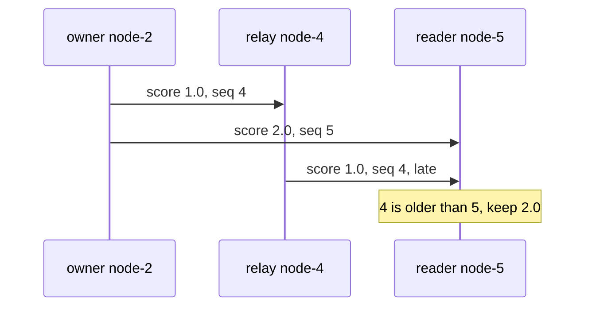

# Logical Clocks: Lamport Terms and Sequence Numbers

Two machines never agree exactly on the time, so "newest timestamp wins" is a coin flip for
events that happen close together. A **logical clock** is just a counter that answers the
question we actually care about: "did this claim come after that one?"

Analogy: version numbers on a shared document. You do not care what time "v7" was saved, only
that v7 beats v6.

Three ideas cover almost everything:

- **Lamport clock:** every process keeps a counter. Bump it on each event. On receiving a
  message with counter $t$, set yours to $\max(L, t) + 1$. If $a$ caused $b$, then
  $L(a) < L(b)$.
- **Per-author sequence number:** if only one node ever writes a value, it bumps a counter on
  each change and everyone else just copies it. Any two versions are then easy to order.
- **Epoch plus sequence:** a restarted process loses its counter, so pair it with an epoch that
  grows on each restart. Compare the epoch first, then the sequence.

## How swarm-net uses it

- `Member.Incarnation` (`backend/pkg/cluster/member.go`) is the epoch. A node sets it from the
  wall clock once at start (`backend/cmd/swarm-node/main.go`) and only adds 1 after that.
- `Member.Seq` orders a node's own role and score claims. Only that node bumps it.
- `Table.Upsert` compares incarnation first, then `Seq`
  (see [Monotonic Merge and Incarnation](/concepts/monotonic-merge-and-incarnation)).
- A node's **term** counts leader-set changes it has seen. On receipt it takes the max with
  **no** +1 (`handleHeartbeat` in `backend/pkg/cluster/heartbeat.go`). A heartbeat with a lower
  term is not counted as liveness.
- Snapshots are ordered by `(Term, Version)` (`newerSnapshot` in
  `backend/pkg/cluster/replication.go`).

A late relay cannot undo a newer claim, because the reader compares `Seq`:

## Common pitfalls

- **Comparing counters from different authors.** `View.Version` is local to one node. Comparing
  it with another node's number means nothing.
- **A relay bumping someone else's counter.** Only the owner may raise its `Seq`. A relay that
  bumps it makes stale data look new.
- **Adding +1 to terms on receipt.** A leader and worker would bump each other on every beat
  and ack, forever.
- **Thinking a term prevents split-brain.** It only catches a leader that is behind its own
  workers. Two partitions can still each have their own leaders.

## Further reading

- [Split-Brain and Quorum](/concepts/split-brain-and-quorum)
- Lamport, [Time, Clocks, and the Ordering of Events](https://lamport.azurewebsites.net/pubs/time-clocks.pdf)
