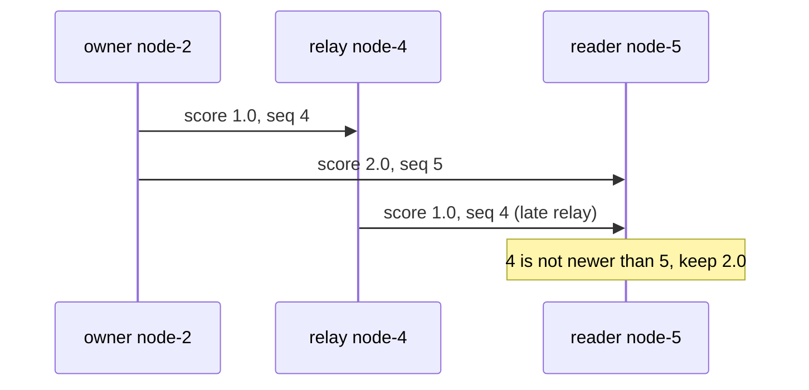
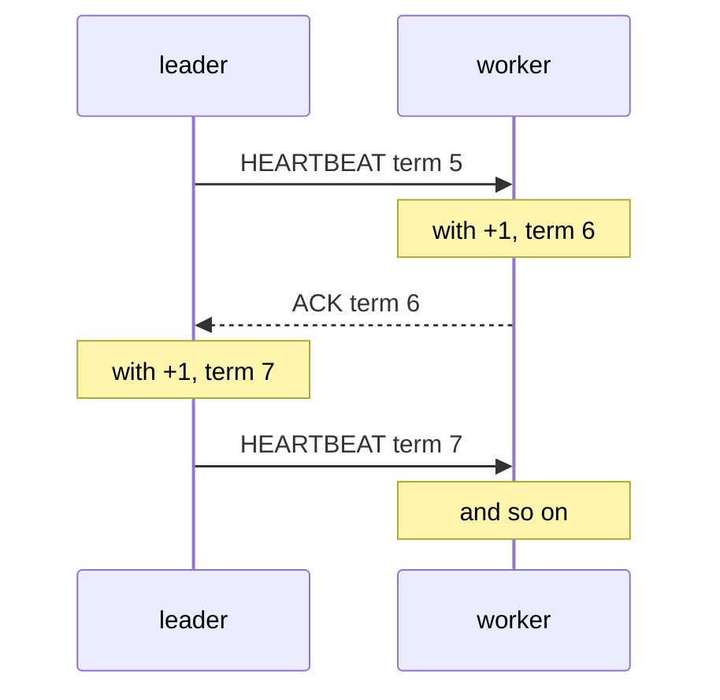

# Logical Clocks: Lamport Terms and Sequence Numbers

This swarm never orders two events by comparing timestamps from two machines. It uses
counters. This page explains why, the two classic counter rules, and every counter in the code.

Prerequisite: [Monotonic vs Wall Clocks](/concepts/monotonic-vs-wall-clocks).

---

## Core Mental Model

### Why not timestamps

Two machines' wall clocks disagree by milliseconds on a good day and by seconds after an NTP
step. A message can arrive "before" it was sent. So "newer timestamp wins" is a coin flip for
any two events closer together than the clock skew, and gossip relays events that are
milliseconds apart all the time.

What we actually need is narrower: **did this claim come after that one?** A counter answers it
exactly, if the right process bumps it.

### Rule 1: Lamport clocks

Leslie Lamport (1978). Every process keeps a counter $L$.

| Event | Rule |
|---|---|
| local event | $L \leftarrow L + 1$ |
| send | attach $L$ |
| receive a message carrying $t$ | $L \leftarrow \max(L, t) + 1$ |

It guarantees: if $a$ caused $b$, then $L(a) < L(b)$. The converse does not hold: a smaller
number does not mean "happened before". Lamport clocks cannot detect concurrency.

### Rule 2: per-author sequence numbers

If a value has **exactly one writer**, ordering is easy. The writer bumps a counter on every
change. Everyone else only copies it.



No clock skew, no concurrency: there is only one writer, so any two versions are ordered. A
vector clock is the multi-writer generalisation. A version vector with one entry per member,
where only that member writes its entry, is exactly what `Seq` is.

### Epoch plus sequence

A process that restarts loses its counter. Pair the counter with an **epoch** that is bigger
after every restart, and compare lexicographically:

$$
(e_1, s_1) < (e_2, s_2) \iff e_1 < e_2 \;\lor\; (e_1 = e_2 \land s_1 < s_2)
$$

The sequence may reset to 1 after a restart. The higher epoch makes that safe. In this swarm the
epoch is the incarnation, and the pair is (Incarnation, Seq).

---

## Under the Hood

### Every counter in the swarm

| Counter | Orders | Who bumps it | Compared across nodes? | Code |
|---|---|---|---|---|
| `Incarnation` | a member's lives | the member at start (Unix seconds) and on refutation. An observer, by one, when recording a death | yes | `pkg/cluster/member.go:84` |
| `Seq` | a member's role and score claims within one incarnation | only the member | yes, for the same member | `pkg/cluster/member.go:93` |
| `Term` | leader-set changes this node has seen | the node, on its own election change. Reconciled by max over the leader-worker link | only between a leader and its workers | `pkg/cluster/node.go:363` |
| `StateSyncPayload.Version` | one leader's snapshots | that leader | no, paired with `Term` | `pkg/cluster/replication.go:77` |
| `View.Version` / `ViewVersion` | one node's table mutations | that node | **no** | `pkg/cluster/member.go:106`, `pkg/protocol/message.go:406` |
| `HeartbeatPayload.Seq` | beats on one link | the leader | no | `pkg/cluster/heartbeat.go:45` |
| `probeSeq` | probe rounds on one node | the node | no, local only | `pkg/cluster/node.go:1472` |

### Incarnation and Seq together

`Upsert` compares incarnation first, then `Seq`, and handles liveness on its own axis:

```go
// pkg/cluster/member.go:236 (abridged)
switch {
case m.Incarnation > existing.Incarnation:
	// new life: take everything
case m.Incarnation < existing.Incarnation:
	return false
default:
	if m.State < existing.State {
		m.State = existing.State // liveness only worsens
	}
	switch {
	case m.Seq > existing.Seq:
		// newer claim, from anyone
	case m.Seq == 0 && existing.Seq == 0:
		// pre-Seq build: old rules
	default:
		m.Role, m.Score, m.Seq = existing.Role, existing.Score, existing.Seq
	}
}
```

Liveness is not ordered by `Seq` because it is **not** single-writer: any observer may say
"dead". That is why a death bumps the incarnation instead. See
[Monotonic Merge and Incarnation](/concepts/monotonic-merge-and-incarnation).

A node starts at `Seq: 1` (`pkg/cluster/node.go:499`), so its first real claim beats the `Seq: 0`
placeholder a peer creates from the handshake.

### Terms: Lamport without the +1

Each node bumps its term when **its own** leader set changes (`pkg/cluster/node.go:1717`). On
receipt it takes the max, with no +1:

```go
// pkg/cluster/heartbeat.go:92
case p.Term > n.term:
	n.term = p.Term
```

Why no +1: a term is "how many leader changes have I seen", not an event counter. With a +1 on
receipt, a leader and a worker would bump each other on every beat and ack, forever:



With plain max, both settle at 5 after one exchange.

What a term detects: a beat with a **lower** term than the worker's comes from a leader that has
not seen a leader change the worker saw. It is ignored as liveness
(`pkg/cluster/heartbeat.go:88`). What it cannot detect: two partitions each with their own
leader and their own term history. Terms are only reconciled where messages flow.

### Snapshot order: (Term, Version)

```go
// pkg/cluster/replication.go:287
func newerSnapshot(term, version, heldTerm, heldVersion uint64) bool {
	if term != heldTerm {
		return term > heldTerm
	}
	return version > heldVersion
}
```

`Version` is a per-leader counter, so it is only meaningful within one attachment. The worker
resets its held key whenever it attaches to a leader (`pkg/cluster/node.go:1435`).

### Where wall clocks still appear

`Envelope.SentAtUnixNano` (`pkg/protocol/message.go:235`) is a wall-clock reading. It is for
logs and dashboards. It never orders a claim, and RTT is measured on the sender's monotonic
clock instead.

---

## Why It Matters in This Swarm

- **`Seq` fixed a real divergence.** Before it, role and score were last-writer-wins by arrival
  order, and relayed full views made nodes elect different leaders. See
  [Convergence Debugging](/architecture/convergence-debugging).
- **A term is a split-brain hint, not a guard.** It catches a leader that fell behind its own
  workers. It does not stop two partitions from each electing leaders. See
  [Split-Brain and Quorum](/concepts/split-brain-and-quorum).
- **Incarnations come from a wall clock, once.** `time.Now().Unix()` at start
  (`cmd/swarm-node/main.go:222`) is only used as an epoch that grows across restarts. After that,
  every change is `+1`.

---

## Common Failure Modes & Edge Cases

### Comparing counters from different authors

Symptom: a node discards a fresh snapshot or view as "old". Cause: comparing `View.Version` or
`StateSync.Version` from two different nodes. Those counters have different authors and no
common scale.

### A relay bumps an owner's counter

Symptom: stale scores win again after a refactor. Cause: a code path calls `SetScore` or
`SetRole` on someone else's record, making `Seq` multi-writer. Only the member may bump it.

### Restart with a clock behind the last life

Symptom: a restarted node is briefly shown dead. Cause: its start-time incarnation is below a
death record (death adds one, refutation adds one). It heals through refutation. See
[Monotonic Merge and Incarnation](/concepts/monotonic-merge-and-incarnation).

### Term inflation

Symptom: terms in the dashboard climb into the hundreds. Cause: every leader-set change a node
sees adds one, and the max is spread over leader-worker links. A flapping swarm inflates
terms. The number itself is harmless, but a fast climb is a thrash signal.

### Counter overflow

`Seq`, `Term` and `Version` are `uint64`. At one bump per millisecond, overflow takes about
$5.8 \times 10^8$ years. Incarnation is `int64` and saturates instead of wrapping
(`NextIncarnation`, `pkg/cluster/member.go:373`), because it arrives from untrusted peers.

---

## See Also

- [Monotonic Merge and Incarnation](/concepts/monotonic-merge-and-incarnation) -- the merge that
  uses these counters.
- [Monotonic vs Wall Clocks](/concepts/monotonic-vs-wall-clocks) -- why timestamps cannot do
  this job.
- [Failure Detection and Failover](/architecture/failure-detection-and-failover) -- terms on the
  heartbeat path.
- [Replication and Tasks](/architecture/replication-and-tasks) -- (Term, Version) in use.
