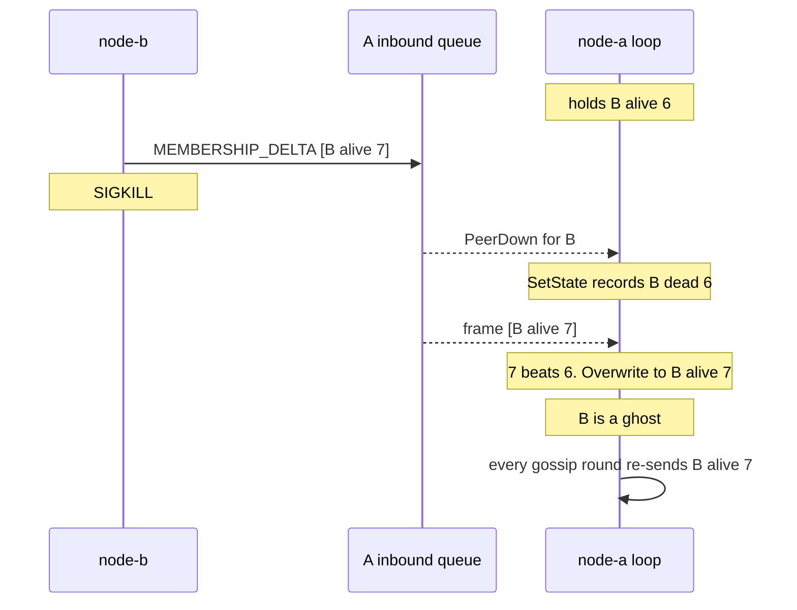
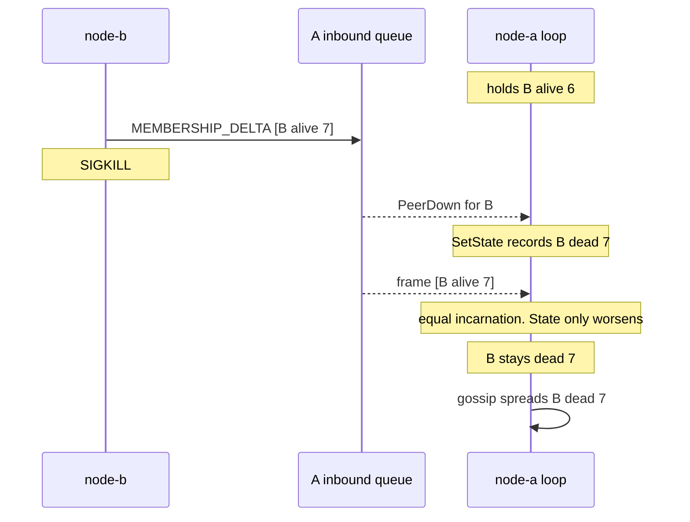
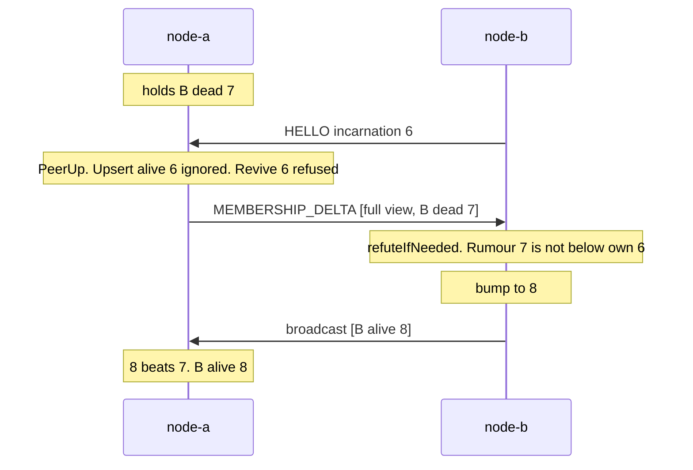

# Monotonic Merge and Incarnation

Gossip only converges if merging two beliefs can never go backwards. This page is the rule
that guarantees it, the bug that showed the rule was not enough on its own (audit finding
HIGH-2), and the one-line fix: **a death bumps the incarnation**.

Prerequisite: [Gossip and Anti-Entropy](/concepts/gossip-and-anti-entropy).

---

## Core Mental Model

### A record is a pair, ordered

Every claim about node B is a pair `(incarnation, state)`. Merging keeps the larger pair.


Read left to right as "is beaten by". Incarnation is compared first. At equal incarnation,
`alive < suspect < dead`.

### The three rules

`Table.Upsert` (`pkg/cluster/member.go:212`):

| Incoming vs held | Result | Line |
|---|---|---|
| higher incarnation | full overwrite, even back to alive | `pkg/cluster/member.go:224` |
| lower incarnation | ignored | `pkg/cluster/member.go:227` |
| equal incarnation | state may only get worse | `pkg/cluster/member.go:234` |

Worked examples, holding `B dead 6`:

| Incoming | Held after | Why |
|---|---|---|
| `B alive 5` | `B dead 6` | stale rumour |
| `B alive 6` | `B dead 6` | equal, alive is not worse than dead |
| `B alive 7` | `B alive 7` | B speaking after a refutation |

These three rules make the merge commutative, associative and idempotent. Any set of records,
merged in any order, any number of times, gives the same table. That is why gossip can
re-send the same full view forever without harm.

### Who may raise an incarnation

| Claim | Who makes it | Incarnation |
|---|---|---|
| "B is dead" | any observer | B's held incarnation **+ 1** |
| "B is suspect" (Phase 4) | any observer | B's held incarnation, unchanged |
| "B is alive" | only B | above any rumour about B |

The first row is the fix this page is about.

---

## Under the Hood

### The HIGH-2 interleaving, before the fix

B hears a rumour about itself and refutes it with `alive 7`. The frame reaches A's inbound
queue. Then B is killed. A's event loop `select` is ready on both the transport event and the
queued frame, and picks the event first.



Nothing buries the ghost. Phase 3 has no heartbeat to notice the silence, and under
anti-entropy every node holding `B alive 7` re-asserts it each round and wins each merge.

### After the fix

`SetState` bumps the incarnation on the transition to dead (`pkg/cluster/member.go:325`).

```go
// pkg/cluster/member.go:324-327
m.State = s
if s == StateDead {
	m.Incarnation = NextIncarnation(m.Incarnation)
}
```



The queued refutation is now an *equal* incarnation record, and the third rule rejects it.
`TestRefutationAtOldIncarnationLosesToDeath` (`pkg/cluster/member_test.go:212`) pins this
at the table level, and `TestDeadRecordConvergesAndStaysDead`
(`pkg/cluster/gossip_test.go:277`) pins it across real nodes under anti-entropy.

### The refutation path

A live node that was wrongly buried (a partition, not a crash) must still come back. It cannot
come back by reconnecting alone:

```go
// pkg/cluster/member.go:373
if !ok || incarnation < m.Incarnation {
	return false
}
```

Its handshake carries its own incarnation (6), which is below the death (7), so `Revive`
refuses it. It heals by speaking about itself instead:



| Step | Code |
|---|---|
| welcome view on every PeerUp | `pkg/cluster/node.go:639` |
| rumour about self detected | `pkg/cluster/node.go:952` |
| ignore alive or stale rumours | `pkg/cluster/node.go:1045` |
| bump past the rumour | `pkg/cluster/node.go:1051` |
| broadcast own record | `pkg/cluster/node.go:1062` |

If that broadcast is lost, anti-entropy carries B's own record to each peer within a cycle,
because every gossiped view includes the sender's own record.

### Saturation at MaxInt64

Incarnations come from peers, and Phase 3 has no authentication. A plain `+1` on
`math.MaxInt64` wraps to `math.MinInt64`, and a negative incarnation loses every merge.

```go
// pkg/cluster/member.go:342
func NextIncarnation(inc int64) int64 {
	if inc == math.MaxInt64 {
		return inc
	}
	return inc + 1
}
```

Both the death bump (`pkg/cluster/member.go:326`) and the refutation
(`pkg/cluster/node.go:1051`) go through it.

| Input | `inc + 1` | `NextIncarnation` |
|---|---|---|
| 7 | 8 | 8 |
| `MaxInt64` | `MinInt64` (loses every merge) | `MaxInt64` |

The price: at the ceiling a dead record can no longer be out-bumped, so that one member stays
dead until it rejoins under a new ID. That is a much smaller failure than an order that wraps.
Tests: `TestSetStateDeadSaturatesIncarnation` (`pkg/cluster/member_test.go:238`),
`TestNextIncarnation` (`pkg/cluster/member_test.go:248`).

---

## Why It Matters in This Swarm

- **Departures are dead records, not deletions.** `markLeft` (`pkg/cluster/node.go:712`)
  calls `SetState(id, StateDead)`. A deleted record has no incarnation to defend, so the first
  gossiped `alive` echo would re-insert it. `Table.Remove` (`pkg/cluster/member.go:390`) is
  no longer called by the node.
- **Order inside the equal-incarnation branch matters.** The state clamp runs *before* role,
  address and score are compared (`pkg/cluster/member.go:234`). A record sent only to report
  a role change carries whatever state its sender held, and without the clamp first it would
  resurrect a buried node. `TestRoleChangeCannotResurrectADeadNode`
  (`pkg/cluster/member_test.go:114`) pins it.
- **Suspect does not bump.** Suspicion (Phase 4) is a doubt, and the member must be able to
  refute it at the incarnation it holds. Only the verdict bumps
  (`pkg/cluster/member.go:325`).
- **Incarnation and view version are different things.** `View.Version`
  (`pkg/cluster/member.go:102`) and `ViewVersion` on the wire
  (`pkg/protocol/message.go:395`) are per-sender counters. They never order claims about a
  node. Only `Incarnation` (`pkg/cluster/member.go:84`) does.

### The tombstone cost

Dead records are never deleted in Phase 3. Garbage collection is Phase 4 work.

| Cost | Grows with |
|---|---|
| table memory | every distinct node ID ever seen |
| bytes per gossip view | the same, since `sendView` sends dead records too |
| `handleMembershipDelta` time | the same, one binary search per record |

A restart under the **same ID** reuses its tombstone: the new start-time incarnation is
higher, so the record is overwritten, not added. The growth comes from **new IDs**, for
example container names that change on every `docker compose up`.

Readers already filter the dead: `View.Alive` (`pkg/cluster/member.go:106`) for elections
and `View.Addresses` (`pkg/cluster/member.go:424`) for health retention.

---

## Common Failure Modes & Edge Cases

### A killed node flaps back to alive

Symptom: a node you killed shows as alive in some views, a leader is elected on it, and the
state never decays. Cause: the death was recorded at the victim's current incarnation, and a
refutation already in flight outranked it. This is HIGH-2.

### A healed partition stays split

Symptom: after a partition heals, the connections are back but each side still lists the
other as dead. Cause: a missing welcome view or a missing refutation. The handshake alone
can never revive a node that was declared dead (`Revive` refuses it by design). Check the
logs for `refuting rumour about self` (`pkg/cluster/node.go:1061`). If it never appears, the
view was never sent or never reached the node.

### Restart within the same second

Symptom: a node restarted twice in quick succession is briefly shown dead after its second
start. Cause: the incarnation is `time.Now().Unix()` (`cmd/swarm-node/main.go:158`), in
seconds, and every refutation and death adds one on top. A fast restart can come up *below*
the held death. It still heals, but through the refutation path above rather than on
connect.

### A member stuck dead forever

Symptom: one node ID is dead in every view, and restarting it changes nothing. Cause: a record
at `MaxInt64`, from corruption or a hostile peer. Nothing can out-bump it. Rejoin under a new
ID.

### Membership memory that only grows

Symptom: gossip frame size and table size climb steadily in a long-running swarm with churn,
while the alive count stays flat. Cause: tombstones for IDs that will never return. Expected
until Phase 4 adds garbage collection.

---

## See Also

- [Gossip and Anti-Entropy](/concepts/gossip-and-anti-entropy) -- how records travel and the
  repair bound.
- [Failure Detectors](/concepts/failure-detectors) -- who is allowed to say "dead", and the
  suspect state still to come.
- [Idempotence and Hysteresis](/concepts/idempotence-and-hysteresis) -- the same "repeat is
  harmless" property at the election layer.
