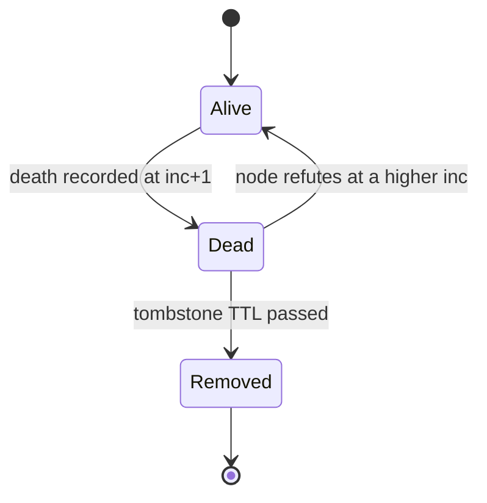

# Monotonic Merge and Incarnation

Gossip delivers the same news many times, late, and in any order. So merging two copies of a
record must always move "forward" and never back. That is a **monotonic merge**. Each record
about node B carries an **incarnation** (which "life" of B this is) and a state
(`alive < suspect < dead`). Merging keeps the larger pair: compare incarnation first, then
state.

Analogy: a newspaper correction. A correction for edition 7 beats anything printed in
edition 6, however late it arrives.

Because the merge only moves forward, it does not matter in what order records arrive or how
often. Every node ends up with the same table.

## How swarm-net uses it

`Table.Upsert` in `backend/pkg/cluster/member.go` applies four rules:

- **Higher incarnation:** take the whole record, even if it says "alive" again.
- **Lower incarnation:** ignore it. It is a stale rumour.
- **Same incarnation:** state may only get worse (alive to suspect to dead).
- **Same incarnation:** role and score change only with a higher `Seq`, which only the node
  itself bumps.

And who may raise what:

- **Any observer** recording "B is dead" uses B's incarnation **+ 1**, so an old "alive" copy
  can never beat it.
- **Only B** can say "alive" at a higher incarnation. It does this to refute a false rumour
  (`refuteIfNeeded` in `backend/pkg/cluster/node.go`), using `NextIncarnation`.
- **Tombstones** (dead records) are removed after 60 s (`DefaultTombstoneTTL`) by
  `sweepTombstones` in `backend/pkg/cluster/failure.go`.

## Common pitfalls

- **Recording a death without +1.** A stale "alive" at the same incarnation keeps arriving,
  and a killed node flaps back to alive.
- **Letting anyone bump `Seq`.** Relayed old scores then look new, and nodes elect different
  leaders.
- **TTL too short.** A tombstone must live long enough for the death to reach every node.
  Roughly $TTL > (2N - 1) \cdot T_{gossip}$. With a 2 s gossip interval, 60 s is enough up to
  about 15 nodes. Raise it for larger swarms, or dead nodes come back as "alive".
- **Tombstones kept forever.** Every full view grows with churn and never shrinks.

## Further reading

- [Logical Clocks](/concepts/logical-clocks)
- [Gossip and Anti-Entropy](/concepts/gossip-and-anti-entropy)
- SWIM paper: [Scalable Weakly-consistent Infection-style Membership](https://www.cs.cornell.edu/projects/Quicksilver/public_pdfs/SWIM.pdf)
