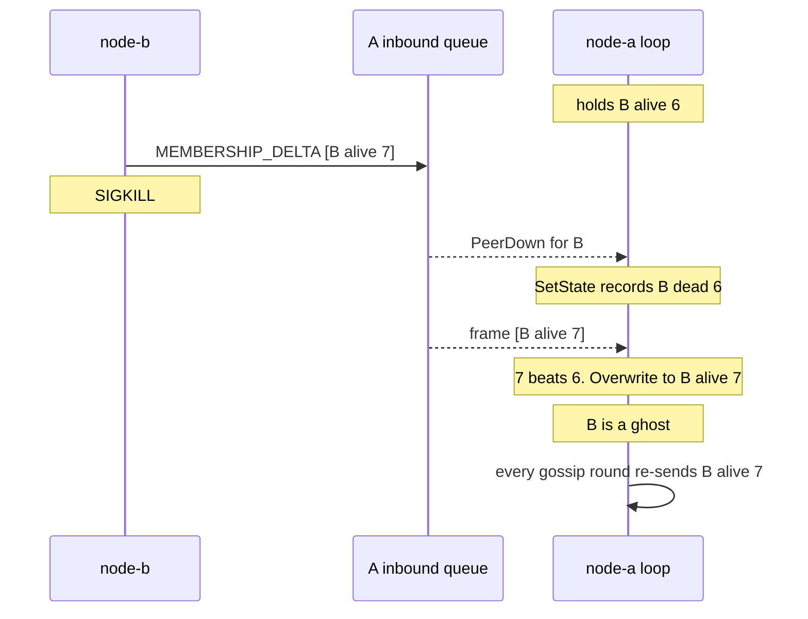
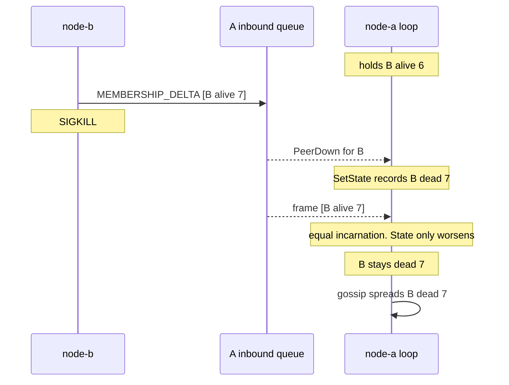
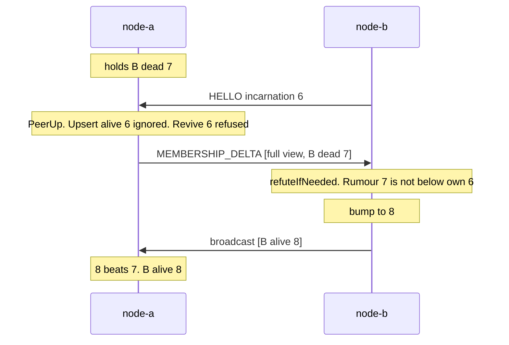
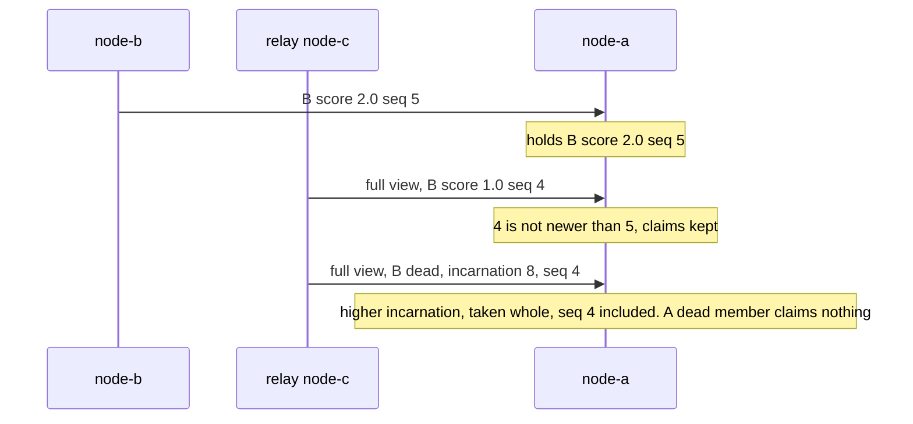
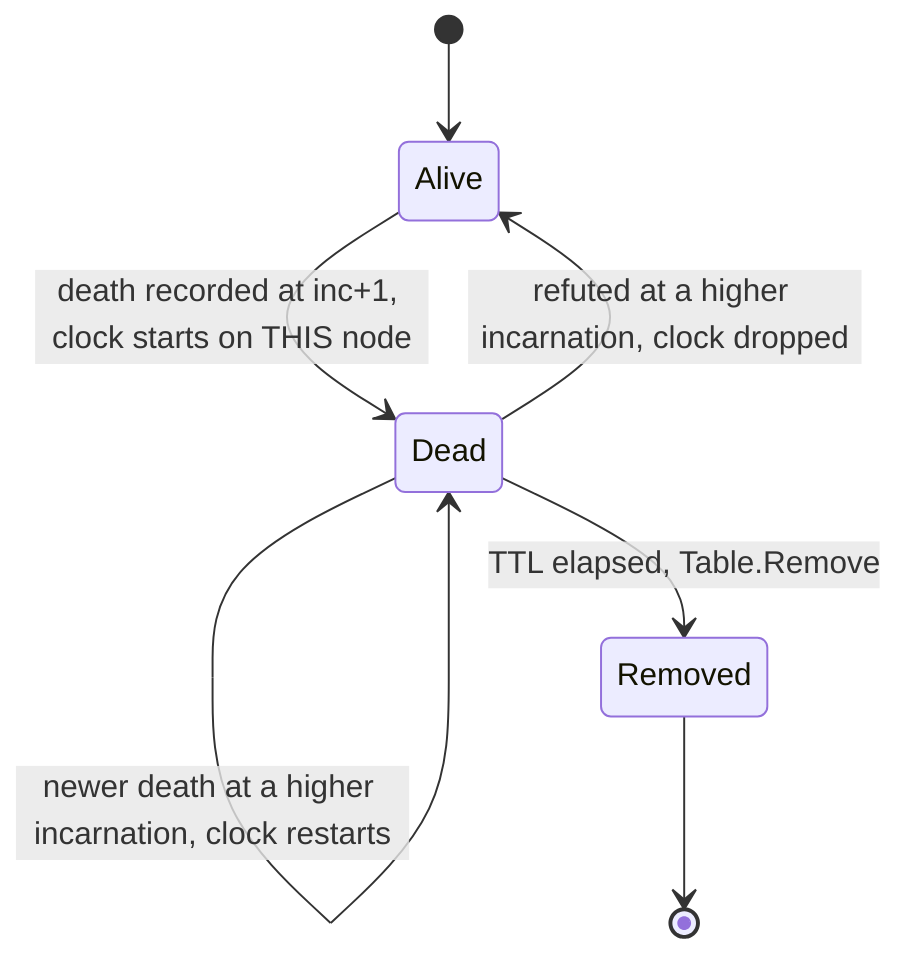

# Monotonic Merge and Incarnation

Gossip only converges if merging two beliefs can never go backwards. This page is the rule
that guarantees it, the bug that showed the rule was not enough on its own (audit finding
HIGH-2), and the one-line fix: **a death bumps the incarnation**.

Prerequisite: [Gossip and Anti-Entropy](/concepts/gossip-and-anti-entropy).

---

## Core Mental Model

### A record is a pair, ordered

Every claim about node B is a pair `(incarnation, state)`. Merging keeps the larger pair.


Read left to right as "is beaten by". Incarnation is compared first. At equal incarnation,
`alive < suspect < dead`.

### The four rules

`Table.Upsert` (`pkg/cluster/member.go:225`):

| Incoming vs held | Result | Line |
|---|---|---|
| higher incarnation | full overwrite, even back to alive | `pkg/cluster/member.go:237` |
| lower incarnation | ignored | `pkg/cluster/member.go:240` |
| equal incarnation | state may only get worse | `pkg/cluster/member.go:247` |
| equal incarnation | role and score taken only from a newer `Seq` | `pkg/cluster/member.go:251` |

Worked examples, holding `B dead 6`:

| Incoming | Held after | Why |
|---|---|---|
| `B alive 5` | `B dead 6` | stale rumour |
| `B alive 6` | `B dead 6` | equal, alive is not worse than dead |
| `B alive 7` | `B alive 7` | B speaking after a refutation |

These rules make the merge commutative, associative and idempotent. Any set of records,
merged in any order, any number of times, gives the same table. That is why gossip can
re-send the same full view forever without harm.

The fourth rule came later (see "Seq orders a member's own claims" below). Without it,
role and score were the one part of a record that did **not** merge monotonically.

### Who may raise which counter

| Claim | Who makes it | Incarnation | Seq |
|---|---|---|---|
| "B is dead" | any observer | B's held incarnation **+ 1** | carried |
| "B is suspect" | any observer | B's held incarnation, unchanged | carried |
| "B is alive" | only B | above any rumour about B | carried |
| "B's score or role is now x" | only B | unchanged | B's **+ 1** |

The first row is the HIGH-2 fix. The last row is the convergence fix.

---

## Under the Hood

### The HIGH-2 interleaving, before the fix

B hears a rumour about itself and refutes it with `alive 7`. The frame reaches A's inbound
queue. Then B is killed. A's event loop `select` is ready on both the transport event and the
queued frame, and picks the event first.



Nothing buried the ghost. Before Phase 4 nothing timed a silent record into a death, and under
anti-entropy every node holding `B alive 7` re-asserts it each round and wins each merge.
(Since Phase 4, failed probes would eventually suspect and kill the ghost again, at 8. The fix
below still matters: it stops the ghost from being elected in the meantime.)

### After the fix

`SetState` bumps the incarnation on the transition to dead (`pkg/cluster/member.go:356`).

```go
// pkg/cluster/member.go:355-358
m.State = s
if s == StateDead {
	m.Incarnation = NextIncarnation(m.Incarnation)
}
```



The queued refutation is now an *equal* incarnation record, and the third rule rejects it.
`TestRefutationAtOldIncarnationLosesToDeath` (`pkg/cluster/member_test.go:212`) pins this
at the table level, and `TestDeadRecordConvergesAndStaysDead`
(`pkg/cluster/gossip_test.go:311`) pins it across real nodes under anti-entropy.

### The refutation path

A live node that was wrongly buried (a partition, not a crash) must still come back. It cannot
come back by reconnecting alone:

```go
// pkg/cluster/member.go:404
if !ok || incarnation < m.Incarnation {
	return false
}
```

Its handshake carries its own incarnation (6), which is below the death (7), so `Revive`
refuses it. It heals by speaking about itself instead:



| Step | Code |
|---|---|
| welcome view on every PeerUp | `pkg/cluster/node.go:870` |
| rumour about self detected | `pkg/cluster/node.go:1241` |
| ignore alive or stale rumours | `pkg/cluster/node.go:1370` |
| bump past the rumour | `pkg/cluster/node.go:1376` |
| broadcast own record | `pkg/cluster/node.go:1388` |

If that broadcast is lost, anti-entropy carries B's own record to each peer within a cycle,
because every gossiped view includes the sender's own record.

### Seq orders a member's own claims

Incarnation orders a member's **lives**. Within one life, a member changes its score every few
seconds and its role now and then. Before Phase 4 those changes had no order at equal
incarnation: whichever record arrived last won. Relayed full views regularly delivered an old
score after a newer announcement, and nodes elected from different scores. The case study is
[Convergence Debugging](/architecture/convergence-debugging).

The fix is a second counter with a single writer:

```go
// pkg/cluster/member.go:282 (SetScore, trimmed)
m.Score = score
m.Seq++ // only ever called on the node's own record
```



| Incoming vs held, same incarnation | Role and score | State |
|---|---|---|
| newer `Seq` | taken, from anyone | clamped, only worsens |
| same or older `Seq` | kept | clamped, only worsens |
| both `Seq` 0 (older build) | old rule: a valid score is taken | clamped, only worsens |

State is not ordered by `Seq`. Any observer may say "dead", so liveness is not single-writer.
That is exactly why a death bumps the incarnation instead. Tests: `TestUpsertOrdersClaimsBySeq`
(`pkg/cluster/member_test.go:484`), `TestRelayedClaimsAreOrderedBySeq`
(`pkg/cluster/converge_test.go:633`). The counter family is on
[Logical Clocks](/concepts/logical-clocks).

### Saturation at MaxInt64

Incarnations come from peers, and the mesh has no authentication. A plain `+1` on
`math.MaxInt64` wraps to `math.MinInt64`, and a negative incarnation loses every merge.

```go
// pkg/cluster/member.go:373
func NextIncarnation(inc int64) int64 {
	if inc == math.MaxInt64 {
		return inc
	}
	return inc + 1
}
```

Both the death bump (`pkg/cluster/member.go:357`) and the refutation
(`pkg/cluster/node.go:1376`) go through it.

| Input | `inc + 1` | `NextIncarnation` |
|---|---|---|
| 7 | 8 | 8 |
| `MaxInt64` | `MinInt64` (loses every merge) | `MaxInt64` |

The price: at the ceiling a dead record can no longer be out-bumped, so that one member stays
dead until it rejoins under a new ID. That is a much smaller failure than an order that wraps.
Tests: `TestSetStateDeadSaturatesIncarnation` (`pkg/cluster/member_test.go:238`),
`TestNextIncarnation` (`pkg/cluster/member_test.go:248`).

---

## Why It Matters in This Swarm

- **Departures are dead records, not deletions.** `markLeft` (`pkg/cluster/node.go:961`)
  calls `SetState(id, StateDead)`. A deleted record has no incarnation to defend, so the first
  gossiped `alive` echo would re-insert it. The only deletion is tombstone collection, below.
- **Order inside the equal-incarnation branch matters.** The state clamp runs *before* role,
  address and score are compared (`pkg/cluster/member.go:247`). A record sent only to report
  a role change carries whatever state its sender held, and without the clamp first it would
  resurrect a buried node. `TestRoleChangeCannotResurrectADeadNode`
  (`pkg/cluster/member_test.go:114`) pins it.
- **Suspect does not bump.** Suspicion is a doubt, and the member must be able to refute it at
  the incarnation it holds. Only the verdict bumps (`pkg/cluster/member.go:356`).
  `TestSetStateSuspectKeepsIncarnation` (`pkg/cluster/member_test.go:201`).
- **Incarnation, Seq and view version are different things.** `View.Version`
  (`pkg/cluster/member.go:106`) and `ViewVersion` on the wire
  (`pkg/protocol/message.go:406`) are per-sender counters. They never order claims about a
  node. Only `Incarnation` (`pkg/cluster/member.go:84`) and, within it, `Seq`
  (`pkg/cluster/member.go:93`) do.

### Tombstones and their garbage collection

A dead record is a **tombstone**. It must live long enough to outrank every stale "alive" copy
still circulating, and no longer, or every full view grows with churn forever.

Since Phase 4, each node times every tombstone it holds and removes it after `TombstoneTTL`
(60 s, `pkg/cluster/node.go:55`), in `sweepTombstones` (`pkg/cluster/failure.go:233`):



| Detail | Why | Code |
|---|---|---|
| clock starts when this node first sees the death | there is no death timestamp on the wire | `pkg/cluster/failure.go:247` |
| removal also forgets the address | a real comeback under a new container is dialled again | `pkg/cluster/failure.go:268` |
| a relayed tombstone for an unknown member is dropped | two nodes that collected a death seconds apart would otherwise hand it back and forth forever | `pkg/cluster/node.go:1256` |

**How long is long enough?** The TTL must exceed the anti-entropy repair bound, the time for
the death to reach every node that could still hold "alive":

$$
TTL > (2N - 1) \cdot T_{gossip}
$$

| $N$ | $T_{gossip}$ | $(2N - 1) \cdot T_{gossip}$ | covered by 60 s? |
|---|---|---|---|
| 10 | 2 s | 38 s | yes |
| 15 | 2 s | 58 s | just |
| 20 | 2 s | 78 s | **no**, raise the TTL |

**The re-infection trade-off.** Collect too early and a stale "alive" record re-inserts the
member. That is not permanent: the ghost is probed, fails, is suspected and dies again within
about `DeadAfter` probe intervals, at the cost of one more tombstone cycle and a possible
election blip. Collect too late and every gossip frame carries the dead. The 60 s default picks
the first cost for swarms above about 15 nodes. Tests:
`TestTombstoneIsCollectedAfterTTL` (`pkg/cluster/failure_test.go:298`),
`TestNewerDeathRestartsTombstoneClock` (`pkg/cluster/failure_test.go:364`).

Readers filter the dead anyway: `View.Alive` (`pkg/cluster/member.go:110`) and
`View.Addresses` (`pkg/cluster/member.go:463`).

---

## Common Failure Modes & Edge Cases

### A killed node flaps back to alive

Symptom: a node you killed shows as alive in some views, a leader is elected on it, and the
state never decays. Cause: the death was recorded at the victim's current incarnation, and a
refutation already in flight outranked it. This is HIGH-2.

### A healed partition stays split

Symptom: after a partition heals, the connections are back but each side still lists the
other as dead. Cause: a missing welcome view or a missing refutation. The handshake alone
can never revive a node that was declared dead (`Revive` refuses it by design). Check the
logs for `refuting rumour about self` (`pkg/cluster/node.go:1387`). If it never appears, the
view was never sent or never reached the node.

### Restart within the same second

Symptom: a node restarted twice in quick succession is briefly shown dead after its second
start. Cause: the incarnation is `time.Now().Unix()` (`cmd/swarm-node/main.go:222`), in
seconds, and every refutation and death adds one on top. A fast restart can come up *below*
the held death. It still heals, but through the refutation path above rather than on
connect.

### A member stuck dead forever

Symptom: one node ID is dead in every view, and restarting it changes nothing. Cause: a record
at `MaxInt64`, from corruption or a hostile peer. Nothing can out-bump it. Rejoin under a new
ID.

### A departed node reappears a minute later

Symptom: a node that died over a minute ago shows up as alive again, briefly, then dies again.
Logs show `tombstone collected` for it shortly before. Cause: the tombstone was collected before
a stale "alive" copy had died out somewhere, usually in a swarm larger than the TTL covers.
Raise `TombstoneTTL` above $(2N - 1) \cdot T_{gossip}$.

### Stale scores win after a refactor

Symptom: nodes disagree about one member's score, and the disagreement does not heal. Cause: a
code path that changes another member's role or score through `SetScore` or `SetRole`, which
bump `Seq`. Only a node's own record may be written that way.

---

## See Also

- [Gossip and Anti-Entropy](/concepts/gossip-and-anti-entropy) -- how records travel and the
  repair bound.
- [Failure Detectors](/concepts/failure-detectors) -- who is allowed to say "dead", and the
  suspect state.
- [Logical Clocks](/concepts/logical-clocks) -- incarnation and `Seq` as counters.
- [Convergence Debugging](/architecture/convergence-debugging) -- the bug `Seq` fixed.
- [Idempotence and Hysteresis](/concepts/idempotence-and-hysteresis) -- the same "repeat is
  harmless" property at the election layer.
