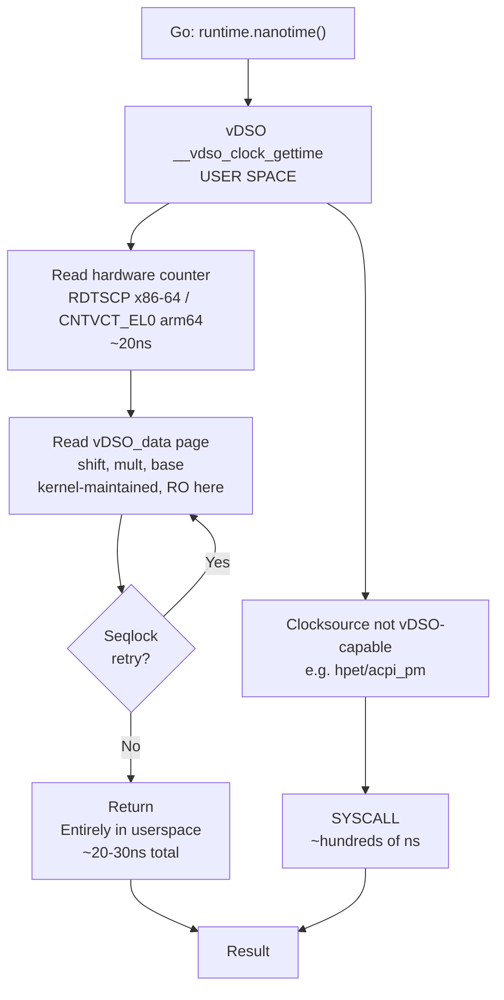
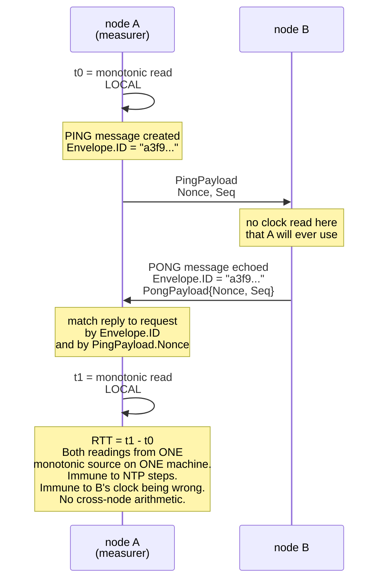

# Monotonic vs Wall Clocks: Measuring Duration Without Lying

`pkg/health` elects leaders on measured latency. `pkg/protocol` stamps every envelope with
a timestamp. Both of those are clock reads, and they are reads of **different clocks**,
for reasons that are not stylistic: mixing them up produces a swarm that elects the node
with the most badly skewed clock and cannot explain why.

`docs/WORKLOG.md` Sec.1.6 nominated this page as Phase-2 blocking, with the note "Small page,
high bug-prevention value." Two packages now depend on the distinction. Here it is.

---

## 1. Core Mental Model

### Two clocks, two jobs

```
CLOCK_REALTIME  ("wall clock")            CLOCK_MONOTONIC
----------------------------              ----------------------------

Question it answers:                      Question it answers:
  "What time is it?"                        "How much time has passed?"

Epoch: 1970-01-01 UTC                     Epoch: arbitrary, unspecified.
  (meaningful, shared, comparable)          In practice, boot. Meaningless
                                            outside this one machine.

Can jump forwards.      ^                 Cannot go backwards. Ever.
Can jump BACKWARDS.     | NTP, admin,     Cannot jump forwards.
Can be set by hand.     | VM migration,   Advances at (close to) 1 s/s,
Can be slewed.          v container start.  subject only to slewing.

Use for:                                  Use for:
  log timestamps                            timeouts
  scheduling ("at 03:00")                   RTT / latency measurement
  displaying "sent at"                      rate limiting
  cross-machine ordering HINTS              retry backoff
                                            anything subtracted
```

The rule that follows is one sentence and it is the whole page:

> **A duration question must never be answered with a realtime clock.**

"How long did that take", "has the deadline passed", "how long since the last heartbeat",
"what is this peer's RTT" -- all duration questions. All monotonic.

"When was this message sent", "what should the dashboard display", "what goes in the log
line" -- all point-in-time questions. All realtime, and all inherently untrustworthy across
machines.

### Why the wall clock jumps

It is not an edge case. On a normal Linux host the realtime clock is adjusted routinely:

- **NTP discipline.** `ntpd`/`chronyd`/`systemd-timesyncd` correct drift continuously.
- **Boot.** Many systems have no battery-backed RTC precision, or none at all in a VM;
  the first NTP sync after boot is frequently a multi-second correction.
- **VM migration and suspend/resume.** The guest's notion of time is restored from
  whatever the hypervisor says, which can be a large step.
- **A human.** `date -s`, or a container started with a deliberately skewed clock.

Each of those is a moment at which `time.Now()` can return a value *earlier* than a
`time.Now()` that already happened. Subtract the two and you get a negative duration.

---

## 2. Under the Hood

### `clock_gettime` and the vDSO

Both clocks are read through one syscall:

```c
int clock_gettime(clockid_t clk_id, struct timespec *tp);
/* clk_id in { CLOCK_REALTIME, CLOCK_MONOTONIC, CLOCK_BOOTTIME, CLOCK_MONOTONIC_RAW, ... } */
```

But a clock read is usually **not** a syscall. Linux maps a small page -- the vDSO,
"virtual dynamic shared object" -- into every process's address space at exec time. The
kernel keeps a timekeeping structure in that page (the counter's last value, the shift and
multiplier converting counter ticks to nanoseconds, the realtime offset), updating it on
every timer tick. `clock_gettime` in the vDSO reads the hardware counter directly -- on
x86-64 that is the `RDTSCP` instruction, on arm64 `CNTVCT_EL0` -- applies the conversion,
and returns, **entirely in userspace**.



You can confirm this: `strace` a program doing a million `time.Now()` calls and you will
see essentially zero `clock_gettime` syscalls. `cat /sys/devices/system/clocksource/clocksource0/current_clocksource`
tells you whether you are on `tsc` (vDSO-fast) or something like `hpet` or `xen`
(syscall-slow). This is why a Go clock read is ~20-30 ns and not ~500 ns, and why a
per-probe `time.Now()` is free at the scale `pkg/health` operates at.

The page is protected by a **seqlock**: the reader samples a sequence number before and
after, and retries if the kernel was mid-update. That is how a lock-free read stays
consistent without the reader ever entering the kernel.

### `CLOCK_MONOTONIC` vs `CLOCK_BOOTTIME` vs `CLOCK_MONOTONIC_RAW`

| Clock | Counts suspend time? | NTP-slewed? | Notes |
|---|---|---|---|
| `CLOCK_MONOTONIC` | **No** -- frozen across suspend | Yes | What Go uses |
| `CLOCK_BOOTTIME` | Yes | Yes | Real elapsed wall time since boot |
| `CLOCK_MONOTONIC_RAW` | No | **No** | Raw hardware counter, drifts freely |

The suspend distinction matters if you ever run a node on a laptop that sleeps: a
`CLOCK_MONOTONIC` deadline of 30 s, with a 2-hour suspend in the middle, fires 30 s of
*awake* time later. Go's timers are on `CLOCK_MONOTONIC`, so a `time.Ticker` does not
catch up on suspend -- it simply did not tick.

`CLOCK_MONOTONIC_RAW` is deliberately not NTP-slewed, which sounds purer but is worse for
most purposes: it drifts against real seconds by whatever the crystal's error is
(typically 10-100 ppm, i.e. up to ~9 s/day), so "one second" measured on it is not one
second.

### NTP: slew vs step

This is the distinction that determines whether a clock adjustment quietly degrades your
measurements or destroys them.

| Aspect | SLEW (adjtime/adjtimex) | STEP (settimeofday/clock_settime) |
|---|---|---|
| **Target offset** | +40 ms | -3 s (or other large offset) |
| **How the kernel adjusts** | Changes the RATE at which realtime advances, typically 500 ppm, gradually absorbing offset | Jumps the clock discontinuously |
| **Visual behavior** | `realtime ---- slope 1.0005 s/s for ~80s, then back to 1.0` | `realtime ---|-- DISCONTINUITY 3 seconds vanish or repeat` |
| **Monotonicity** | PRESERVED -- realtime never goes backwards | DESTROYED -- t2 < t1 even though t2 read later |
| **Damage to durations** | Off by <= 0.05%. Survivable. | Wrong by 3 s, possibly negative. THIS is the one that ruins you. |
| **Time cost** | 80 seconds to absorb 40 ms; ~5.5 hours to absorb 10 s | Immediate (but damages in-flight measurements) |
| **When it happens** | ntpd normal mode for small corrections | ntpd beyond step threshold (default 128 ms); chrony makestep at boot |

`CLOCK_MONOTONIC` is affected by slew (it shares the same frequency discipline) and is
**never** affected by a step. That single property is the whole reason it exists.

**Leap seconds** are a related hazard. A positive leap second inserts 23:59:60 UTC. Linux's
historical handling was to step the clock back one second, and the resulting duplicate
second broke a considerable amount of software in 2012 and 2015. The modern practice is
**smearing**: spreading the extra second over a window (Google smears across 24 hours,
AWS across 24 hours centred on the leap) as a slew, so the clock never repeats or reverses.
A smeared clock is up to ~0.0012% wrong for a day, which is fine for timestamps and
irrelevant to anything on `CLOCK_MONOTONIC`.

### Go specifically: `time.Time` carries both readings

This is the part most Go programmers have absorbed as "Go handles it for you", which is
true right up until it isn't.

A `time.Time` returned by `time.Now()` contains **two** readings:

| Field | Type | Contents |
|---|---|---|
| `wall` | `uint64` | Flag bit (has monotonic?) + seconds-since-1885 + nanoseconds (WALL reading from runtime.walltime) |
| `ext` | `int64` | When monotonic flag is set: MONOTONIC reading in nanoseconds since process start (from runtime.nanotime) |
| `loc` | `*Location` | Time zone location |

Behavior notes:
- Top bit of `wall` = "has monotonic". Set by `time.Now()`. Cleared by many operations.
- `t2.Sub(t1)` and `time.Since(t)` use the **monotonic** readings when both operands have one. If either lacks it, they silently fall back to subtracting wall readings.

`time.Now()` calls `runtime.now`, which reads *both* `CLOCK_REALTIME` and
`CLOCK_MONOTONIC`, and packs both into the returned value.

Then:

- `t2.Sub(t1)` and `time.Since(t)` use the **monotonic** readings **when both operands
  have one**. If either lacks it, they silently fall back to subtracting wall readings.
- `t.Before(u)`, `t.After(u)`, `t.Equal(u)` do the same.
- `t.Format`, `t.Unix()`, `t.Year()` etc. use the **wall** reading, always.

The fallback is silent. There is no error, no panic, no vet warning. A correct duration
computation becomes an incorrect one with no visible change at the call site.

### Operations that strip the monotonic reading

Memorise this list; it is the entire bug surface.

| Operation | Strips? | Why |
|---|---|---|
| `t.Round(d)`, `t.Truncate(d)` | **yes** | Rounding a monotonic reading is meaningless |
| `t.UTC()`, `t.Local()`, `t.In(loc)` | **yes** | Changing location is a wall-clock operation |
| `t.AddDate(y, m, d)` | **yes** | Calendar arithmetic is wall-clock arithmetic |
| `t.Add(d)` | no | Shifts both readings |
| `time.Unix(sec, nsec)`, `time.Date(...)` | **n/a -- never had one** | Constructed from wall values |
| `json.Marshal` / `Unmarshal`, `gob`, `MarshalText` | **yes** | RFC 3339 has no field for it |
| `t.UnixNano()`, `t.Unix()`, `t.UnixMilli()` | **yes -- returns a bare int64** | The result is a wall value with no monotonic component at all |
| `fmt.Println(t)` | doesn't strip, but prints `m=+0.000123` so you can see it | |

The `String()` behaviour is a useful debugging tool: a `time.Time` with a monotonic
reading prints as

```
2026-09-16 11:04:33.918273 +0000 UTC m=+0.000412618
```

and one without prints the same thing minus the `m=+...` suffix. If you are unsure whether
a value still carries its monotonic reading, print it.

### A concrete strip, and the wrong answer it produces

```go
package main

import (
	"fmt"
	"time"
)

func main() {
	start := time.Now()

	// Someone "normalises" the timestamp for a log line. Entirely reasonable-looking.
	start = start.UTC() // <- STRIPS the monotonic reading. Nothing warns.

	work()

	// time.Since(start) now subtracts WALL readings, because start has no monotonic
	// component. If NTP stepped the clock backwards by 2s during work(), this is
	// negative. If it stepped forwards, this is inflated by 2s.
	elapsed := time.Since(start)
	fmt.Println("elapsed:", elapsed) // elapsed: -1.998s
}

func work() { time.Sleep(50 * time.Millisecond) }
```

Two things about this example are worth dwelling on:

1. The `.UTC()` call is *correct in isolation*. It is the kind of line that gets added in
   an unrelated commit ("make log timestamps consistent") and reviewed favourably.
2. The bug is invisible until a clock step happens. It will pass every test, every staging
   run, and every day in production until an NTP correction lands during the measured
   window. The correct fix is to never reuse the measurement `time.Time` for display:
   keep `start := time.Now()` untouched and derive a separate display value.

`t.UnixNano()` is the same strip with an extra property: the result is an `int64`, so
there is no `time.Time` left to interrogate. Once a timestamp is an `int64`, the monotonic
reading is gone irrecoverably, and the number is a pure wall-clock value.

### Timers, tickers, and context deadlines are monotonic

`time.Timer`, `time.Ticker`, `time.After`, `time.Sleep` and `context.WithTimeout`/
`WithDeadline` are all driven by the runtime's timer machinery, which stores deadlines as
`runtime.nanotime()` values -- monotonic. Stepping the wall clock does **not** fire your
timers early or delay them.

This is why `context.WithTimeout(ctx, s.probeTimeout)` in
`pkg/health/latency.go:216` is trustworthy under a clock step, while a hand-rolled
`for time.Now().Before(deadline)` loop would not be. (`context.WithDeadline` stores an
absolute `time.Time`, and the runtime computes the remaining duration from it using
`time.Until`, which uses the monotonic reading when present -- which it is, for a deadline
derived from `time.Now().Add(d)`.)

Timers can fire *late* -- arbitrarily late under scheduler pressure -- but never early. See
[The GMP Scheduler](/concepts/go-scheduler-gmp) for why lateness is the normal failure
mode.

---

## 3. Why It Matters in This Swarm

### There is no clock synchronisation, and the design assumes there is none

`pkg/protocol/message.go:200-219` documents the swarm's position in the field comment on
`Envelope.SentAtUnixNano`, and it is worth reading as written:

> SentAtUnixNano is the sender's WALL-CLOCK reading at the moment of encoding.
>
> READ THIS BEFORE USING IT. It must NEVER be used to compute a duration by subtracting
> one node's timestamp from another's. There is no clock synchronisation in this swarm --
> no NTP inside the containers, nothing. Two nodes' wall clocks can differ by seconds, and
> each can be stepped backwards at any moment by the host's own time discipline.
> Subtracting across nodes therefore yields a number that is not merely imprecise but can
> be negative, and a latency-derived election that ingests it will confidently promote the
> node with the furthest-skewed clock.

The field's legitimate uses are enumerated at `message.go:214-216`: display in the
dashboard, and as a weak ordering hint between messages from the **same** sender. It is
consumed exactly once outside the constructor, by the debug dumper at
`pkg/protocol/dump.go:111`, which prints it. That is the correct and only use.

### Two machines' monotonic clocks are incomparable *by construction*

This is the fact that makes the whole cross-node timestamp question moot rather than
merely difficult. `CLOCK_MONOTONIC`'s epoch is **unspecified**. On Linux it is boot. So:

```
node-a, up for 3 days        node-b, restarted 4 minutes ago after a chaos kill
  mono  approx  259_200_000_000_000    mono  approx  240_000_000_000
       (259200 s)                    (240 s)
```

`a.mono - b.mono` = 258,960 seconds = three days. The two nodes are on the same bridge
network, microseconds apart. The number is not *imprecise*; it is not a measurement of
anything. There is no offset you could apply, because the epochs are unrelated by
definition and change on every restart.

This is why sending a monotonic reading across the wire would be strictly worse than
sending a wall reading: a wall reading is at least *approximately* comparable, and the
error is bounded by the clock skew. A monotonic reading has unbounded, meaningless error.
`PongPayload` (`pkg/protocol/message.go`, just above `HeartbeatPayload`) carries no
timestamp at all, and its comment says why: "any timestamp here would be a cross-node wall
clock reading and therefore useless for RTT."

### Therefore: RTT is always two local reads bracketing a correlation-ID match



The correlation ID is load-bearing, not decoration. `Envelope.ID`'s comment
(`pkg/protocol/message.go:190-195`) explains the failure it prevents: without it, a node
with several probes in flight on one connection cannot tell which PONG answers which PING,
"and its RTT measurements silently become wrong rather than absent." If PONG #2 is credited
to PING #1, the measured RTT is not a measurement error -- it is the wrong interval
entirely, and it can be near zero, which makes the peer look excellent.

`PingPayload.Nonce` is a second layer (`message.go`, in the `PingPayload` declaration): it
makes a replayed or mis-routed PONG detectable at the payload level, "so a stale response
cannot be credited as a fast one."

`TypePing`'s own comment at `pkg/protocol/message.go:66-68` states the rule at the message
level: "The RTT it measures is computed by the *sender*, locally, from a monotonic clock --
never from the timestamps in the envelopes."

### One chokepoint for wall-clock reads

`pkg/protocol/message.go:416`:

```go
func nowUnixNano() int64 { return time.Now().UnixNano() }
```

with the comment at `message.go:408-415`:

> It is a named function rather than an inline time.Now().UnixNano() so that there is
> exactly one place in the package where a wall-clock reading is taken, and so that place
> can carry this warning: calling .UnixNano() strips the monotonic reading that time.Now()
> embedded in the time.Time. That is correct here -- a monotonic reading is meaningless
> once it leaves this process -- and it is exactly why the resulting number must never be
> subtracted across nodes.

Why one chokepoint beats scattered calls:

1. **The warning has somewhere to live.** A comment above one function is read by everyone
   who touches the clock. A comment above one of nine `time.Now().UnixNano()` calls is
   read by one ninth of them.
2. **`grep` becomes an audit.** `grep -rn "time.Now()" pkg/` across the non-test tree
   returns exactly two production sites: `pkg/protocol/message.go:416` (this function,
   plus its comment lines) and `pkg/health/latency.go:437` (`start := time.Now()` in
   `TCPConnectProber`). Two. Both intentional, both documented. A reviewer can verify the
   swarm's entire clock discipline in one command -- and a third site appearing in a diff
   is a question worth asking.
3. **It is the seam for a fake clock.** When Phase 4 wants deterministic tests over
   envelope ordering, `nowUnixNano` becomes a package variable or a `Clock` field and
   every call site follows. Nine inlined calls would each need finding.
4. **It makes the strip explicit.** `nowUnixNano` *names* the operation as a wall-clock
   read. `time.Now().UnixNano()` scattered inline reads like "get the time", which is
   exactly the imprecision that causes the bug.

The `Envelope` is stamped at `message.go:329`, inside `NewEnvelope`. Every envelope in the
swarm gets its timestamp there and nowhere else.

### `pkg/health` measures monotonically and rejects anything that isn't

`TCPConnectProber` (`pkg/health/latency.go:432`) is the shipped default measurement, and
its body is the canonical pattern:

```go
start := time.Now()                                   // latency.go:437
conn, err := dialer.DialContext(ctx, "tcp", string(target))
if err != nil {
    return 0, err
}
elapsed := time.Since(start)                          // latency.go:445
```

`start` is never round-tripped, never `.UTC()`'d, never formatted, never marshalled. It is
used for exactly one thing: `time.Since`. Because both readings carry monotonic
components, the subtraction is monotonic.

The doc comment at `pkg/health/latency.go:425-431` states this and then states the
distributed corollary:

> For the same reason a peer's own timestamp is never used to compute a duration anywhere
> in this package: two machines' wall clocks have no defined relationship, and their
> monotonic clocks are incomparable by construction.

And `EvaluateScore` refuses to trust a `Prober` that disagrees
(`pkg/health/latency.go:226-232`):

```go
// A prober that reports a negative duration is broken (a wall-clock subtraction
// across an NTP step is the usual cause). Treat it as a failed probe rather than
// feeding a negative sample into the EWMA, where it would make a broken peer the
// most attractive leader in the swarm.
if rtt < 0 {
    return s.classify(ctx, target, fmt.Errorf("prober returned negative duration %v", rtt))
}
```

`Prober` is an injection point (`latency.go:26`) -- Phase 3 swaps in a mesh PING/PONG
prober, and a third party could supply another. The contract cannot *force* an
implementation to use a monotonic clock. So the strategy validates the one property that
a wall-clock mistake violates, and fails the probe rather than the swarm. The property is
pinned by `TestNegativeDurationIsRejected` (`pkg/health/latency_test.go:206`), whose
comment names the cause explicitly.

Routing it through `classify` rather than returning a bare error is the right call: it
means a strategy fed by a broken prober records the failure penalty and reports
`ErrUnreachable`, which is honest -- a peer whose latency cannot be measured is, for
election purposes, a peer that failed its probe. See
[Error Wrapping & Classification](/concepts/error-wrapping-and-classification).

---

## 4. Common Failure Modes & Edge Cases

### A negative sample elects the sickest node in the swarm

Lead with this one because it is the failure the code at `pkg/health/latency.go:230`
exists to prevent, and because its shape is representative of the entire class.

**The mechanism.** A prober computes its duration from wall-clock reads. NTP steps the
clock back 2 s mid-probe. The prober returns `-1.997s`. Without the guard, that reaches
`record` (`pkg/health/latency.go:313`), which converts it to `-1997.0` milliseconds and
folds it into the EWMA at `latency.go:325`:

```go
st.value = s.alpha*sampleMS + (1-s.alpha)*st.value
```

With `alpha = 0.3` (`DefaultAlpha`, `latency.go:36`) and a peer sitting at a healthy
`4.0 ms`:

```
  before:   4.0
  sample: -1997.0
  after:   0.3*(-1997.0) + 0.7*(4.0)  =  -599.1 + 2.8  =  -596.3
```

**What happens next.** `IsValidScore` (`pkg/health/strategy.go:146`) checks for NaN and
+/-Inf -- `-596.3` is neither, so it is a perfectly valid score. `Better`
(`strategy.go:160`) implements lower-is-better, and `-596.3` is lower than every honest
score in the swarm. The peer with the broken clock wins the election.

Then it stays won. The EWMA's recovery is geometric: from `-596.3`, with good `4.0 ms`
samples at `alpha = 0.3`, it takes roughly `ln(596/4) / ln(1/0.7)`  approx  14 probe intervals to
climb back to the honest range -- and one more clock step resets it. A single NTP step has
handed leadership to one node semi-permanently.

**The symptom, which is the nasty part.** Nothing errors. Nothing logs a warning. The
dashboard shows a leader with an absurd negative or implausibly small score, which is easy
to read as "the metric is a bit weird" rather than "the election is compromised." Task
throughput drops because the elected leader is the one machine with a misbehaving host
clock -- often a machine misbehaving in other ways too. The correlation between "bad clock"
and "bad node" makes this worse, not better.

**Why rejection beats clamping.** Clamping to zero would be the obvious alternative and is
worse: zero milliseconds is the *best possible* score, so a clamped negative sample still
wins every election. Clamping to the failure penalty would be defensible but conflates a
broken prober with a slow peer. Rejecting the sample and classifying the probe as failed
says the true thing: this measurement is not evidence about the peer.

### Cross-node timestamp subtraction

The generalisation of the above, arrived at by a different route: someone implements
one-way latency as `receivedAt - envelope.SentAtUnixNano`.

**Symptom:** the swarm's latency numbers are stable, plausible, and wrong. Each node's
measured "latency" to each peer is dominated by the constant clock offset between them,
not by the network. A node whose clock is 300 ms *behind* shows a 300 ms latency to
everyone; a node whose clock is 300 ms *ahead* shows -300 ms, and is therefore the best
node in the swarm. Nothing crashes. The dashboard looks like a working latency dashboard.

**Why it is attractive:** one-way delay is genuinely more informative than RTT for
asymmetric paths, and the field is *right there* in the envelope. The comment at
`message.go:200` exists to be read before that idea reaches an editor.

**The honest version** requires bounded clock uncertainty, which is the last failure mode
below.

### Log timestamps that go backwards

After an NTP step, log lines appear out of order -- or two lines share a timestamp that a
third line, logically between them, precedes. Symptom during an incident: a causal chain
that reads as impossible ("the reply is logged before the request"), and a dozen wasted
minutes assuming a code bug.

This one is *not* fixable by using a monotonic clock, because a log timestamp must be a
wall-clock reading to be meaningful at all. The mitigations are: log a monotonic offset
alongside the wall time when ordering matters; use a per-node sequence number (which the
protocol already has for heartbeats, `HeartbeatPayload.Seq`, today diagnostic only: the
worker counts beat-less ticks, see [Failure Detectors](/concepts/failure-detectors)); and never correlate across nodes
by timestamp.

### The suspended node

A container or host suspended for 30 minutes resumes with `CLOCK_MONOTONIC` having
advanced by ~0 (it is frozen across suspend) and `CLOCK_REALTIME` having advanced by 30
minutes. A `time.Ticker` scheduled to beat every second did not beat at all during the
suspend and does not catch up -- it fires once and continues.

Symptom: after resume, the node believes almost no time has passed while every peer has
evicted it for 1,800 consecutive missed heartbeats. It rejoins as a stranger with no
history. This is *correct* behaviour for the swarm, but it is surprising the first time,
and it is why `CLOCK_BOOTTIME` exists -- a liveness check that wants to know "how long was
I actually gone in the real world" needs `CLOCK_BOOTTIME`, not `CLOCK_MONOTONIC`.

### Measuring an interval with wall-clock arithmetic that "worked in testing"

The `.UTC()` example in Sec.2 is the archetype. The general symptom is a metric that is
correct 99.99% of the time and produces a wild outlier at irregular intervals -- typically
around 03:00 local, when scheduled NTP corrections tend to land, or shortly after a host
reboots. The outlier is then dismissed as a spike. A negative one is dismissed as a
rendering bug.

Detection: assert non-negativity at every boundary where a duration enters a statistic.
That is exactly what `latency.go:230` does, and what
`pkg/health/latency_test.go:566-568` does for the integration-style test ("Non-negative and
finite is the only honest claim").

### "Just run NTP and assume the clocks agree"

The tempting shortcut, and worth understanding precisely *why* it fails rather than
treating it as superstition.

NTP over a LAN typically holds hosts within single-digit milliseconds of each other; PTP
with hardware timestamping reaches sub-microsecond. That sounds sufficient -- until you ask
what the guarantee actually is. NTP gives you a *typical* offset. It does not give you a
**bound**. At any given instant a host may be mid-step, may have lost its upstream, may
have a lying upstream, or may be a VM whose clock the hypervisor just restored. The
distribution has no finite support, and correctness arguments over a clock need the
support, not the median.

The design that *does* work is bounded uncertainty, and Google's Spanner is the reference:
TrueTime's API does not return a timestamp, it returns an **interval**.

```
  TT.now() -> TTinterval{ earliest, latest }  with the invariant:
                                              the true absolute time lies
   earliest -----+--------- latest            within this interval.
                "now"
             epsilon approx 1-7 ms, derived from GPS + atomic clock
             references and known drift rates
```

Spanner then makes correctness *derive* from the bound rather than from accuracy: to
commit a transaction at timestamp `t`, it **waits out the uncertainty** -- it sleeps until
`TT.now().earliest > t`, guaranteeing that `t` is in the past everywhere. That deliberate
`commit-wait` is the price of depending on synchronised clocks, and it costs a couple of
milliseconds of latency on every transaction, plus GPS receivers and atomic clocks in
every datacentre.

The lesson for this swarm is not "Spanner is better." It is that depending on
cross-machine clock agreement requires either that hardware and that latency cost, or a
design that does not need the agreement. This swarm chose the second: measure durations
locally, correlate by ID, and treat cross-node timestamps as display data. That choice is
recorded in `pkg/protocol/message.go:200-216` and costs nothing.

---

## See also

- [Latency Measurement as a Statistic](/concepts/latency-as-a-statistic) -- what the EWMA
  does with the durations this page insists be measured correctly
- [Interface Polymorphism](/concepts/interface-polymorphism) -- why `Prober` is an
  injection point, and why that means its output must be validated rather than trusted
- [Wire Protocol Design](/concepts/wire-protocol-design) -- `Envelope.ID`, correlation, and
  what a timestamp field is legitimately for
- [Context & Cancellation Propagation](/concepts/context-cancellation) -- deadlines are
  monotonic, which is why `context.WithTimeout` survives a clock step
- [Error Wrapping & Classification](/concepts/error-wrapping-and-classification) -- how a
  rejected negative duration becomes an `ErrUnreachable`
- [The GMP Scheduler](/concepts/go-scheduler-gmp) -- why timers fire late but never early
