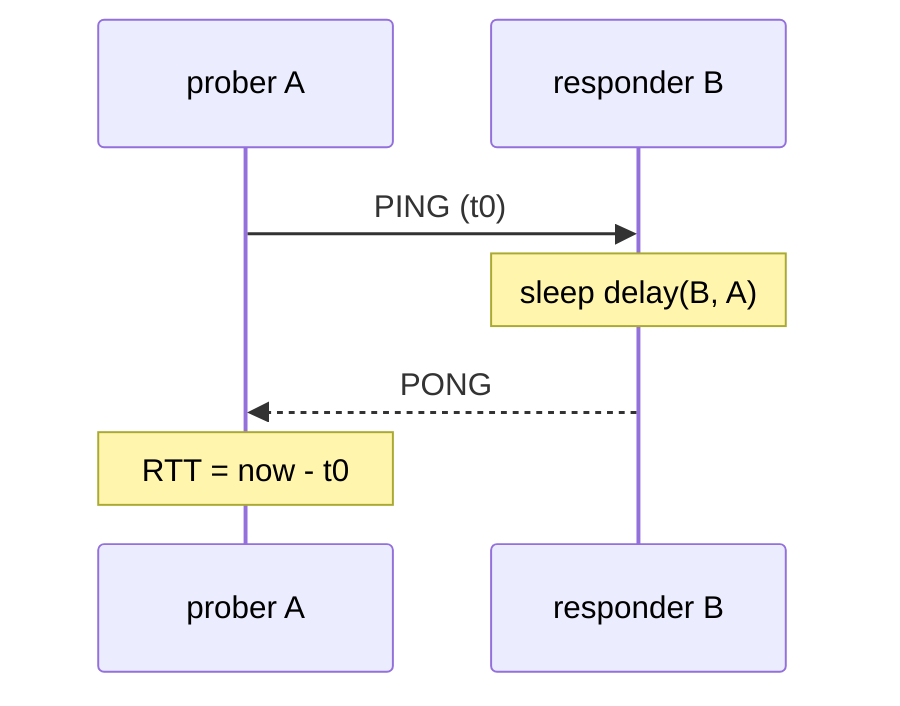
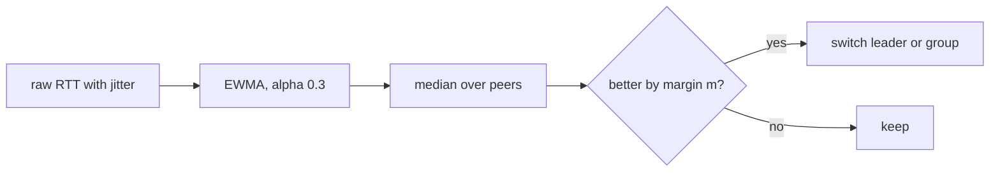

# Network Emulation: Turning Geometry into Latency

On one Docker bridge, every node is about 0.1 ms from every other one. A latency-driven election
has nothing to work with. Emulation adds a fake, controlled delay so the measured latency
follows a picture: drones in a 3D airspace.

## Core Mental Model

Pick **one** place on the path, and add the delay there:

$$RTT_{A \to B} \approx d_{net}(A, B) + d_{net}(B, A) + delay(B, A)$$

With $d_{net} \approx 0.05\,ms$ each way, the measured RTT is almost exactly one emulated
delay. The delay is symmetric ($\lVert a - b \rVert = \lVert b - a \rVert$), so A measuring B
and B measuring A see the same mean.

Where the delay could go:

| Place | Effect |
|---|---|
| kernel qdisc (`tc qdisc add dev eth0 root netem delay 20ms`) | every packet on the interface is delayed. Needs `CAP_NET_ADMIN`, and applies per interface, not per peer. |
| sender, before every frame | heartbeats slow down too. Enough delay causes false failovers. |
| both sides of the probe | RTT becomes two delays. Harder to read on the dashboard. |
| **responder, PONG only** | only the probe sees the delay. This is what swarm-net does. |

## Under the Hood

**`netem` for comparison.** `netem` is a Linux queueing discipline. Packets leaving the
interface are held in the qdisc queue (timestamped `skb`s) until their send time, then passed
to the driver. It delays TCP segments, so it also delays ACKs, which inflates the kernel's
`srtt` (see `ss -ti`, field `rtt:`) and can trigger retransmissions. It needs
`CAP_NET_ADMIN`, and swarm-net containers drop every capability.

**Application-level delay.** swarm-net delays inside the process instead:

- The reply goroutine waits on a timer channel (`time.NewTimer`) inside a `select` that also
  watches the prober's context. The goroutine is parked (`Gwaiting`) and uses no thread.
  The runtime timer heap wakes it.
- The TCP stack never sees a delay. The PING is ACKed at once, so kernel RTT and
  retransmission timers stay normal.
- The delay is per peer, because the responder knows who sent the PING (the envelope `From`).

**Jitter.** Each PONG draws a fresh $u \sim U[0, 1)$:

$$delay = base + d \times perUnit + jitter \times u, \qquad E[delay] = base + d \times perUnit + \frac{jitter}{2}$$

**Smoothing.** The prober feeds each RTT into an EWMA with $\alpha = 0.3$:

$$s_{k} = \alpha \cdot x_{k} + (1 - \alpha) \cdot s_{k-1}$$

After a step change, the part of the old value left after $k$ samples is $(1 - \alpha)^k$.
It takes $k = \lceil \ln(0.1) / \ln(0.7) \rceil = 7$ samples to cover 90% of the step. The
EWMA also shrinks jitter: its steady-state variance is $\frac{\alpha}{2 - \alpha} \approx 0.18$
of the raw variance.

**Hysteresis** is a separate filter, applied after smoothing: a leader or a worker's choice
changes only when the new option is better by the margin $m$.

- The EWMA decides **how fast** the score follows a move.
- Hysteresis decides **how big** a difference must be to act on.
- Rule of thumb: $m$ must exceed the smoothed jitter, or near-equal drones swap roles on noise.

## Why It Matters in This Swarm

- `backend/pkg/geo/geo.go`: `Delay` computes the one-way delay and caps it at 1500 ms, below
  the 2 s probe timeout in `backend/pkg/health/latency.go`. A far drone is slow, not dead.
- `backend/pkg/network/prober.go`: `SetPeerDelay` installs the hook, `replyDelay` adds it to
  the CHAOS delay for each PONG. Only PONGs are delayed, so heartbeats keep their timing and
  failure detection is untouched.
- `backend/pkg/telemetry/sim.go`: `Emulation.PeerDelay` reads the latest config through an
  `atomic.Pointer`, so the hot path of every PONG takes no lock.
- `backend/pkg/health/latency.go`: the EWMA (`DefaultAlpha = 0.3`).
- `backend/pkg/cluster/node.go`: `selfScore` takes the median of the smoothed RTTs, so a
  central drone scores best.
- `backend/pkg/cluster/election.go` and `backend/pkg/cluster/affinity.go`: the hysteresis
  margin, which the dashboard slider can change at run time (`backend/pkg/cluster/tuning.go`).
- `frontend/app.js`: the "predicted" link label uses the mean, $jitter / 2$, because that is
  what the EWMA converges to.

## Common Failure Modes & Edge Cases

| Symptom | Cause |
|---|---|
| nodes flap to `suspect` when drones move apart | the delay was put on heartbeats, not only PONGs |
| measured RTT is twice the predicted delay | both sides delay, or the delay was added to PING and PONG |
| a far drone is marked unreachable | the delay was not capped below the probe timeout |
| leaders swap every few seconds with high jitter | the margin is below the smoothed jitter. Raise hysteresis. |
| a moved drone keeps its group for several seconds | the EWMA is catching up (about 7 probes for 90%). Expected. |
| hysteresis 0 and leaders swap on every probe | 0 really means no damping at run time |
| `tc netem` fails inside the container | `CAP_NET_ADMIN` is dropped. Use the application-level delay. |
| delayed replies leak goroutines on shutdown | the timer wait does not also watch a context. The prober selects on its own context. |

## Further Reading

- [Drone Simulation](/architecture/drone-simulation)
- [Latency as a Statistic](/concepts/latency-as-a-statistic)
- [Idempotence and Hysteresis](/concepts/idempotence-and-hysteresis)
- [Cooperative vs Uncooperative Failure Injection](/concepts/cooperative-vs-uncooperative-failure-injection)
- [Heartbeat Intervals, Jitter and Timers](/concepts/heartbeat-intervals-and-timers)
