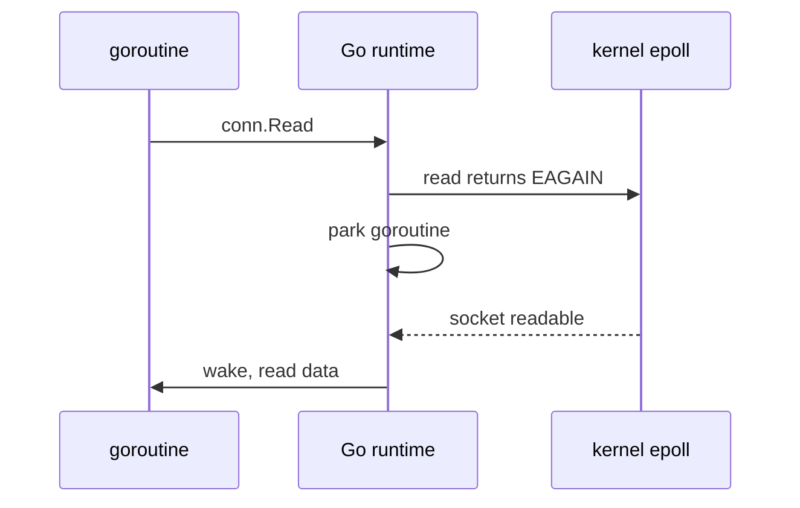

# Non-Blocking I/O: select, poll & epoll

A plain socket read **blocks**: the thread sleeps until data arrives. With thousands of
connections, one thread per connection is too expensive. **Non-blocking I/O** fixes this: a
read with no data returns `EAGAIN` at once, and the program asks the kernel "which of my
sockets are ready?".

Linux has three ways to ask:

- `select`: pass a bitmap of sockets every call. Limited to 1024 descriptors.
- `poll`: pass an array every call. No hard limit, but still scans every socket each time.
- `epoll`: register sockets **once** (`epoll_ctl`), then `epoll_wait` returns only the ready
  ones. Cost grows with activity, not with the number of sockets.

Analogy: `select`/`poll` is a waiter asking every table "ready to order?". `epoll` is tables
raising a hand.

Go hides all of this. You write blocking-looking code (`conn.Read`) in a goroutine. Under the
hood the runtime sets the socket non-blocking, and if there is no data it parks the goroutine
and registers the socket with epoll. When epoll reports it ready, the goroutine runs again.

## How swarm-net uses it

- Code in `backend/pkg/network/` never calls epoll directly. It uses `net.Conn` and lets the
  Go netpoller do the work.
- Each connection gets one reader and one writer goroutine (`NewConn` in
  `backend/pkg/network/conn.go`). A full mesh of $N$ nodes has about $N(N-1)$ sockets in total.
  Parked goroutines are cheap (a few KB each).
- Deadlines (`SetReadDeadline`) are also handled by the netpoller, so a silent peer wakes the
  reader with a timeout instead of blocking forever.
- The control center in `backend/cmd/control-center/` holds node connections plus one
  WebSocket per dashboard viewer on the same model.

## Common pitfalls

- **Assuming "ready" means "a whole message".** Readiness means at least one byte. Framing
  still has to loop (see [Stream Framing](./stream-framing)).
- **Reading with no deadline.** A peer that goes silent parks the goroutine forever.
- **Holding a lock across a read or write.** The goroutine parks with the lock held and blocks
  everyone else.
- **Running out of file descriptors.** Every socket is an fd. Check `ulimit -n` as the swarm grows.

## Further reading

- [The Go Netpoller](./go-netpoller)
- [TCP Sockets & The Kernel](./tcp-sockets-and-the-kernel)
- `man 7 epoll`
