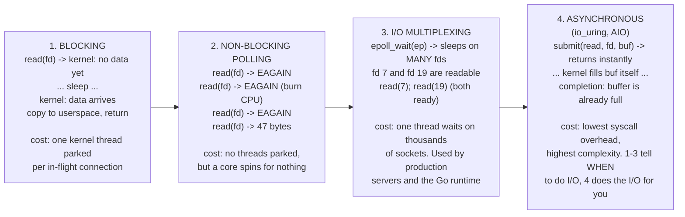
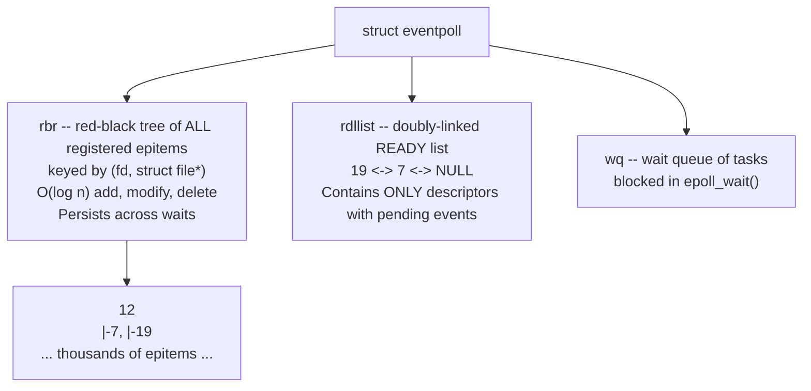

# Non-Blocking I/O: select, poll & epoll

Go hands you a beautifully simple deal: spawn one goroutine per connection, call `conn.Read`,
and let it block. That deal is a lie told by a very good liar. Underneath, the Go runtime holds
a single `epoll` instance per operating system thread group and never lets a real kernel thread
block on a socket if it can avoid it. This page is about what is underneath the lie, because the
moment you have `N` swarm nodes each holding `N-1` peer connections plus heartbeat timers, the
properties of that machinery -- how many descriptors it can hold, what it costs per wakeup, what
happens when you fail to drain a buffer -- become your properties.

Read this alongside [TCP Sockets & The Kernel](./tcp-sockets-and-the-kernel), which covers what a
socket *is*, and [The Netpoller](./go-netpoller), which covers how the Go runtime bolts the
mechanism described here onto the goroutine scheduler.

---

## Core Mental Model

### The four I/O models

Every I/O design in Unix is one of four shapes. The difference between them is entirely a
question of *who waits* and *where the waiting happens*.



Models 1-3 are all *readiness* notification: the kernel tells you a subsequent `read` will not
block, and you still perform the `read`. Model 4 is *completion* notification: the kernel performs
the transfer and tells you it is finished. Conflating readiness with completion is the single most
common source of confusion when people first meet `epoll` after using Windows IOCP or `io_uring`.

### The fundamental primitive: O_NONBLOCK

Multiplexing is useless without non-blocking descriptors. The primitive underneath everything on
this page is a single flag on the open file description:

```c
int flags = fcntl(fd, F_GETFL, 0);
fcntl(fd, F_SETFL, flags | O_NONBLOCK);
```

With `O_NONBLOCK` set, a `read()` on an empty socket receive buffer does not sleep. It returns
`-1` immediately with `errno == EAGAIN` (spelled `EWOULDBLOCK` on some systems; on Linux the two
constants are numerically identical, which is why portable C code writes
`if (errno == EAGAIN || errno == EWOULDBLOCK)`). Symmetrically, a `write()` into a full send
buffer returns `EAGAIN` rather than sleeping until the peer drains it.

`EAGAIN` is not an error. It is the kernel saying *"nothing to do right now, ask me later"*. The
entire discipline of event-driven networking is: do work until `EAGAIN`, then go back to waiting.
Every serious bug in this area is some variation of forgetting one half of that sentence.

---

## Under the Hood

### select(): the original, and its two hard walls

`select()` takes three bitmaps -- read, write, exception -- plus the highest descriptor number plus
one, and a timeout.

```c
int select(int nfds, fd_set *readfds, fd_set *writefds,
           fd_set *exceptfds, struct timeval *timeout);
```

An `fd_set` is a fixed-size bit array. On glibc/Linux:

```c
#define __FD_SETSIZE 1024
typedef struct {
    unsigned long fds_bits[__FD_SETSIZE / (8 * sizeof(long))];  /* 16 longs = 1024 bits */
} fd_set;
```

Two consequences follow directly from that struct, and neither is fixable:

**Wall one -- FD_SETSIZE.** Descriptor 1024 cannot be represented. `FD_SET(1024, &set)` writes past
the end of the array. This is not a documented error return; it is memory corruption. Raising
`RLIMIT_NOFILE` does not help, because the limit lives in a userspace type, not in the kernel.
People have tried recompiling with a larger `FD_SETSIZE`, which breaks the ABI against every
library that was compiled with the old one.

**Wall two -- the O(n) rescan.** The bitmaps are both input and output. Every call must:

1. copy the three bitmaps from userspace into kernel memory,
2. walk every set bit, look up the `struct file`, and call its `->poll()` method,
3. if nothing is ready, sleep on every one of those wait queues,
4. on wake, walk every bit *again* to determine which are ready,
5. copy the (now rewritten) bitmaps back out.

Then userspace walks all `n` bits a third time to find the ready ones. So even if exactly one of
your thousand connections has a heartbeat waiting, you pay a full thousand-element scan, twice in
the kernel and once in userspace, plus three bitmap copies across the syscall boundary -- every
single call. The bitmaps are destroyed by the call, so you must rebuild them from scratch before
the next one.

```
select() with 1000 idle fds and 1 ready:
  userspace: rebuild 3 bitmaps          ~1000 ops
  copy_from_user                        3 x 128 bytes
  kernel: poll() every fd               ~1000 ops
  kernel: rescan after wake             ~1000 ops
  copy_to_user                          3 x 128 bytes
  userspace: scan for the ready one     ~1000 ops
  -------------------------------------------
  useful work: one read(). Overhead: ~4000 ops.
```

### poll(): one wall down, one still standing

`poll()` replaces the fixed bitmaps with a caller-allocated array:

```c
struct pollfd {
    int   fd;
    short events;   /* what you want:    POLLIN | POLLOUT */
    short revents;  /* what you got -- kernel writes here  */
};
int poll(struct pollfd *fds, nfds_t nfds, int timeout);
```

This removes `FD_SETSIZE` entirely -- the array is as large as you make it -- and it separates
input (`events`) from output (`revents`), so you no longer rebuild the request set each time.
Those are real improvements.

What `poll()` does *not* fix is the complexity. The kernel still copies the whole array in, still
walks all `n` entries calling `->poll()`, still rescans on wake, still copies the whole array back.
The per-call cost grew from 1 bit per fd to 8 bytes per fd, so for large `n` the copy is actually
worse. `poll()` is `select()` with a better data type and identical asymptotics: **O(n) per call,
where n is the number of descriptors you are watching, not the number that are ready.**

That distinction is the whole story. For a swarm node holding 9 peers, nobody cares. For a server
holding 10,000 mostly idle connections -- the classic C10K problem -- it is fatal, and it is fatal
for a reason that has nothing to do with hardware speed. **C10K was a data-structure problem.**
The interest set was being rebuilt and rescanned on every wait, when it barely changes between
waits. The fix is not a faster scan; it is not scanning.

### epoll(): keep the interest set in the kernel

`epoll` splits the single `select()` call into three operations, separating the thing that rarely
changes (which descriptors you care about) from the thing that changes constantly (which of them
are ready).

```c
int epoll_create1(int flags);                              /* make the interest set  */
int epoll_ctl(int ep, int op, int fd, struct epoll_event *ev);  /* ADD / MOD / DEL   */
int epoll_wait(int ep, struct epoll_event *out, int maxevents, int timeout);
```

Inside the kernel, `struct eventpoll` holds two things:



When you `epoll_ctl(ADD)` a socket, the kernel allocates an `epitem`, inserts it into the
red-black tree, and -- crucially -- registers a **callback** (`ep_poll_callback`) on that socket's
own wait queue. There is no polling anywhere. When a packet arrives, the network softirq runs
`tcp_data_queue`, which wakes the socket's wait queue, which invokes `ep_poll_callback`, which
links that `epitem` onto `rdllist` and wakes anyone sleeping in `epoll_wait`.

`epoll_wait` therefore does not scan anything. It splices `rdllist`, copies out at most
`maxevents` entries, and returns. Its cost is **O(number of ready events)** and is completely
independent of how many descriptors are registered. Ten idle connections and ten million idle
connections cost the same to wait on.

This is why it scales: the expensive work (registration) happens once per connection lifetime
instead of once per event loop iteration.

### Level-triggered vs edge-triggered

`epoll` supports two notification semantics, and choosing wrongly produces one of the nastiest
classes of networking bug -- the kind where everything works in testing and one connection silently
freezes in production.

**Level-triggered (LT, the default):** `epoll_wait` reports a descriptor as readable *whenever
there is data in its receive buffer*. If you read 10 bytes of a 100-byte buffer and loop back to
`epoll_wait`, it reports readable again immediately. It behaves like `poll()`. It is forgiving.

**Edge-triggered (EPOLLET):** `epoll_wait` reports a descriptor only when its readiness state
*transitions* -- when new data arrives on a buffer the kernel considers you to have caught up with.
If you read 10 bytes of 100 and loop back, `epoll_wait` **blocks**, because no new packet has
arrived. The remaining 90 bytes sit in the receive buffer forever.

Here is the bug, concretely. Suppose a peer sends a 4-byte length prefix followed by a 900-byte
heartbeat payload (see [Stream Framing](./stream-framing) for why messages look like this), and
your read buffer is 512 bytes:

```
  t0  Peer writes 904 bytes.
  t1  Kernel receive buffer: [904 bytes]. Edge fires.
  t2  epoll_wait returns fd=7 EPOLLIN.
  t3  read(7, buf, 512) -> 512.  Handler parses the length prefix,
                                 sees it needs 904, has 512, waits for more.
  t4  Loop back to epoll_wait().
      Receive buffer still holds 392 bytes. But no NEW data arrived,
      so no NEW edge. epoll_wait does not return fd=7.
  t5  ... nothing happens. Ever. ...
  t6  The peer's heartbeat is never parsed. Your failure detector
      counts K missed beats and declares a perfectly healthy leader dead.
      A re-election runs. The "dead" leader is still sending fine.
```

The symptom is not a crash and not an error log. It is a *stall on one connection under load*,
because the bug only manifests when a message happens to exceed your read buffer -- which happens
only when the system is busy. That is the worst possible failure signature.

The rule that fixes it: **under EPOLLET you must loop on `read()` until it returns `EAGAIN`.**
Only `EAGAIN` proves you have drained the buffer and that the next arrival will generate a fresh
edge. The same applies symmetrically to `write()` -- write until `EAGAIN`, then and only then arm
`EPOLLOUT`.

Why use ET at all, given that trap? Two reasons. First, fewer syscalls: LT will keep returning a
writable socket on every single `epoll_wait` until you either write to it or deregister
`EPOLLOUT`, which in a write-idle server means the loop spins. Second, ET composes correctly with
multiple threads sharing one epoll set, because an event is delivered once rather than repeatedly
to every waiter.

### The thundering herd and EPOLLEXCLUSIVE

Classic shape: `M` worker threads or processes all add the *same* listening socket to their own
epoll instances (or share one), then all block. A single connection arrives. The kernel wakes
**all** `M` waiters. One wins the `accept()`; the other `M-1` get `EAGAIN` and go back to sleep,
having burned `M-1` context switches and cache-line bounces for nothing. At `M = 64` cores and a
high connection rate, most of the machine is doing nothing but waking up and disappointedly going
back to bed.

Linux 4.5 added `EPOLLEXCLUSIVE`:

```c
ev.events = EPOLLIN | EPOLLEXCLUSIVE;
epoll_ctl(ep, EPOLL_CTL_ADD, listen_fd, &ev);
```

which tells the kernel to wake *one* (or a small subset of) waiters per event rather than all of
them. The complementary approach is `SO_REUSEPORT`, where each worker gets its own listening
socket and the kernel hashes incoming connections across them, so there is no shared wait queue to
stampede in the first place.

Go's runtime dodges the problem structurally: there is one netpoller and one goroutine blocked in
`Accept`, and distribution of work happens in the scheduler rather than in the kernel wait queue.

### A brief, honest note on io_uring

`io_uring` (Linux 5.1+) is a genuine architectural change, not an `epoll` refinement. It is two
lock-free ring buffers shared between kernel and userspace: a submission queue you write
operations into, and a completion queue the kernel writes results into. It is a *completion*
interface -- you submit "read 4 KiB from fd 7 into this buffer" and later collect "done, 904 bytes"
-- and with `IORING_SETUP_SQPOLL` the kernel side can poll the submission ring so that steady-state
I/O involves **zero syscalls**.

So why does the Go runtime still use `epoll`? Honestly:

- **Portability.** Go's netpoller abstracts `epoll` (Linux), `kqueue` (BSD/macOS), and IOCP
  (Windows) behind one interface. `io_uring` exists only on Linux, and only on recent kernels.
- **Buffer ownership.** Completion-based I/O requires handing a buffer to the kernel for an
  unbounded period. That fights Go's garbage collector and its moving-stack model; the buffer must
  be pinned, and cancellation becomes genuinely hard to get right.
- **Security posture.** A number of distributions and container runtimes (including several
  default `seccomp` profiles, and Google's and others' production environments) restrict or
  disable `io_uring` outright following a run of exploitable bugs. A runtime that depends on it
  would simply fail to start in those environments.
- **The gain is small at our scale.** `io_uring` wins decisively at very high IOPS, particularly
  for storage. For a swarm of `N` nodes exchanging small heartbeat frames, the bottleneck is
  network latency and scheduling, not `epoll_wait` syscall overhead.

There is ongoing experimentation with an `io_uring`-backed netpoller, but as of Go 1.27 the
production path on Linux is `epoll`.

### The abstraction gap, side by side

This is the whole point of the page. Left: what the kernel offers. Right: what Go presents.

```c
/* --- C-shaped epoll loop (level-triggered, elided error handling) --- */

int ep = epoll_create1(EPOLL_CLOEXEC);

struct epoll_event ev = { .events = EPOLLIN, .data.fd = listen_fd };
epoll_ctl(ep, EPOLL_CTL_ADD, listen_fd, &ev);

struct epoll_event events[128];

for (;;) {
    int n = epoll_wait(ep, events, 128, -1);   /* O(ready), not O(registered) */
    for (int i = 0; i < n; i++) {
        int fd = events[i].data.fd;

        if (fd == listen_fd) {
            for (;;) {                          /* drain the accept queue */
                int c = accept4(listen_fd, NULL, NULL, SOCK_NONBLOCK);
                if (c < 0) {
                    if (errno == EAGAIN) break; /* queue empty: done */
                    break;                      /* real error */
                }
                struct epoll_event cev = { .events = EPOLLIN, .data.fd = c };
                epoll_ctl(ep, EPOLL_CTL_ADD, c, &cev);
            }
            continue;
        }

        char buf[4096];
        ssize_t r = read(fd, buf, sizeof buf);
        if (r > 0) {
            /* You now own a PARTIAL byte range. You must hold per-connection
               parse state on the heap yourself, because there is no stack to
               keep it on -- this callback returns before the message is whole. */
            conn_feed(conn_lookup(fd), buf, r);
        } else if (r == 0) {
            epoll_ctl(ep, EPOLL_CTL_DEL, fd, NULL);  /* peer sent FIN */
            close(fd);
        } else if (errno != EAGAIN) {
            epoll_ctl(ep, EPOLL_CTL_DEL, fd, NULL);
            close(fd);
        }
    }
}
```

```go
// --- The same server in Go. Identical syscalls underneath. ---

ln, err := net.Listen("tcp", ":7946")
if err != nil {
    return err
}
defer ln.Close()

for {
    conn, err := ln.Accept() // parks this goroutine in the netpoller
    if err != nil {
        return err
    }
    go handleConn(conn) // one goroutine per connection
}

func handleConn(conn net.Conn) {
    defer conn.Close()

    buf := make([]byte, 4096)
    for {
        // Blocks the GOROUTINE, never the OS thread. The runtime sets
        // O_NONBLOCK on the fd, registers it with epoll once at Accept
        // time, and on EAGAIN parks the goroutine until the netpoller
        // reports readiness.
        n, err := conn.Read(buf)
        if n > 0 {
            // Parse state lives on THIS goroutine's stack. That is the
            // entire ergonomic win: the partial-message problem that
            // forces heap-allocated per-connection state machines in C
            // collapses into an ordinary blocking read loop.
        }
        if err != nil {
            return // io.EOF on FIN, or a *net.OpError otherwise
        }
    }
}
```

The two programs issue essentially the same sequence of syscalls. Confirm it yourself:

```
$ strace -f -e trace=epoll_create1,epoll_ctl,epoll_pwait,accept4,read ./swarm-node
epoll_create1(EPOLL_CLOEXEC)            = 4
epoll_ctl(4, EPOLL_CTL_ADD, 3, {events=EPOLLIN|EPOLLOUT|EPOLLRDHUP|EPOLLET, ...}) = 0
epoll_pwait(4, [{events=EPOLLIN, data={u32=1861417480, ...}}], 128, -1, NULL, 0) = 1
accept4(3, NULL, NULL, SOCK_CLOEXEC|SOCK_NONBLOCK) = 7
epoll_ctl(4, EPOLL_CTL_ADD, 7, {events=EPOLLIN|EPOLLOUT|EPOLLRDHUP|EPOLLET, ...}) = 0
read(7, "\0\0\3\210{\"type\":\"heartbeat\"", 4096) = 904
```

Note `EPOLLET` in that registration: Go registers **edge-triggered** and both directions at once,
and it never calls `epoll_ctl(MOD)` to toggle interest. It can do that safely because the runtime
always drains to `EAGAIN` before parking a goroutine -- the discipline described above is
implemented once, correctly, inside `internal/poll`, rather than by every application author.
[The Netpoller](./go-netpoller) traces exactly how that parking and unparking works.

---

## Why It Matters in This Swarm

No Go code exists yet at the time of writing; what follows are commitments the implementation will
have to honour.

**`pkg/network/` will never see `epoll` directly, and that is a decision, not an accident.**
The transport layer will be written against `net.Listener` and `net.Conn` with one goroutine per
peer connection, because the framing logic -- read a length prefix, then read exactly that many
bytes -- is a state machine that is trivial on a goroutine stack and genuinely unpleasant as a
heap-allocated callback struct. The C column above shows what we are choosing not to write.

**`pkg/network/` will hold roughly `N x (N-1)` sockets across the swarm, plus listeners.**
At the `N = 10` target of `deploy/docker-compose.yml`, each node holds fewer than twenty
descriptors -- far inside `FD_SETSIZE`, and a regime where `select()` would in fact be adequate.
We are not using `epoll` because we need `epoll` at `N = 10`; we get it for free from the runtime,
and it means the design does not acquire a scaling cliff at `N = 1024` that nobody would have
noticed until it fired.

**Every goroutine blocked in `Read` costs about 8 KiB of stack, not an OS thread.** This is the
budget that makes the one-goroutine-per-connection topology of `pkg/cluster/` affordable. A node
holding a reader goroutine per peer, a heartbeat ticker per peer, and a health prober per leader
will run tens of goroutines against a handful of OS threads. Understanding that the parked
goroutines are *not* parked kernel threads is the difference between that design reading as
extravagant and reading as correct.

**`pkg/health/`'s latency probes depend on readiness semantics being honest.** A
`LatencyHealthStrategy` measures round-trip time by writing a probe and timing the response. If a
read ever stalled because a buffer was not drained -- the edge-triggered bug above -- the measured
latency would be an artefact of our own I/O bug, and the affinity clustering in `pkg/cluster/`
would route workers on the strength of a lie. We rely on `internal/poll` for that correctness; we
do not re-implement it.

**`deploy/docker-compose.yml` and the container image must not shrink the descriptor limit.**
Container runtimes have historically set `RLIMIT_NOFILE` to values as low as 1024, and Go's
runtime raises the soft limit to the hard limit at startup but cannot exceed the hard limit. The
Control Center in `cmd/control-center/` holds one WebSocket per dashboard viewer in addition to
the swarm mesh, so it is the process most likely to notice. The commitment: if the limit is ever
tightened, it is tightened deliberately and documented in the compose file, not inherited.

**`cmd/swarm-node/` will pass a `context.Context` into every read loop.** Since `epoll` readiness
never fires for "the operator asked you to stop", shutdown is expressed through deadlines and
connection closure rather than through the poller. See
[Context & Cancellation Propagation](./context-cancellation).

---

## Common Failure Modes & Edge Cases

**Edge-triggered without draining to EAGAIN.**
*Symptom:* one connection out of many silently stops making progress, only under load, with no
error logged. Heartbeats from a live peer stop arriving and a healthy leader is evicted.
*Cause:* a message larger than the read buffer left residue in the kernel receive buffer, and no
new edge ever fired. *Detection:* `ss -tmi` shows a non-zero `Recv-Q` on a socket your process is
idle on. If `Recv-Q` is non-zero and your process is in `epoll_wait`, you have this bug.

```
$ ss -tmi 'sport = :7946'
State  Recv-Q  Send-Q   Local Address:Port    Peer Address:Port
ESTAB  392     0        172.28.0.4:7946       172.28.0.7:51432
         skmem:(r4096,rb131072,t0,tb87040,f3704,w0,o0,bl0,d0)
```

`Recv-Q 392` with an idle process is the smoking gun.

**Treating EAGAIN as a fatal error.**
*Symptom:* connections dropped at random under load, correlating with traffic bursts.
*Cause:* code that checks `if err != nil { closeConn() }` without distinguishing "not ready" from
"broken". In Go this is largely handled for you, but it reappears the moment you set a deadline:
a deadline expiry surfaces as an error satisfying `os.ErrDeadlineExceeded` and `net.Error`'s
`Timeout() == true`, and it does **not** mean the connection is dead. Code must discriminate:

```go
n, err := conn.Read(buf)
if err != nil {
    var netErr net.Error
    if errors.As(err, &netErr) && netErr.Timeout() {
        // Idle, not broken. This is the heartbeat-deadline path:
        // count a missed beat and continue, do not tear down the peer.
        continue
    }
    return err // genuine failure: EOF, RST, or a closed descriptor
}
```

Getting this wrong in `pkg/cluster/` would mean a slow peer is treated identically to a dead one,
and a transient latency spike -- exactly what the chaos controls will inject -- would trigger a
spurious re-election.

**Blocking the event loop in a callback.**
*Symptom:* total server stall; every connection freezes simultaneously.
*Cause:* in a single-threaded C event loop, one blocking `DNS lookup`, one `fsync`, or one long
CPU loop inside a handler stops all `N` connections. This is the failure mode Go's model
structurally prevents -- a slow handler blocks its own goroutine, and the scheduler runs others --
but it returns in Go the instant you hold a global mutex across a network call. *Rule:* never hold
a lock over an I/O operation in `pkg/cluster/`'s state machine.

**File descriptor exhaustion.**
*Symptom:* `accept: too many open files`; the process stops accepting but existing connections
keep working, so it looks half-alive rather than dead.
*Cause:* leaked descriptors from missing `defer conn.Close()`, or a `RLIMIT_NOFILE` set too low
for the connection count. *Detection:* `ls /proc/<pid>/fd | wc -l` against
`cat /proc/<pid>/limits | grep files`. In a swarm this presents especially badly, because a node
that cannot accept but can still send heartbeats appears healthy to its own leader while being
unreachable to everyone else -- a one-way partition.

**Stale descriptor numbers after close.**
*Symptom:* reads and writes land on the wrong connection; occasional data delivered to the wrong
peer. *Cause:* descriptor numbers are reused immediately after `close()`. A queued event referring
to fd 7 may be dispatched after fd 7 has been closed and reassigned to a new connection. Kernel
`epoll` handles this via `struct file*` identity in the red-black tree, and Go handles it via a
generation counter in `internal/poll.FD`, but any application-level map keyed on the raw fd number
has this bug. *Rule:* key peer tables on a stable node identity, never on a descriptor number or a
resolved IP -- see [Docker Bridge Networking](./docker-bridge-networking) for why the IP half of
that rule bites hard under container restarts.

**Level-triggered EPOLLOUT left armed.**
*Symptom:* one core pinned at 100% with no traffic; `epoll_wait` returning immediately in a tight
loop. *Cause:* a socket registered for `EPOLLOUT` level-triggered is writable essentially always,
so `epoll_wait` never sleeps. *Fix:* arm `EPOLLOUT` only while you have buffered data to flush,
and `epoll_ctl(MOD)` it away once the buffer drains -- or use edge-triggered, which is what Go does.

**Assuming readiness implies a full message.**
*Symptom:* garbled or truncated frames; a JSON decoder failing on valid data.
*Cause:* `EPOLLIN` means *at least one byte* is available. It says nothing about message
boundaries, which TCP does not have. This is the core of [Stream Framing](./stream-framing), and
it is the bug that a length-prefixed protocol plus `io.ReadFull` exists to make unrepresentable.

---

## Further Reading

- [TCP Sockets & The Kernel](./tcp-sockets-and-the-kernel) -- what is behind the descriptor: the
  socket buffers, the accept queues, and the state machine these events report on.
- [The Netpoller](./go-netpoller) -- how `epoll_wait` results become runnable goroutines.
- [Stream Framing](./stream-framing) -- why readiness notification alone never gives you messages.
- [Docker Bridge Networking](./docker-bridge-networking) -- where the packets that fire these
  events actually come from in our deployment.
