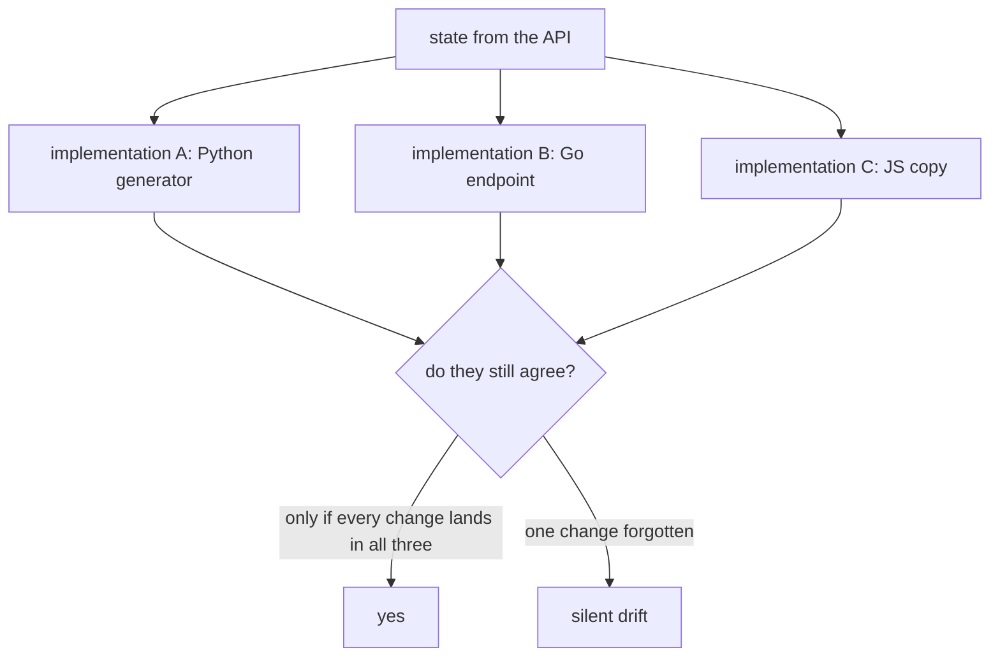

# One Implementation of a Schema

When two programs agree on a data format, someone has to own the conversion. The cheapest
correct answer is: exactly one of them, and the other one imports it.

## The problem

A format described in prose has as many implementations as it has consumers. Each one is
correct on the day it is written.



Drift is silent because nothing fails. Each implementation parses its own output
perfectly. The mismatch appears far away -- a render one release behind, a field that is a
string in one place and a number in the other -- and it appears as a *rendering* bug, not
as a *format* bug, which is why it costs a day to find.

## Three ways to keep two consumers in step

| Strategy | Cost | When it is right |
|---|---|---|
| **One implementation, imported** | Nearly zero. One place to change. | Same language, or one can call the other. |
| **Two implementations plus a golden test** | A test that pins exact bytes or numbers. | Different languages and the logic is small and stable. |
| **Two implementations, prose contract** | A bug per release. | Never, if you can avoid it. |

The middle row is not a failure. It is the honest answer when a browser and a Go server
must both compute the same thing and neither can import the other. The price is that the
golden test becomes load-bearing: delete it and you are in the third row.

## Why It Matters in This Swarm

This repo contains both of the good strategies, side by side, for different reasons.

### One implementation: the Blender scene format

`blender/swarm_blender.py` never re-derives `swarm-scene/1`. Its `scene_from_state` puts
its own directory on `sys.path` and calls the generator:

```python
here = os.path.dirname(os.path.abspath(__file__))
if here not in sys.path:
    sys.path.insert(0, here)
try:
    import make_swarm_scene as gen
    state = dict(state)
    state["_source_url"] = source_url
    return gen.build_scene(state, gen.METRES_PER_UNIT, None)
except Exception:
    return _minimal_scene(state, source_url)
```

The obvious alternative was a `GET /api/scene` endpoint in Go, serving the same document.
It was deliberately **not** built. A Go implementation would have to be updated in lockstep
with `blender/make_swarm_scene.py` forever, and the Control Center would gain a rendering
concern it has no other reason to hold. The generator is a few hundred lines of dependency
-free Python and the add-on already runs Python, so importing it costs nothing.

Note the fallback. When only `swarm_blender.py` was installed as an add-on and the
generator is not on disk, `_minimal_scene` emits positions and one flat colour -- no links,
no clusters. That is a **visibly degraded** result, not a second implementation quietly
pretending to be the first. A fallback that looked correct would be the worst of both
worlds.

### Two implementations plus a golden test: default positions

`geo.DefaultPosition` in `backend/pkg/geo/geo.go` places an unplaced drone by hashing its
ID. The dashboard has to draw a drone before any telemetry arrives, so `defaultPos` in
`frontend/app.js` reimplements it in JavaScript with `BigInt` -- a browser cannot import a
Go function.

That second implementation is guarded by `TestDefaultPositionGolden` in
`backend/pkg/geo/geo_test.go`, which pins exact coordinates for known IDs. The failure it
prevents is real and was seen: before the splitmix64 finalizer was added, Compose replicas
landed along a single axis. See [Hash Mixing](/concepts/hash-mixing-and-finalizers).

### One implementation with an exact inverse

The unit-to-metre conversion is a third shape of the same problem: two functions that must
stay mutually consistent rather than identical.

- `to_metres` in `blender/make_swarm_scene.py`: units -> metres.
- `positions_payload` in `blender/swarm_blender.py`: metres -> units, plus a clamp.

They cannot be one function -- they run in opposite directions -- so a property test
(`test_metres_convert_back_to_the_units_they_came_from`) pins the round trip instead of
pinning either half. That is the right test for an inverse pair: it fails if *either* side
changes alone.

## Common Failure Modes

| Symptom | What actually happened |
|---|---|
| A render shows the swarm from before a schema change; the JSON looks fine | Two implementations; the one you did not edit was used. |
| A field is `"3"` in one consumer and `3` in another | Independent serialisers. JSON does not enforce a type. |
| A fallback path produces plausible but wrong output | A degraded implementation that does not look degraded. |
| The golden test is deleted "because it kept failing" | It kept failing because it was doing its job. |
| An inverse pair silently biases positions | One side was updated, the round-trip test did not exist. |

The general tell: the format is right at every boundary you inspect and wrong at the end.
That means the boundaries are being computed by different code.

## Related

- [Blender Scene Tooling](/architecture/blender-scene)
- [Wire Protocol Design](/concepts/wire-protocol-design)
- [Hash Mixing: Why FNV Needs a Finalizer](/concepts/hash-mixing-and-finalizers)
- [Drone Simulation](/architecture/drone-simulation)
