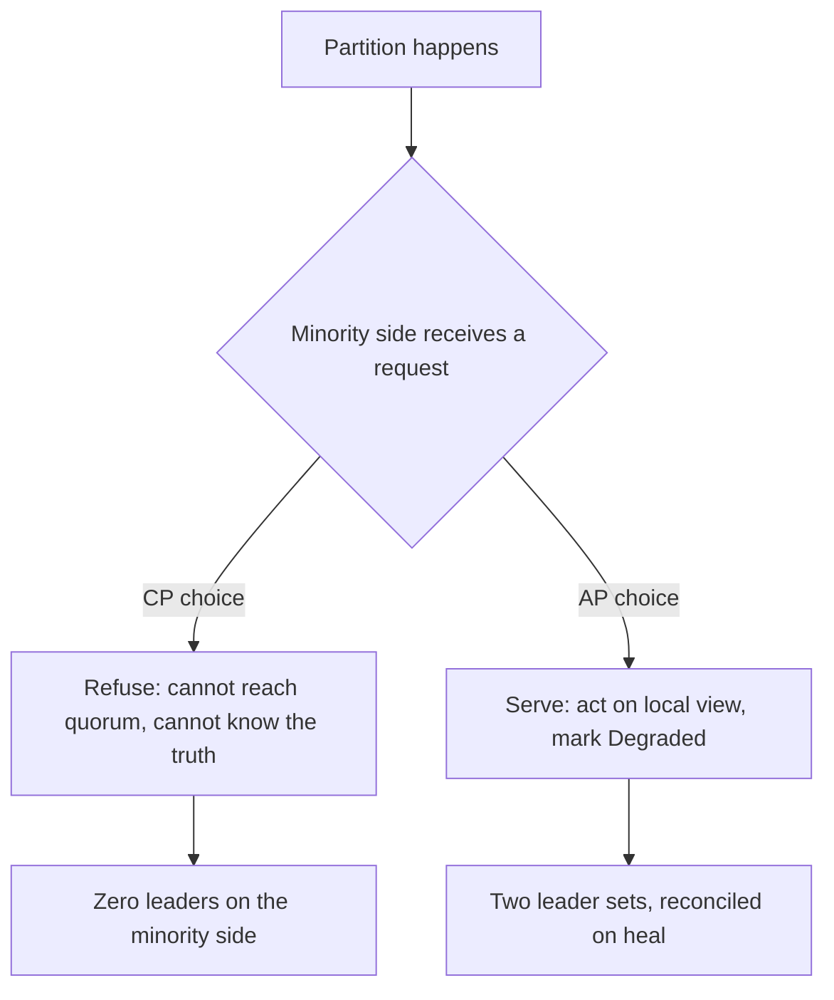

# Split-Brain and Quorum

*Split-brain* is the condition where two groups of nodes, each unable to see the other, both
believe they are the swarm. Each elects, each serves, and each is internally consistent. The word
*quorum* names the one arithmetic fact that can prevent it. This page is about that arithmetic,
why this swarm computes it, and why this swarm nevertheless does not let it gate anything.

Two formulas appear in `pkg/cluster` that look similar and mean opposite things:

| Formula | Where | What it answers |
|---|---|---|
| $Q(n) = \lfloor n/2 \rfloor + 1$ | `pkg/cluster/partition.go:22` | "Am I certain no other group can also be acting?" |
| $L(N) = \max(1, \lceil N \cdot t \rceil)$ | `pkg/cluster/election.go:64` | "How many leaders should a group of this size staff?" |

The first is a statement about *exclusivity*. The second is a statement about *capacity*.
Confusing them is how a reader concludes this swarm has election safety when it does not.

---

## Core Mental Model

### Why a majority, and why strictly more than half

Take any set of $n$ nodes and any two subsets $A$ and $B$. If both have size at least
$\lfloor n/2 \rfloor + 1$, then

$$|A| + |B| \geq 2\left(\left\lfloor \tfrac{n}{2} \right\rfloor + 1\right) > n$$

so by pigeonhole $A \cap B \neq \emptyset$. **Any two quorums share at least one node.** That is
the entire content of the word. A decision made by a quorum is witnessed by someone in every other
possible quorum, so two contradictory decisions cannot both be made.

Exactly half is not enough. With $n = 4$, two subsets of size 2 can be disjoint: $\{1,2\}$ and
$\{3,4\}$. Each is "half the swarm", each can be on its own side of a partition, and each can
believe exactly the same thing about itself. The `+1` is what forbids that.

```go
// pkg/cluster/partition.go:22
func Quorum(n int) int {
	if n <= 0 {
		return 0
	}
	return n/2 + 1
}
```

Integer division in Go is floor for positive operands, so `n/2 + 1` is $\lfloor n/2 \rfloor + 1$.

| $n$ | $Q(n)$ | Largest minority | Nodes that can fail while a quorum survives |
|---|---|---|---|
| 1 | 1 | 0 | 0 |
| 2 | 2 | 1 | 0 |
| 3 | 2 | 1 | 1 |
| 4 | 3 | 2 | 1 |
| 5 | 3 | 2 | 2 |
| 6 | 4 | 3 | 2 |
| 7 | 4 | 3 | 3 |

Two things fall out of the last column. Even $n$ is wasteful: 4 nodes tolerate the same single
failure that 3 do, at 33% more cost. And $n = 2$ tolerates nothing, which is the two-node problem
below.

### `ceil(N * threshold)` is a sizing rule

$$L(N) = \max\left(1, \left\lceil N \cdot t \right\rceil\right), \quad t = 0.3$$

```go
// pkg/cluster/election.go:64
func LeaderCount(n int, threshold float64) int {
```

This says how many leaders a swarm of $N$ *should have*. It says nothing about whether two groups
can each staff their own set. Both sides of a partition call it with their own $N$, both get a
valid answer, both act on it. The function has no way to know it was called twice.

| $N$ | $\lceil 0.3 N \rceil$ | $L(N)$ |
|---|---|---|
| 1 | 1 | 1 |
| 2 | 1 | 1 |
| 3 | 1 | 1 |
| 4 | 2 | 2 |
| 6 | 2 | 2 |
| 7 | 3 | 3 |
| 10 | 3 | 3 |

For any $N \geq 1$ and $t > 0$ the ceiling is already at least 1, so `max(1, ...)` is a
belt-and-braces floor that states the intent -- somebody is always in charge -- rather than
relying on a reader to notice that `ceil` never yields zero here. The cap at $n$
(`pkg/cluster/election.go:75`) covers thresholds above 1, which `withDefaults` already rejects.

### CAP, in practice

CAP says that under a network partition (P, which you do not get to opt out of), a system must
choose between answering every request (A) or answering only with the one linearizable truth (C).



This swarm is AP, recorded at `pkg/cluster/partition.go:5`. What that promises and what it does
not:

| Promise | Kept? |
|---|---|
| Every partition with at least one alive node has at least one leader | yes, `max(1, ...)` |
| Every node can always compute an election from what it sees | yes, `Elect` is local |
| The minority side knows it is the minority | yes, `Degraded` |
| At most one leader set exists swarm-wide | **no** |
| A task accepted by one side is known to the other | **no** |
| Membership views on the two sides are the same | **no**, until gossip heals them |

The full account of what the "no" rows cost, and why that is acceptable for this workload, is in
[Why Not Consensus](/architecture/why-not-consensus).

---

## Under the Hood

### Measuring against the high-water mark

`Degraded` compares the alive count against a quorum of the swarm's *last known* size, not its
current size:

```go
// pkg/cluster/partition.go:43
func Degraded(alive, lastKnownSize int) bool {
	if alive <= 0 || lastKnownSize <= 1 {
		return false
	}
	return alive < Quorum(lastKnownSize)
}
```

The comment at `pkg/cluster/partition.go:32` explains why. A partition of two, measuring against
its own view, computes `Quorum(2) = 2`, sees two, and is not degraded. Measured against a
high-water mark of 6 it computes `Quorum(6) = 4`, sees two, and is. The high-water mark is the
only memory the node has of a world larger than its current partition.

The cost is deliberate: a swarm that legitimately scales from 6 to 2 looks degraded until the
operator resets the mark. From inside a node, "we shrank" and "we were cut off" produce identical
observations, so the function reports both and lets a human disambiguate.

### The two-node problem

$Q(2) = 2$. Losing either node leaves the survivor below quorum, so with two nodes **every single
failure is, by definition, a minority partition** from the survivor's point of view. There is no
configuration of a two-node system that can distinguish "my peer died" from "the link died and my
peer is still serving".

| Event | Survivor sees | `Degraded(1, 2)` | Truth |
|---|---|---|---|
| Peer crashed | 1 alive | true | survivor is the whole swarm, should lead |
| Link cut | 1 alive | true | peer is also leading, split-brain |

Identical inputs, opposite correct responses. A CP system resolves this by refusing to act in
both cases (and so a two-node CP cluster has *worse* availability than one node). An AP system
acts in both cases and accepts the split-brain in the second. This swarm's `max(1, ...)` in
`LeaderCount` is the AP answer: the survivor elects itself.

Production consensus systems say "use 3 or 5 nodes" for exactly this reason, and the table above
is why.

### Two views, two elections

Quorum reasoning assumes every node knows $n$. Under gossip, $n$ is each node's belief, and two
nodes can hold different beliefs at the moment they elect. `Result.Size` at
`pkg/cluster/election.go:51` records the $N$ each election was computed from, so when two nodes
publish different leader sets the first thing to compare is whether they were sizing the same
swarm. See [Gossip and Anti-Entropy](/concepts/gossip-and-anti-entropy) for why this window is
bounded but never zero.

---

## Why It Matters in This Swarm

### Where the formulas are consumed

- `Elect` (`pkg/cluster/election.go:107`) calls `LeaderCount` on `len(view.Alive())`. It never
  calls `Quorum`. Election and partition detection are independent by construction.
- `Result.Want` (`pkg/cluster/election.go:55`) can exceed `len(Result.Leaders)` when too few
  nodes have a valid score. That gap means "the swarm could not staff its own leadership", which
  is a different problem from a partition and is reported differently.
- `Degraded` is a telemetry input. Nothing in `pkg/cluster` branches on it.

### What the dashboard should show

Because nothing prevents split-brain, the operator's only defence is seeing it. A node reporting
`degraded: true` alongside a leader role is the signature. A swarm where the sum of every node's
reported leader count exceeds `LeaderCount(high-water N)` is the aggregate signature. Both are
cheap to compute from telemetry and expensive to reconstruct after the fact.

---

## Common Failure Modes & Edge Cases

### "Half the nodes agree, so we have quorum"

Symptom: an operator sees 3 of 6 nodes reporting the same leader set and concludes the election is
settled. `Quorum(6)` is 4. Three nodes is the largest possible minority, and the other three may
be reporting a different leader set to a dashboard nobody is looking at. Always compare against
$\lfloor n/2 \rfloor + 1$, never against $n/2$.

### Even node counts

Symptom: a 4-node swarm loses 2 nodes and both remaining nodes report `Degraded`. Cause:
`Quorum(4) = 3`, so 2 alive is a minority. This is correct. A 4-node deployment has the fault
tolerance of a 3-node one; the fourth node adds capacity, not safety. Deploy odd counts when the
`Degraded` signal matters.

### Resetting the high-water mark too eagerly

Symptom: a partition is never reported. Cause: the caller resets `lastKnownSize` to the current
alive count on every tick, which makes `Degraded` compare a view against a quorum of itself and
always return false. The mark must only fall on an explicit operator action or a voluntary
`LEAVE` (`pkg/protocol/message.go:95`), never on a failure-detector eviction.

### Reading `Degraded` as a gate

Symptom: a contributor wraps `Elect` in `if !Degraded(...)`. Effect: the minority side of every
partition loses its leader, which is the CP behaviour rejected at `pkg/cluster/partition.go:8`,
and a two-node swarm can never survive a single failure. The AP choice was made deliberately and
is recorded in `docs/WORKLOG.md` section 4.1.

### Quorum of a stale $n$

Symptom: after scaling from 3 to 9 nodes, a node that has not yet gossiped the new members
computes `Quorum(3) = 2` and reports healthy while seeing only 2 of 9. Cause: the high-water mark
lags membership. This resolves as gossip converges, and the window is one of the reasons the
election result carries `Size`.

---

## See Also

- [Why Not Consensus](/architecture/why-not-consensus) -- the full cost of the AP choice.
- [Gossip and Anti-Entropy](/concepts/gossip-and-anti-entropy) -- why $n$ is a belief.
- [Failure Detectors](/concepts/failure-detectors) -- why "alive" is also a belief.
- [System Overview](/architecture/overview) -- the leader-count formula in context.
