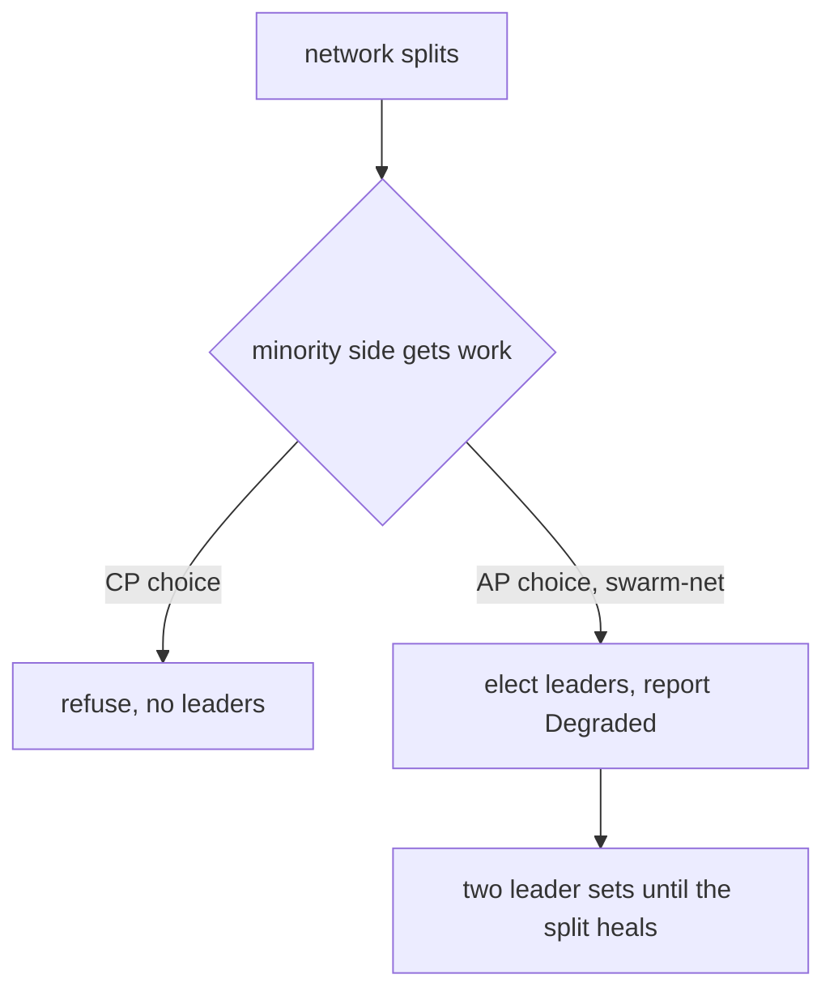

# Split-Brain and Quorum

**Split-brain** happens when the network splits and each side thinks it is the whole system.
Each side elects its own leaders and keeps working. A **quorum** is a strict majority:

$$Q(n) = \lfloor n/2 \rfloor + 1$$

Any two majorities of the same group share at least one member, so two sides can never both
have a quorum. Exactly half is not enough: with 4 nodes, {1,2} and {3,4} are both "half" and
share nobody.

Analogy: a club vote. If a decision needs more than half the members, two rooms of members
can never pass opposite decisions at the same time.

By the CAP theorem, during a partition a system must choose: refuse to act without a quorum
(consistency), or keep acting on what it can see (availability). **swarm-net chooses
availability.**

## How swarm-net uses it

- `Quorum` and `Degraded` live in `backend/pkg/cluster/partition.go`.
- `Degraded` is true when a node sees fewer alive nodes than a quorum of the largest swarm it
  has seen (its high-water mark). It is reported in telemetry only. Nothing is blocked by it.
- The leader count is a **sizing** rule, not a quorum:
  $L(N) = \max(1, \lceil N \cdot threshold \rceil)$ (`LeaderCount` in
  `backend/pkg/cluster/election.go`, default threshold 0.3). Each side of a split computes it
  for itself, so each side gets leaders.
- Terms (see [Logical Clocks](/concepts/logical-clocks)) catch a leader that is behind its own
  workers, but they do not stop two partitions from having separate leaders.

## Common pitfalls

- **Reading the leader formula as safety.** `ceil(N * threshold)` says how many leaders a group
  should have. It says nothing about whether another group has its own.
- **Measuring the quorum against the current view.** A partition of 2 would see 2 and call
  itself a majority. That is why `Degraded` uses the high-water mark.
- **Even-sized groups.** 4 nodes tolerate one failure, the same as 3. And 2 nodes tolerate none.
- **Legit scale-down looks like a split.** After shrinking on purpose, the node still reports
  `Degraded` against the old high-water mark.

## Further reading

- [Logical Clocks](/concepts/logical-clocks)
- [Monotonic Merge and Incarnation](/concepts/monotonic-merge-and-incarnation) -- how the two
  sides reconcile after healing.
- Martin Kleppmann, [Please stop calling databases CP or AP](https://martin.kleppmann.com/2015/05/11/please-stop-calling-databases-cp-or-ap.html)
