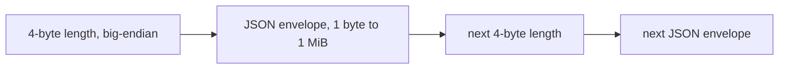

# Stream Framing: There Are No Messages in TCP

TCP delivers a stream of bytes, not messages. Two sends of 100 bytes can arrive as one read
of 200, or as reads of 37 and 163. **Framing** is how the receiver finds where each message
starts and ends.

Analogy: a phone call. The other side hears a continuous stream of sound. You need pauses or
"over" to mark where each sentence ends.

Three common approaches:

- **Delimiter** (for example newline): simple, but you do not know the size until the end.
- **Fixed size**: easy, but wastes space and cannot grow.
- **Length prefix**: send the size first, then the body. The receiver knows exactly how many
  bytes to read, and can refuse a size that is too big **before** allocating.

swarm-net uses a length prefix:

## How swarm-net uses it

- The codec is in `backend/pkg/protocol/framing.go`: `Encoder.WriteEnvelope` and
  `Decoder.ReadFrame`.
- The header is 4 bytes, big-endian. `MaxFrameSize` is 1 MiB. The size is checked
  **before** the payload buffer is allocated.
- A zero-length frame is an error (`ErrZeroLengthFrame`), not a keep-alive. Liveness uses real
  messages like `HEARTBEAT` and `PING`.
- Each frame is written with one `Write` call, so two goroutines can never interleave half
  frames. Only the connection's writer goroutine writes (`backend/pkg/network/conn.go`).
- Any framing error closes the connection. There is no "resync" function: the next 4 bytes
  after a bad frame could be any number, so there is nothing reliable to search for.
  Redialing is cheap and correct.

## Common pitfalls

- **One `Read` per message.** Works in tests, fails under load. Use `io.ReadFull`
  (see [io.Reader, io.Writer, and the ReadFull Family](./io-reader-writer-contracts)).
- **Allocating before the size check.** One bad header can exhaust memory.
- **Writing header and body in two calls from two goroutines.** Their bytes interleave and the
  stream is ruined.
- **Trying to recover after a bad frame.** You will read garbage as lengths and deliver fake
  messages.

## Further reading

- [Wire Protocol Design](./wire-protocol-design)
- [TCP Sockets & The Kernel](./tcp-sockets-and-the-kernel)
- [Non-Blocking I/O](./nonblocking-io-and-epoll)
