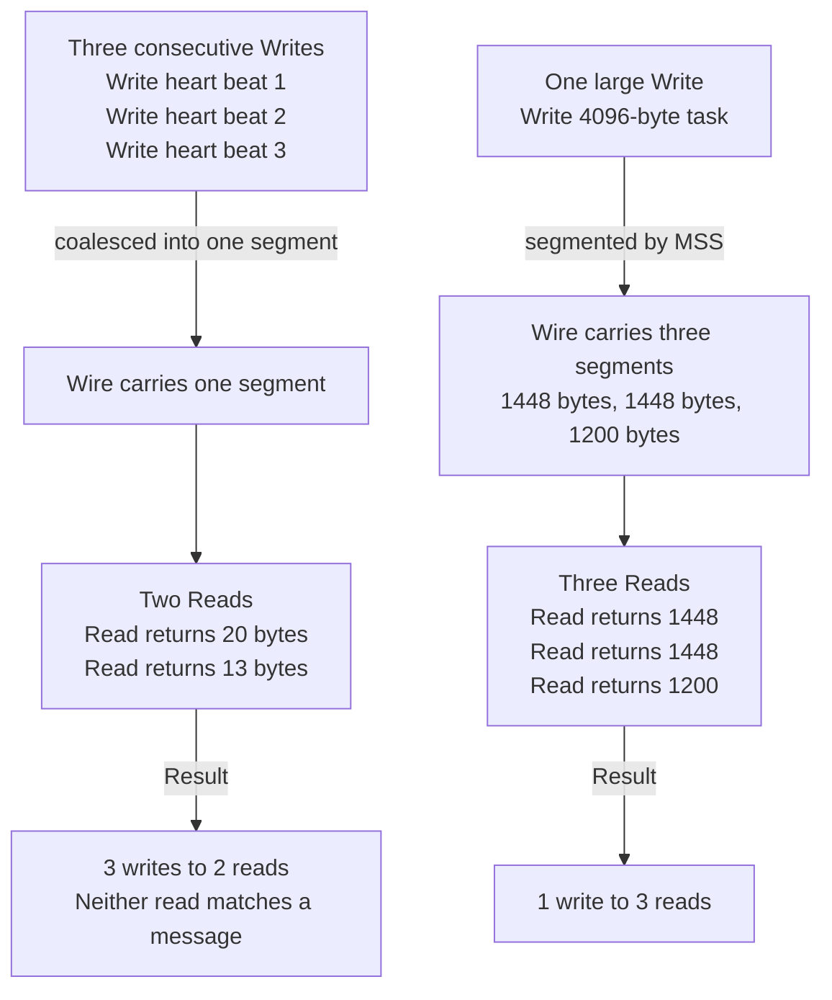
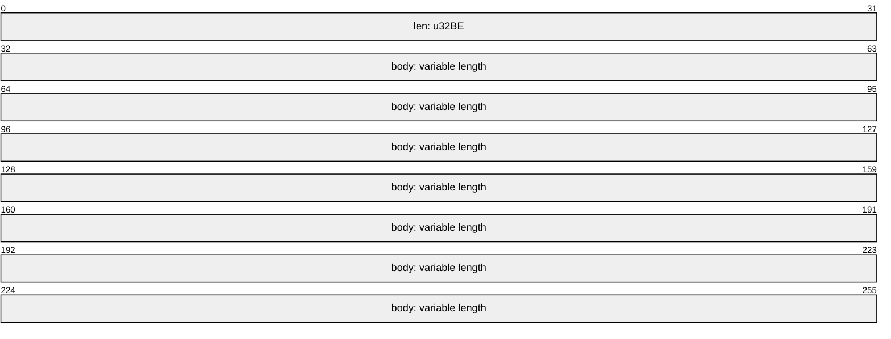
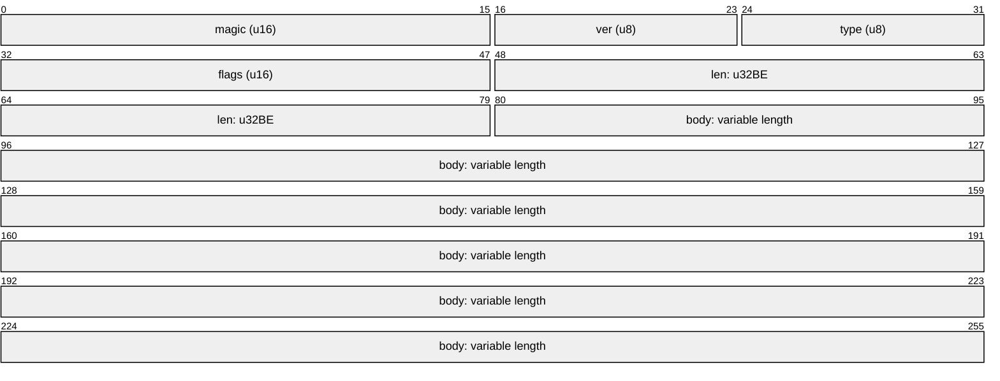

# Stream Framing: There Are No Messages in TCP

Two nodes in this swarm need to exchange discrete things: a heartbeat, a health score, a task, a
membership update. TCP offers none of those. TCP offers an ordered, reliable, bidirectional
**stream of bytes**, with no record boundaries whatsoever. The concept of a "message" is something
your application invents and must defend, on both ends, in the presence of an adversarial network
and a peer that may be lying, slow, or already dead.

This page assumes you have read [TCP Sockets & The Kernel](./tcp-sockets-and-the-kernel), which
covers where the bytes are buffered and why `read` behaves as it does. It pairs with
[io.Reader, io.Writer & the ReadFull Family](./io-reader-writer-contracts), which is the Go-level
mechanics of actually consuming a stream correctly, and with
[Wire Protocol Design](./wire-protocol-design), which covers what goes *inside* a frame once you
can delimit one.

When this page was first written, in Phase 1, no Go code existed and the framing choice was open.
It is now settled and implemented in `pkg/protocol`. The [Decision Record](#the-decision-record)
below states what was chosen, what it cost, and the argument that actually carried it.

## Core Mental Model

Think of the connection as a conveyor belt of bytes with no dividers. The sender drops bytes on;
the receiver picks bytes off. Nothing on the belt records where one sender-side `Write` ended and
the next began. That information is destroyed by the transport, irrecoverably, the moment it
enters the send queue.



The only correct mental model is:

> `Read` hands you *some* bytes. Zero information about message boundaries accompanies them.
> You append them to a buffer, then you ask your own parser whether a complete message is present.

Every framing scheme is an answer to one question: **given a prefix of the stream, how do I know
where the current message ends?** There are exactly three families of answer -- a delimiter, a
length, or a self-describing header -- and they differ in cost, debuggability, and what happens
after something goes wrong.

## Under the Hood

### Why writes coalesce and reads fragment

Three independent mechanisms conspire.

**1. Segmentation by MSS.** TCP splits your byte stream into segments no larger than the
**Maximum Segment Size**, negotiated in the SYN and derived from the path MTU. On a standard
Ethernet path with MTU 1500, MSS is 1448 (1500 - 20 IP - 20 TCP - 12 bytes of timestamp option).
On the Docker bridge in this project the MTU may differ; `ss -tni` reports both:

```
     cubic wscale:7,7 rto:204 rtt:0.412/0.123 mss:1448 pmtu:1500 advmss:1448
```

Any message larger than the MSS is *guaranteed* to be delivered as multiple segments, and each
segment can wake the receiver independently. A 4 KB task payload will essentially never arrive in
a single `Read`.

**2. Coalescing by Nagle and by the send queue.** Small consecutive writes accumulate in
`sk_write_queue` and are transmitted together. The receiver's `read` then drains whatever has
accumulated in `sk_receive_queue` at that instant, which may be two messages, or one and a half.

**3. Receiver-side timing.** Even with one segment per message on the wire, the receiver's
`read` may be called after two segments have arrived, returning both at once. Or it may be called
with a 4 KB buffer against a receive queue containing 1448 bytes, returning a partial message. The
kernel returns *what it has*, never *what you asked for*.

There is a fourth, rarer mechanism worth knowing: **path MTU discovery**. If an intermediate link
has a smaller MTU and the DF bit is set, the router replies with ICMP "fragmentation needed" and
the sender lowers its MSS mid-connection. If that ICMP is firewalled -- an alarmingly common
misconfiguration, known as an ICMP black hole -- the connection establishes fine, small messages
work fine, and large messages hang forever. This presents as "heartbeats work, task broadcast
doesn't", which is a maddening bug if you do not know to look for it.

### Partial reads and partial writes in Go

```go
// WRONG. Silently corrupts on any message larger than one segment,
// and on any pair of messages that coalesce.
buf := make([]byte, 4096)
n, err := conn.Read(buf)
if err != nil {
	return err
}
var msg Message
return json.Unmarshal(buf[:n], &msg) // buf[:n] is a prefix, a suffix, or one and a half messages
```

The shipped decoder never issues a bare `Read`. `pkg/protocol/framing.go:309` states the rule in
the code itself, and `pkg/protocol/framing.go:320` and `pkg/protocol/framing.go:347` are the two
`io.ReadFull` calls that enforce it -- one for the 4-byte header, one for the payload.

Note the asymmetry in errors from `io.ReadFull`: it returns `io.EOF` if *zero* bytes were read
(the peer closed cleanly on a message boundary -- a normal shutdown) and `io.ErrUnexpectedEOF` if
*some* bytes were read (the peer died mid-message -- a real fault). Distinguishing these is how you
avoid logging a graceful disconnect as an error, and how you avoid logging a truncation as a
graceful disconnect. That distinction is load-bearing enough in this codebase to get its own
treatment in [io.Reader, io.Writer & the ReadFull Family](./io-reader-writer-contracts); the
normalisation that preserves it lives at `pkg/protocol/framing.go:356`.

On the write side, `net.Conn.Write` already loops internally, so a short count always accompanies
an error. But framing correctness demands that a header and its body reach the wire as one logical
unit *from the perspective of concurrent writers*. The encoder assembles both into one contiguous
buffer and issues exactly one `Write` -- the rationale block at `pkg/protocol/framing.go:197` and
the single write at `pkg/protocol/framing.go:226`:

```go
need := headerSize + len(body)
if cap(e.buf) < need {
	e.buf = make([]byte, need)
}
e.buf = e.buf[:need]
binary.BigEndian.PutUint32(e.buf[:headerSize], uint32(len(body)))
copy(e.buf[headerSize:], body)

if _, err := e.w.Write(e.buf); err != nil {
	return fmt.Errorf("protocol: write %s frame: %w", env.Type, err)
}
```

Two reasons, and the second is the serious one. With `TCP_NODELAY` in force, two `Write` syscalls
become two TCP segments -- a 4-byte segment followed by a payload segment -- which is two syscalls
and two receiver wakeups for a message that fits in one. More importantly, a write that fails
*between* the header and the payload leaves the peer holding a length prefix for a frame that will
never arrive; it blocks in `ReadFull` waiting for bytes the sender has already abandoned. One
`Write` cannot fail in that gap, because `io.Writer`'s contract forbids a short count without an
error.

`net.Conn` is safe for concurrent use in the sense that it will not corrupt kernel state, but two
concurrent `Write` calls may interleave their bytes on the stream, which destroys framing
absolutely. The swarm has at least two independent writers per connection -- a heartbeat ticker and
whatever dispatches tasks or telemetry -- so `Encoder` carries a mutex (`pkg/protocol/framing.go:147`)
held across the entire assemble-and-write. `TestConcurrentEncodersDoNotInterleave`
(`pkg/protocol/framing_test.go:513`) is what keeps that honest.

### The three framing strategies

**Delimiter-delimited.** A byte that cannot appear inside a message terminates it. Newline is the
usual choice, paired with JSON (which never emits a raw newline inside a compact encoding, since
newlines inside strings are escaped as `\n`).

```go
sc := bufio.NewScanner(conn)
sc.Buffer(make([]byte, 0, 4096), maxFrameSize) // MUST bound it; default is 64 KiB
for sc.Scan() {
	var msg Message
	if err := json.Unmarshal(sc.Bytes(), &msg); err != nil {
		return err // framing is fine, content is not -- still fatal for this connection
	}
	handle(msg)
}
return sc.Err() // bufio.ErrTooLong if a line exceeded the buffer
```

**Length-prefixed binary.** A fixed-width integer states the body length; the body follows. This is
what this swarm ships. The length is big-endian (network byte order); `pkg/protocol/framing.go:20`
defines `headerSize = 4` and explains that the byte-swap costs a single `BSWAP` instruction while a
backwards length in Wireshark costs an afternoon.



**Self-describing / typed header.** A fixed header carrying length *and* metadata: a magic number,
a protocol version, a message type, a flags field, sometimes a checksum. This is what real
protocols converge on.



The magic number is not decoration. It is how a receiver detects that it is talking to something
that is not this protocol at all -- a health-check prober, a port scanner, an HTTP client that got
the wrong port -- and rejects it on the first four bytes rather than allocating a 3 GB buffer
because the ASCII of `GET ` happens to be a very large `uint32`.

This swarm took a middle path: a bare 4-byte length prefix on the wire, with version and type
carried as *fields inside the JSON envelope* rather than as binary header fields. The version check
therefore happens after the payload decodes, at `pkg/protocol/framing.go:386`, and a version
mismatch is fatal (`ErrUnsupportedVersion`, `pkg/protocol/framing.go:83`) precisely because an
unknown version means the field layout itself is in question. See
[Wire Protocol Design](./wire-protocol-design) for why an unknown *type* is deliberately not fatal.

### Trade-offs

| | Delimiter (newline + JSON) | Length-prefixed binary | Typed header |
|---|---|---|---|
| **Parse cost** | Must scan every byte for the delimiter; JSON decode allocates heavily (reflection, interface boxing, string copies) | No scan: read 4 bytes, read N bytes. Body decode cost depends on the codec | Same as length-prefixed plus a few fixed-offset field reads |
| **Encode cost** | JSON marshal allocates; escaping must be verified | One length write, one copy | Header write is a handful of stores |
| **`tcpdump -A` / `netcat`** | Fully readable. You can `nc node-3 7946` and type a message by hand | Opaque without a decoder; `tcpdump -X` shows hex; needs a custom dissector to be useful | Opaque body, but magic/version/type are readable in hex and identify the frame |
| **Max message bound** | Must be imposed externally via `Scanner.Buffer`; nothing in the format states a size | Stated in the frame itself; can be rejected before allocating | Same, and the type field allows per-type limits |
| **Allocation before validation** | Buffer grows as the scan proceeds -- you allocate before you know the size | You know the size first, so you validate then allocate | Same, plus you can reject on magic before reading the length at all |
| **Resynchronisation after corruption** | Theoretically possible: discard to the next delimiter and resume. In practice the "corruption" is usually an encoder bug producing an unescaped delimiter, so resync lands mid-message | Impossible. A wrong length consumes an arbitrary number of following bytes as body | Impossible, but the magic number lets you *detect* desync immediately on the next frame rather than silently misparsing |
| **Binary payload** | Requires base64 or escaping: ~33% overhead plus encode cost | Native | Native |
| **Schema evolution** | Trivial -- unknown JSON fields are ignored by `encoding/json` | Depends entirely on the body codec | Version + type fields make it explicit and enforceable |
| **Debuggability of a bug at 3am** | Highest. Logs are the wire format | Lowest without tooling | Middling; you will write a `swarmdump` helper |

There is no free answer. Delimiter framing optimises for the human reading the wire; length
prefixing optimises for the machine parsing it; typed headers pay a few fixed bytes to buy failure
detection and versioning.

### Bounded reads are a security property, not an optimisation

An unbounded length field is a remote out-of-memory primitive. Consider:

```go
n := binary.BigEndian.Uint32(hdr[:]) // attacker sends 0xFFFFFFFF
body := make([]byte, n)              // 4 GiB allocation, immediately
```

One packet, four bytes of header, and the node is dead. It need not even be malicious: a
desynchronised stream will produce a garbage length just as effectively as an attacker. The same
applies to delimiter framing -- `bufio.Scanner` without an explicit `Buffer` call caps lines at
`bufio.MaxScanTokenSize` (64 KiB) and returns `bufio.ErrTooLong`, which is a safe default, but
`bufio.Reader.ReadString('\n')` has **no bound at all** and will grow until the process dies.

The rule is absolute: **every framing decoder validates the length against a compile-time maximum
before allocating a single byte.** The maximum is a protocol constant, not a configuration knob,
because both ends must agree on it.

In this codebase that constant is `MaxFrameSize = 1 << 20` at `pkg/protocol/framing.go:58`, with
the reasoning for both the existence and the specific value in the block above it
(`pkg/protocol/framing.go:22-57`). Two claims there deserve to be read twice. First, the bound is
*per frame* but the exposure is *per frame times fan-in* -- a node with fifty peers can be handed
fifty maximal frames at once, which is why 1 MiB rather than 64 MiB. Second, if a message class
ever needs more than this, the answer is to chunk at the application layer, because "a protocol
whose frame bound tracks its largest message has no bound."

## Why It Matters in This Swarm

### The decision record

Phase 1 left the framing choice open and Phase 2 closed it. CLAUDE.md S5 Phase 2.1 requires the
question be put to the user before code is written; it had already been provisionally settled at the
Phase 1 checkpoint, but an inherited decision is not a gate, so the trade-off was presented again in
full and confirmed explicitly. **Length-prefixed JSON stands** -- a `uint32` big-endian length
followed by a JSON envelope. The analysis is recorded in `docs/WORKLOG.md` S3.1:

| | Delimiter (`\n`-terminated JSON) | Length-prefixed (`uint32` BE + JSON) |
|---|---|---|
| Size bound | Not known until the delimiter arrives | Known **before** any payload allocation |
| Payload coupling | Framing depends on JSON escaping newlines | Framing is payload-agnostic |
| Partial reads | `bufio` hides them, which hides the lesson | `io.ReadFull` makes them explicit |
| Bad frame | Resync is tempting and unsafe | Desync is unambiguous; drop the connection |
| Debuggability | `nc` just works | Needs a decoder |

**The deciding argument was not elegance.** It was the chaos model. This swarm is *designed* to have
nodes `SIGKILL`ed mid-write by the dashboard's chaos controls. A truncated frame is therefore not
an exceptional event to be handled defensively; it is a routine, expected, deliberately-induced
event that will happen many times per demo. Length-prefixing is the design in which that routine
event has **exactly one correct response**: the declared length did not arrive, the stream position
is unknown, drop the connection. There is no judgement call, no heuristic, and no second path
through the code that only executes during an incident.

Under delimiter framing the same event has an *attractive wrong answer* -- scan forward to the next
newline and carry on -- and the whole argument of the next section is that the attractive wrong
answer will eventually be taken.

The accepted cost is real: losing `nc` readability matters for a teaching repository. It was bought
back deliberately rather than mourned. `protocol.DumpStream` (`pkg/protocol/dump.go:48`) reads a
frame stream and renders it as annotated, pretty-printed JSON -- offset, frame index, declared
length, version, type, control-plane-vs-data-plane classification, and an indented payload. It is
explicitly not production code (`pkg/protocol/dump.go:29`): it re-implements the frame read rather
than calling `Decoder.ReadFrame`, because a diagnostic that refuses to show you the broken frame is
useless exactly when you need it. It prints and continues past a malformed *body*, but stops dead at
a bad *length* -- same ordering discipline as the codec, stated at `pkg/protocol/dump.go:68`.

### Why there is no resync API, and why that absence is the design

`pkg/protocol/framing.go:296` is a doc-comment heading reading `# Why there is no resync`. The
argument is worth restating because it generalises well beyond this repository.

With a **delimiter**, resynchronisation is *possible*: scan forward for the next `\n`, assume a
message starts after it, resume. With a **length prefix**, resynchronisation is *impossible* in a
strong sense -- not hard, not expensive, impossible. Once the reader is off a frame boundary, the
next four bytes it reads are some arbitrary slice of a JSON body, and that slice is a perfectly
valid `uint32`. It might decode to 12. It might decode to 1.7 billion. **There is no bit pattern
that means "frame starts here"**, so there is nothing to scan for, and no way to test a guess.

```
  stream:  [ frame A ][ frame B ][ frame C ][ frame D ]...
                         ^
                         decoder read a bad length here and consumed 9000 bytes
                         it is now positioned in the middle of frame D
                         the next 4 bytes it reads are ASCII from a JSON string:
                           "node" -> 0x6E6F6465 -> 1,853,124,197 -> rejected, good
                           "  { " -> 0x2020207B -> 538,984,571   -> rejected, good
                           "\": 1" -> 0x223A2031 -> 574,169,137  -> rejected, good
                           " id:" -> 0x20696400 -> 544,646,656   -> rejected, good
                         ... but sooner or later, a slice that decodes to 0..1048576
                         and then a "frame" of pure fiction is delivered upstream.
```

The delimiter case is worse, not better, precisely because it *appears* to work. A `\n` byte inside
a partially-read string body is byte-for-byte indistinguishable from a real frame boundary. Resync
"succeeds", the decoder resumes mid-message, and every subsequent message parses cleanly and is
wrong. The failure has no symptom at the framing layer at all -- it surfaces, much later and much
further away, as a leader demoted on a membership update that nobody sent.

So there is no resync function in `pkg/protocol`. Not an unexported one, not a `// TODO`, not a
convenience helper on `Decoder`. `docs/WORKLOG.md` S3.2 records this as a non-negotiable handed to
the implementation agent: *"no resync API is provided even as a convenience -- an affordance that
exists will eventually be used."* This is the load-bearing part. The reason to omit the function is
not that today's code would misuse it; it is that a function which exists is a function that a
future contributor, under time pressure, during an incident, will call. The only reliable way to
prevent "we recovered from the desync" from being a sentence anyone says about this system is for
there to be nothing to call.

The correct response to *any* error from `ReadFrame` is therefore uniform:

1. Close the connection. Do not attempt to resynchronise.
2. Record which peer and which error, because repeated protocol violations from one peer indicate
   version skew or a bug, not a transient fault -- and `IsProtocolViolation`
   (`pkg/protocol/framing.go:112`) exists so the caller can tell the difference without string
   matching.
3. Re-dial with backoff. A fresh connection starts at a known boundary -- the only boundary you can
   ever be certain of.

A *content* error at a higher layer -- valid frame, valid envelope, but a field out of range -- is a
different matter: framing is intact, the stream position is known, and you may log and continue. The
error taxonomy at `pkg/protocol/framing.go:63-88` keeps those categories in distinct sentinel values
from the first commit. See [Error Wrapping & Classification](./error-wrapping-and-classification).

### Validate before allocate, in the code

`pkg/protocol/framing.go:330` is a comment in shouting capitals -- `THE BOUNDS CHECK.` -- immediately
above `pkg/protocol/framing.go:334`:

```go
if n > MaxFrameSize {
	return nil, fmt.Errorf("protocol: peer declared %d-byte frame (max %d): %w",
		n, MaxFrameSize, ErrFrameTooLarge)
}
```

The comment says what the code cannot: *"Inverting these two statements -- allocate, then validate --
is the OOM bug that length-prefixing exists to prevent, and it is a one-line edit away at all
times."* That is exactly right. The scratch-buffer growth at `pkg/protocol/framing.go:342` sits
three lines below the check, and moving it three lines up is a change that compiles, passes a
casual review, and turns the node into a four-byte kill target.

Which is why the ordering is a *test*, not a comment.
`TestOversizeFrameRejectedBeforeAllocating` (`pkg/protocol/framing_test.go:245`) declares a 3 GiB
frame and feeds it through `headerOnlyReader` (`pkg/protocol/framing_test.go:96`) -- a reader that
yields exactly one length header and then calls `t.Error` if it is read again. If the check ever
moved after the allocation, the decoder would either OOM the test binary or attempt to consume the
body, and the reader would catch it. The test additionally asserts `dec.buf` is still `nil`
afterwards: not one byte of scratch space was allocated on behalf of a peer's claim.

`TestOversizeByOneByteRejected` (`pkg/protocol/framing_test.go:264`) pins the boundary itself --
`MaxFrameSize` is legal, `MaxFrameSize+1` is not -- because off-by-one on a bound is the classic way
a correct-looking check becomes a wrong one.

### Where framing shows up elsewhere

- `pkg/network/` owns connection lifecycle and, critically, **deadlines**. The codec takes
  `io.Reader`/`io.Writer` and therefore cannot set one; `pkg/protocol/framing.go:252` states the
  consequence in capitals. A `Decoder` on a `net.Conn` with no read deadline blocks forever against
  a SIGKILLed peer. This is covered in full on
  [io.Reader, io.Writer & the ReadFull Family](./io-reader-writer-contracts).
- `pkg/health` measures application-level round trip over these frames. A framing artefact that adds
  tens of milliseconds -- see the Nagle discussion below -- is not a performance nuisance in a system
  that elects leaders by latency; it is a correctness bug in the health model. See
  [Latency as a Statistic](./latency-as-a-statistic).
- `cmd/control-center/` bridges swarm frames to a browser WebSocket. WebSocket is itself a
  length-prefixed framing layer bolted onto TCP, for exactly the reasons on this page -- a useful
  sanity check on the design space, since RFC 6455 reached the same conclusion.

## Common Failure Modes & Edge Cases

### Nagle's algorithm and delayed ACK: the 40 ms stall

Nagle's algorithm (RFC 896) says: if there is unacknowledged data outstanding, buffer any new
small write until either the outstanding data is acknowledged or a full MSS has accumulated.

Delayed ACK (RFC 1122) says: do not acknowledge immediately; wait up to `ato` (40 ms on Linux,
visible as `ato:40` in `ss -tni`) in the hope that outgoing data will come along to piggyback on.

Each is reasonable. Together, on a small request/response exchange, they deadlock:

```
  t=0ms    A: write(heartbeat)         -> sent immediately (nothing outstanding)
  t=0.4ms  B: receives it
           B: delayed ACK timer starts -- B has no data to send yet
  t=0.5ms  B: application writes reply -> B's Nagle has nothing outstanding, so it sends
           A: receives reply, starts ITS delayed ACK timer
  t=1ms    A: write(next heartbeat)    -> A has unacked data outstanding AND the write is < MSS
           A: Nagle buffers it. Nothing goes out.
  t=41ms   B: delayed ACK timer fires, ACK arrives
           A: Nagle releases the buffered heartbeat
  ------------------------------------------------------------------
  Measured RTT: 41 ms. Actual network RTT: 0.4 ms.
```

**Symptom:** a latency distribution clustered at multiples of 40 ms -- 40, 80, occasionally 200 -- on
a path whose `ss -tni` reports `rtt:0.4`. Leaders elected by measured latency will be elected by an
artefact of framing behaviour, and the artefact is not evenly distributed across peers.

Go sets `TCP_NODELAY` by default on every `TCPConn`, so the correct behaviour is free and the
failure mode only returns if someone "optimises" by calling `SetNoDelay(false)`. The second-order
lesson survives even so: the number of `Write` calls per logical message matters, which is reason
one of the two at `pkg/protocol/framing.go:197`.

### Interleaved writers: the silent permanent desync

**Symptom:** the connection works perfectly under light load and dies unrecoverably the first time
a heartbeat and a telemetry push happen to land in the same microsecond. The receiver reports
`ErrFrameTooLarge` or `ErrMalformedFrame` -- or, worst case, *nothing*, because the interleaved
bytes happened to form a plausible length and a plausible envelope.

This is what the `Encoder` mutex prevents. Note what it does *not* prevent: two `Encoder` values
wrapping the same `net.Conn`. Each is internally serialised and they will happily corrupt each
other. One connection means one `Encoder`, structurally.

### Buffered readers change the failure modes

Wrapping a connection in `bufio.Reader` is close to mandatory: without it, a length-prefixed
decoder issues one syscall for the 4-byte header and another for the body, doubling the syscall
count and the scheduler round-trips per message. But buffering moves bytes from kernel space into a
Go-heap buffer, and that has consequences:

- **Data is lost on abandonment.** Discard a `bufio.Reader`, go back to the raw `net.Conn`, and
  everything buffered is silently gone. Never mix the two on one connection.
- **`ss` lies about progress.** `Recv-Q` shows 0 because the buffered reader drained the kernel,
  even though your application has processed none of it. Kernel-level backpressure is delayed by
  exactly the buffer size.
- **Read deadlines apply to the underlying syscall, not your logical read.** A deadline that
  expires while `bufio` already holds a complete frame will not fire; one that expires mid-refill
  will, leaving partial bytes buffered and the stream position unknown. That is a desync, and it is
  terminal -- which is the real reason a timed-out connection must be closed rather than retried.

### Zero-length frames

A zero-length frame is a protocol violation here, not a keepalive
(`ErrZeroLengthFrame`, `pkg/protocol/framing.go:77`). Many protocols overload an empty frame as a
liveness tick. This one refuses, because liveness is a first-class typed message carrying a sequence
number and a correlation ID that the failure detector accounts for. An untyped empty frame would be
a second, weaker liveness channel invisible to the detector -- and a peer emitting them in a tight
loop would look perfectly healthy. `TestZeroLengthFrameRejected`
(`pkg/protocol/framing_test.go:288`) pins it.

The encoder also guards the sending side at `pkg/protocol/framing.go:183`, on an unreachable
branch: `json.Marshal` of a struct always emits at least `{}`. It is asserted anyway, because
emitting a zero-length frame would kill a peer's connection for *our* mistake.

### Truncation at every possible offset

The chaos controls SIGKILL containers, so every byte offset is a plausible place for a stream to
stop. `TestTruncatedPayloadIsUnexpectedEOF` (`pkg/protocol/framing_test.go:302`) cuts a frame at
three offsets -- exactly after the header, one byte into the payload, and one byte short of the end --
and asserts every one yields `io.ErrUnexpectedEOF` and *not* `io.EOF`.
`TestTruncatedHeaderIsUnexpectedEOF` (`pkg/protocol/framing_test.go:321`) covers a death two bytes
into the length prefix. `TestCleanEOFAtFrameBoundary` (`pkg/protocol/framing_test.go:328`) covers
the opposite case and asserts it is *not* misreported as a death.

If these three collapse into one error value, the swarm loses its ability to distinguish "a node
left" from "a node was killed", and the health scoring that feeds leader election starts penalising
graceful departures.

### The buffer-aliasing trap

Reusing a scratch buffer per `Decoder` avoids a per-heartbeat allocation, but creates a hazard: if
the returned `Envelope.Payload` aliased that buffer, the very next `ReadFrame` would overwrite the
caller's data underneath them. It does not, because `json.RawMessage.UnmarshalJSON` is
`*m = append((*m)[0:0], data...)` against a freshly allocated envelope with zero capacity, so the
append always copies. The reasoning is at `pkg/protocol/framing.go:361-376` -- and, correctly, it is
*verified* by `TestReadFramePayloadDoesNotAliasScratchBuffer`
(`pkg/protocol/framing_test.go:417`) rather than trusted, because it is a property of another
package's implementation and a comment is not a test.

### Pathological readers are the only honest test

Two tests exist purely because real sockets are too well-behaved to catch framing bugs on a quiet
laptop. `TestPartialReadsOneByteAtATime` (`pkg/protocol/framing_test.go:175`) drives the decoder
through a `dripReader` (`pkg/protocol/framing_test.go:37`) that returns exactly one byte per `Read`
-- the meanest legal `io.Reader` there is.  `TestPartialReadsStraddlingBoundaries`
(`pkg/protocol/framing_test.go:209`) uses a `chunkReader` (`pkg/protocol/framing_test.go:61`) with
the hand-picked chunk sizes `{2, 3, 200, 1, 7, 1, 150, 4, 5, 300, 2}`, chosen to split reads across
the header/payload seam and across the seam between two frames.

The failure mode these guard against does not reproduce on loopback, does not reproduce in CI, and
reproduces reliably in production the first time a frame crosses an MSS boundary on a congested
bridge. If your framing code has never been run against a one-byte-at-a-time reader, you do not know
whether it works; you know that nothing has split it yet.

## Further Reading in This Curriculum

- [TCP Sockets & The Kernel](./tcp-sockets-and-the-kernel) -- where the bytes are buffered and why
  `Read` returns what it does.
- [io.Reader, io.Writer & the ReadFull Family](./io-reader-writer-contracts) -- the Go-level
  contracts this page's decoder is built on, and the `EOF`/`ErrUnexpectedEOF` asymmetry in full.
- [Wire Protocol Design](./wire-protocol-design) -- what goes inside a frame: envelopes, versioning,
  and forward compatibility.
- [Error Wrapping & Classification](./error-wrapping-and-classification) -- why `IsProtocolViolation`
  exists and what the cluster layer does with each category.
- [epoll, select & Non-Blocking I/O](./nonblocking-io-and-epoll) -- how readiness notification
  interacts with partial frames.
- [The Netpoller](./go-netpoller) -- why a goroutine blocked in `io.ReadFull` costs you almost
  nothing.
