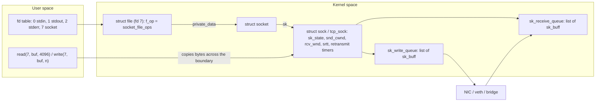
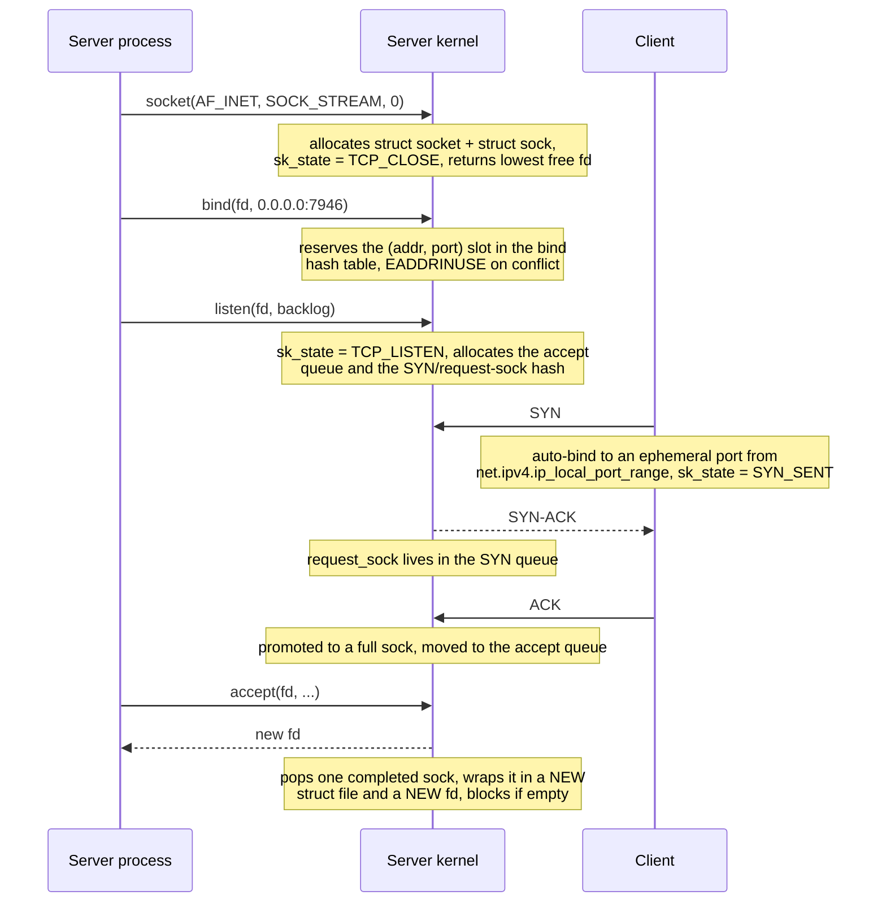
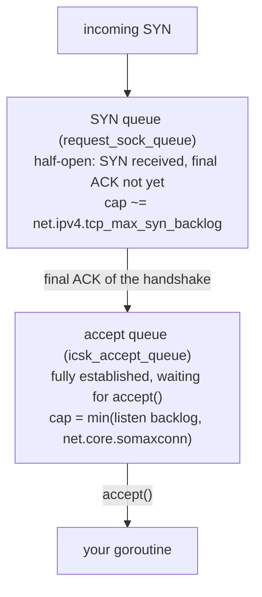
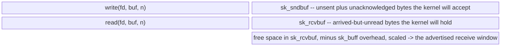
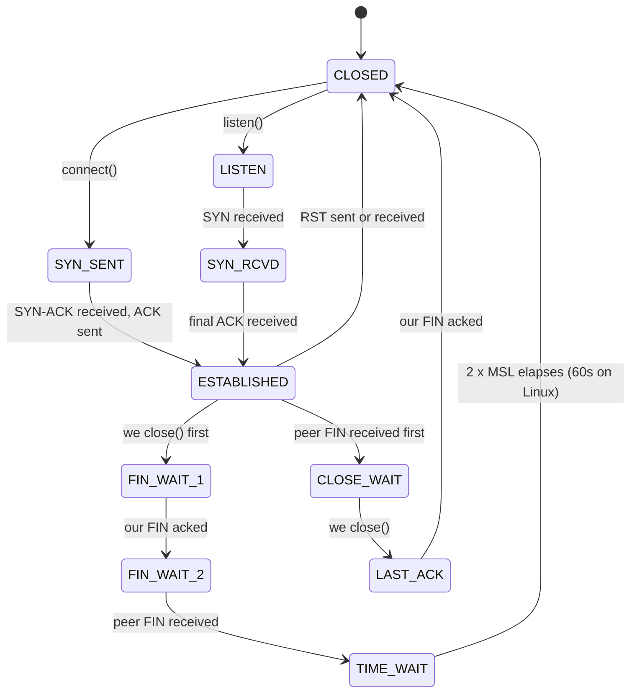

# TCP Sockets & The Kernel

Every node in this swarm talks to every other node over a raw TCP connection. Go hides that behind
`net.Listen` and `net.Dial`, which is convenient right up until a node stops accepting connections
under load, or a container restart leaves a peer stuck in `ESTABLISHED` against a socket that no
longer exists. At that point you are not debugging Go; you are debugging the kernel's TCP state
machine, and you need to know what lives where.

This page is the foundation for [Stream Framing](./stream-framing), which covers what the bytes
*mean* once they arrive, and for [epoll, select & Non-Blocking I/O](./nonblocking-io-and-epoll)
and [The Netpoller](./go-netpoller), which cover how Go multiplexes thousands of these sockets
onto a handful of OS threads.

## Core Mental Model

A socket is not a pipe between two programs. A socket is a **kernel-side data structure** that
your process holds a numbered handle to. Everything interesting -- the connection state machine,
the retransmission timers, the byte buffers, the congestion window -- lives in kernel memory and is
manipulated on your behalf by the network stack, on timers and interrupts, whether or not your
process is currently running.



Three consequences follow immediately, and they drive most of the design decisions in
`pkg/network/`:

1. **`write()` returning does not mean "delivered".** It means "copied into `sk_write_queue`".
   The kernel transmits when the congestion and receive windows allow. If the peer's container is
   killed a microsecond later, that data is lost, and your application never learns about it from
   that `write` call.
2. **Data can arrive while your goroutine is asleep.** The receive queue fills from softirq
   context. `read()` is a *drain* operation against a buffer that is already there, not a request
   to the peer.
3. **The connection can die without either `read` or `write` noticing for minutes**, because TCP
   has no obligation to probe an idle peer. This is precisely why the swarm carries its own
   heartbeats rather than trusting the socket to tell it the truth.

## Under the Hood

### The syscall lifecycle, and what each step allocates



The critical and widely misunderstood point: **`listen()` makes the kernel a fully autonomous TCP
peer.** Once `listen` has returned, the three-way handshake completes without your process being
scheduled at all. A client can `connect`, send 8 KB of data, and `close`, and your server process
may not have called `accept` even once. The connection is established, the data is buffered, and
it will be handed to you whenever you get round to it. This is why a hung `accept` loop presents
as *slow* rather than *refused*.

### Two queues, not one

Linux maintains two distinct structures behind a listening socket, and they overflow in completely
different ways with completely different symptoms.



**SYN queue overflow.** Behaviour depends on `net.ipv4.tcp_syncookies`. With syncookies enabled
(the default on modern distributions), the kernel encodes the connection state into the sequence
number of the SYN-ACK and stops tracking the half-open connection at all -- the connection still
works, but TCP options negotiated in the SYN (window scaling, SACK, timestamps) may be degraded.
With syncookies disabled, the SYN is dropped silently and the client retries after its SYN RTO
(1s, 2s, 4s, ...), which looks like a multi-second connect latency spike with no error anywhere.

**Accept queue overflow.** This is the one that will bite a swarm node. If the accept queue is full
-- which means your accept loop is not keeping up -- behaviour is governed by
`net.ipv4.tcp_abort_on_overflow`. Default is `0`: the final ACK is **ignored**, leaving the
connection in the SYN queue so the peer retransmits its ACK later and it may yet succeed. The
client believes it is connected (it sent the final ACK, so its state machine says `ESTABLISHED`)
and happily writes a handshake frame into a connection the server has never accepted. Set to `1`,
the kernel sends an RST instead and the client fails fast with "connection reset by peer".

Observe it:

```bash
$ ss -ltn
State    Recv-Q   Send-Q      Local Address:Port     Peer Address:Port
LISTEN   0        512               0.0.0.0:7946          0.0.0.0:*
LISTEN   0        4096              0.0.0.0:8080          0.0.0.0:*
```

On a **LISTEN** socket, `ss` overloads the columns: `Recv-Q` is the current number of established
connections waiting in the accept queue, and `Send-Q` is the accept queue's capacity. A `Recv-Q`
that is persistently non-zero on a listener means your accept loop is behind. `Recv-Q == Send-Q`
means you are actively dropping.

```bash
$ nstat -az | grep -i listen
TcpExtListenOverflows           1432        0.0
TcpExtListenDrops               1432        0.0
```

`ListenOverflows` incrementing is unambiguous proof of accept-queue overflow. This counter is the
first thing to check when nodes report intermittent connection failures under churn.

The backlog you pass to `listen(2)` is capped by `net.core.somaxconn`:

```bash
$ cat /proc/sys/net/core/somaxconn
4096
$ cat /proc/sys/net/ipv4/tcp_max_syn_backlog
1024
```

Go's `net.Listen` passes `somaxconn` as the backlog automatically (it reads
`/proc/sys/net/core/somaxconn` at runtime), so you rarely need to tune the application side -- but
inside a container that value comes from the container's network namespace sysctls, not the host's,
and defaults can be far lower than you expect.

### Send and receive buffers

Each `struct sock` owns two byte budgets:



`sk_rcvbuf` is the source of the advertised **receive window**. Roughly: the window offered to the
peer is the free space in `sk_rcvbuf`, minus an overhead reservation for `sk_buff` metadata
(controlled by `net.ipv4.tcp_adv_win_scale`), scaled by the window scale factor negotiated in the
SYN. When your application stops reading, free space shrinks, the advertised window shrinks, and
eventually the peer is told "window 0" and must stop sending. **That is TCP flow control, and it is
end-to-end backpressure you get for free** -- a slow consumer in one swarm node will eventually
block writes in its peer rather than exhaust memory.

Buffers autotune by default:

```bash
$ cat /proc/sys/net/ipv4/tcp_rmem
4096    131072   6291456      # min, default, max
$ cat /proc/sys/net/ipv4/tcp_wmem
4096    16384    4194304
$ cat /proc/sys/net/core/rmem_max
212992
```

The kernel grows the buffer within `[min, max]` based on measured bandwidth-delay product. The
moment you call `SetReadBuffer`/`SetWriteBuffer` (that is, `setsockopt(SO_RCVBUF/SO_SNDBUF)`) you
**disable autotuning for that socket** and pin it at your value -- and the kernel doubles what you
ask for to account for overhead, so `SO_RCVBUF = 65536` reports back as `131072`. For a
low-throughput control-plane mesh like this swarm, setting these explicitly is almost always a
pessimisation. "Let the kernel decide" is correct until a measurement says otherwise.

Inspect a live connection:

```bash
$ ss -tni dst 10.30.0.4
State  Recv-Q Send-Q      Local Address:Port      Peer Address:Port
ESTAB  0      0            10.30.0.2:51234         10.30.0.4:7946
     cubic wscale:7,7 rto:204 rtt:0.412/0.123 ato:40 mss:1448 pmtu:1500
     rcvmss:536 advmss:1448 cwnd:10 bytes_sent:184320 bytes_acked:184320
     bytes_received:92160 segs_out:142 segs_in:139 send 281Mbps
     lastsnd:12 lastrcv:12 lastack:12 pacing_rate 562Mbps delivery_rate 48Mbps
     busy:240ms rcv_space:14480 rcv_ssthresh:64088 minrtt:0.089
```

On an **ESTABLISHED** socket the columns mean what you expect: `Recv-Q` is unread bytes sitting in
the kernel waiting for your `read`, `Send-Q` is bytes written by you but not yet acknowledged by
the peer. A growing `Send-Q` on a heartbeat connection means the peer is not acknowledging -- it is
gone, or the path is broken, and you have found your failure before your own detector fired.
`lastsnd`/`lastrcv`/`lastack` are milliseconds since the last activity of each kind and are the
cheapest liveness signal available from outside the process. `rtt:0.412/0.123` is smoothed RTT and
its mean deviation, in milliseconds -- the same quantity `LatencyHealthStrategy` approximates at
the application layer.

### Blocking and non-blocking semantics

On a blocking stream socket:

- `read(fd, buf, n)` returns as soon as **at least one byte** is available. It returns the number
  of bytes copied, which may be anywhere in `[1, n]`. It returns `0` only on orderly shutdown
  (FIN received and receive queue drained). It blocks only if the receive queue is completely
  empty.
- `write(fd, buf, n)` blocks until *all* `n` bytes are copied into `sk_write_queue`, growing the
  queue up to `sk_sndbuf`. On a socket it will not normally return a short count unless
  interrupted by a signal after partial progress.

On a non-blocking socket (`O_NONBLOCK`), both return `-1/EAGAIN` instead of sleeping, and `write`
routinely returns a **short count**: it copies what fits and tells you how much.

Go's `net.Conn` presents blocking *semantics* over sockets that are, underneath, always
non-blocking. `Conn.Read` can and will return short -- `n < len(p)` with `err == nil` is normal and
correct, not an error condition. `Conn.Write`, by contrast, loops internally and only returns early
with an error, so `n < len(p)` from `Write` always accompanies a non-nil error. Getting the `Read`
case wrong is the single most common TCP bug, and it is the subject of
[Stream Framing](./stream-framing).

```go
// Correct: io.ReadFull loops until the buffer is full or the stream ends.
// A bare conn.Read(hdr) would happily return 2 of the 4 bytes you need.
func readHeader(conn net.Conn) (uint32, error) {
	var hdr [4]byte
	if _, err := io.ReadFull(conn, hdr[:]); err != nil {
		return 0, fmt.Errorf("read frame header: %w", err)
	}
	return binary.BigEndian.Uint32(hdr[:]), nil
}
```

Deadlines are the Go-native replacement for `SO_RCVTIMEO`. `SetReadDeadline` is absolute, not a
per-call duration, and it is not reset by a successful read -- you re-arm it before every
operation. An expired deadline yields an error satisfying `errors.Is(err, os.ErrDeadlineExceeded)`
and, critically, leaves the connection in an undefined read position: if you timed out halfway
through a frame, the stream is desynchronised and the connection must be discarded. The shipped
read loop re-arms the deadline before every frame (`pkg/network/conn.go:368`) and closes on any
error; see [Deadlines & I/O Timeouts](./deadlines-and-io-timeouts).

### The connection state machine



### Closing: FIN versus RST

| | Graceful close (FIN) | Abortive close (RST) |
|---|---|---|
| Exchange | `A -> FIN`, `A <- ACK`, `A <- FIN`, `A -> ACK` | `A -> RST`, nothing further |
| Meaning | "I have no more data to send" -- a half-close | "This connection is invalid, discard it" |
| Peer's next read | `io.EOF`, may keep writing its own side | `ECONNRESET` |
| Peer's pending receive data | Delivered | **Discarded** |
| Closer's end state | `TIME_WAIT` for 2 x MSL | `CLOSED` immediately, no `TIME_WAIT` |
| Typically caused by | `close()` on a drained socket | `close()` with unread data queued, `SO_LINGER` 0, data for a dead socket, connect to a port with no listener |

The practical distinction for this swarm: **a container killed with `SIGKILL` produces neither at
the application's request.** The process dies, the kernel closes its file descriptors, and the
kernel sends FINs on its behalf -- so a `docker kill` of a single process usually *does* produce a
clean FIN. But `docker network disconnect`, an `iptables DROP`, or a host that simply vanishes
produces *silence*. Your peer sits in `ESTABLISHED` forever, `read` blocks forever, and only an
application-level timeout will ever notice. Design for silence, not for EOF.

**TIME_WAIT** holds the 4-tuple for 2 x MSL (60s on Linux, `TCP_TIMEWAIT_LEN`, not tunable via
sysctl) on the side that closed first. It absorbs delayed duplicate segments from the dead
connection and guarantees the peer's final ACK can be retransmitted. `SO_REUSEADDR` lets you
`bind()` a *listening* socket to a port that has lingering TIME_WAIT connections -- it does **not**
let two live listeners share a port (that is `SO_REUSEPORT`, a different option with different
semantics). Go sets `SO_REUSEADDR` on listeners by default, which is why a restarted node can
rebind its port immediately.

### File descriptors are a finite kernel resource

Every accepted connection is a `struct file` plus a `struct socket` plus a `struct sock`, plus
whatever `sk_buff`s are queued. The fd number is just an index into your process's fd table, and
that table is bounded:

```bash
$ ulimit -n           # soft limit, per-process
1024
$ ulimit -Hn          # hard limit
524288
$ cat /proc/sys/fs/file-max        # system-wide
9223372036854775807
$ ls /proc/self/fd | wc -l         # what this process currently holds
14
```

When the soft limit is hit, `accept` fails with `EMFILE`. The failure mode is vicious: the
connection **stays in the accept queue**, so a naive `for { c, err := ln.Accept(); if err != nil
{ continue } }` loop spins at 100% CPU retrying the same undeletable connection forever. Go's
`net.Listener` mitigates this by treating `EMFILE` as a temporary error and backing off, but the
underlying resource leak -- usually connections that were never closed on an error path -- still
has to be fixed.

## Why It Matters in This Swarm

`pkg/network` now exists and the commitments below are cited to the code that honours them.
`pkg/cluster` is landing as this is written; its paragraphs remain commitments.

**`pkg/network/` -- listener and accept loop.** `acceptLoop` (`pkg/network/server.go:111`) does
nothing but `Accept` and hand the socket to `Pool.Admit`, which runs the handshake on its own
goroutine (`pkg/network/server.go:145`), so the accept queue is drained at the speed of a
goroutine spawn rather than the speed of a protocol handshake. Temporary accept errors
(`pkg/network/server.go:157`) get a bounded backoff from 5 ms to 1 s
(`pkg/network/server.go:107`). Every accepted socket is closed on every error path: a failed
handshake closes at `pkg/network/admit.go:29`, a failed dial handshake at
`pkg/network/dial.go:135`. See [Backoff & Connection Storms](./backoff-and-connection-storms).

**`pkg/network/` -- connection pool.** The mesh is full, so each node holds $N-1$ sockets, and
the pool guarantees exactly one per peer: `Connect` is idempotent per address
(`pkg/network/pool.go:230`) and `register` applies the tie-break so a second connection to the
same `NodeID` is closed, not kept (`pkg/network/registry.go:120`). Idle connections are reaped by
the per-frame read deadline (`pkg/network/conn.go:368`), not by a sweeper. See
[The Mesh and the Handshake](/architecture/mesh-and-handshake).

**`pkg/protocol/` -- framing codec.** Every fixed-size read is an `io.ReadFull`
(`pkg/protocol/framing.go:320` for the header, `pkg/protocol/framing.go:347` for the body), never a
bare `Read`. A framing violation is fatal to the connection: the reader classifies it
(`pkg/network/conn.go:37`) and closes (`pkg/network/conn.go:375`). See
[Stream Framing](./stream-framing) for why there is no other option.

**`pkg/health/` -- `LatencyHealthStrategy`.** The default strategy measures application-level
round-trip time, which is deliberately *not* the kernel's `srtt`. It includes accept-queue wait,
goroutine scheduling delay, and framing/serialisation cost -- precisely the components that make a
node a poor leader even when its network path is healthy. A node whose `ss -tni` shows a 0.4 ms
`rtt` but whose application RTT is 80 ms is a node whose event loop is saturated, and that is the
node the swarm must not elect.

**`pkg/cluster/` -- heartbeats and K-missed-beat failover.** This exists because, as established
above, TCP will not tell you a peer is gone. TCP keepalive (`SO_KEEPALIVE`, with
`tcp_keepalive_time` defaulting to 7200 seconds) is useless at swarm timescales; even tuned down it
only detects a dead *path*, not a hung *process*. The listener deliberately never enables it
(`pkg/network/server.go:28`). Application heartbeats detect both, and they
carry payload -- health scores, membership epochs -- that a kernel keepalive never could. The
cluster package commits to deriving liveness solely from its own heartbeat deadlines, and to
treating a socket error as a *hint* that accelerates failover rather than as the sole trigger.

**`deploy/` -- container sysctls.** Each container has its own network namespace and therefore its
own `somaxconn` and `tcp_max_syn_backlog`. The compose configuration commits to setting these
explicitly rather than inheriting whatever the base image provides, so that swarm behaviour is
reproducible across hosts.

## Common Failure Modes & Edge Cases

**Symptom: connections intermittently take exactly 1s, 3s, or 7s to establish.**
Cause: SYN queue overflow with syncookies disabled, or SYN packets dropped by the bridge. Those
durations are the SYN retransmission schedule. Check `nstat -az | grep -i syn` and
`net.ipv4.tcp_syncookies`.

**Symptom: the client logs "wrote handshake, waiting for reply" and then times out; the server has
no log of the connection at all.**
Cause: accept-queue overflow with `tcp_abort_on_overflow=0`. The client completed the handshake
from its own point of view; the server never accepted. `ss -ltn` will show `Recv-Q` at the
listener's capacity and `TcpExtListenOverflows` will be climbing.

**Symptom: a node shows dozens of `ESTABLISHED` connections to a peer that has been dead for twenty
minutes.**
Cause: the peer vanished without sending FIN or RST (network partition, `iptables DROP`, host power
loss). Nothing in TCP will ever resolve this on a connection with no pending writes. Only the
application heartbeat deadline will. If your heartbeat and your read deadline are both absent, the
goroutine blocks in `read` until the process is restarted.

**Symptom: `Send-Q` on one connection grows monotonically and never drains.**
Cause: the peer is alive enough to keep the connection open but is not reading -- its receive
buffer is full, it advertised a zero window, and your writes are piling up in `sk_write_queue`
until `sk_sndbuf` is reached, at which point your writing goroutine blocks. A blocked writer in a
heartbeat loop is a node that appears dead to everyone downstream. Always set a write deadline.

**Symptom: after restarting a node, `bind: address already in use`.**
Cause: a lingering socket in TIME_WAIT or, more likely in a container, a previous process holding
the port. `SO_REUSEADDR` (set by Go automatically) handles TIME_WAIT. It does not handle a live
listener, which is a different bug.

**Symptom: CPU pinned at 100% in the accept loop, no connections being served.**
Cause: `EMFILE` from fd exhaustion, combined with a retry loop that does not back off. Confirm with
`ls /proc/<pid>/fd | wc -l` against `ulimit -n`. The root cause is always a leaked connection
somewhere upstream, not the limit itself.

**Symptom: reads return fewer bytes than requested and the decoder produces garbage.**
Cause: treating `Read` as message-oriented. This is not an edge case; it is the normal behaviour of
a stream socket, and it is guaranteed to happen eventually at any message size. Covered in full in
[Stream Framing](./stream-framing).

**Symptom: `read: connection reset by peer` immediately after a clean-looking shutdown.**
Cause: the peer called `close()` while unread data remained in its receive queue, which forces an
RST rather than a FIN. This is common when one side gives up on a request and closes without
draining. It also destroys any data still in flight toward the closing side.

**Edge case: half-open connections.** `shutdown(fd, SHUT_WR)` sends FIN while leaving the read side
open. Go exposes this as `(*net.TCPConn).CloseWrite()`. It is the correct way to signal "I am done
sending, tell me what you have" -- but only if the peer's read loop distinguishes `io.EOF` on the
read side from a dead connection. A protocol that treats any EOF as "peer is gone" cannot use
half-close, which is one more reason the swarm protocol will terminate exchanges with an explicit
message rather than an EOF.

## Further Reading in This Curriculum

- [Stream Framing: There Are No Messages in TCP](./stream-framing) -- what to do with the bytes.
- [epoll, select & Non-Blocking I/O](./nonblocking-io-and-epoll) -- how one thread watches many
  sockets.
- [The Netpoller](./go-netpoller) -- how Go turns `EAGAIN` back into blocking semantics without
  blocking a thread.
