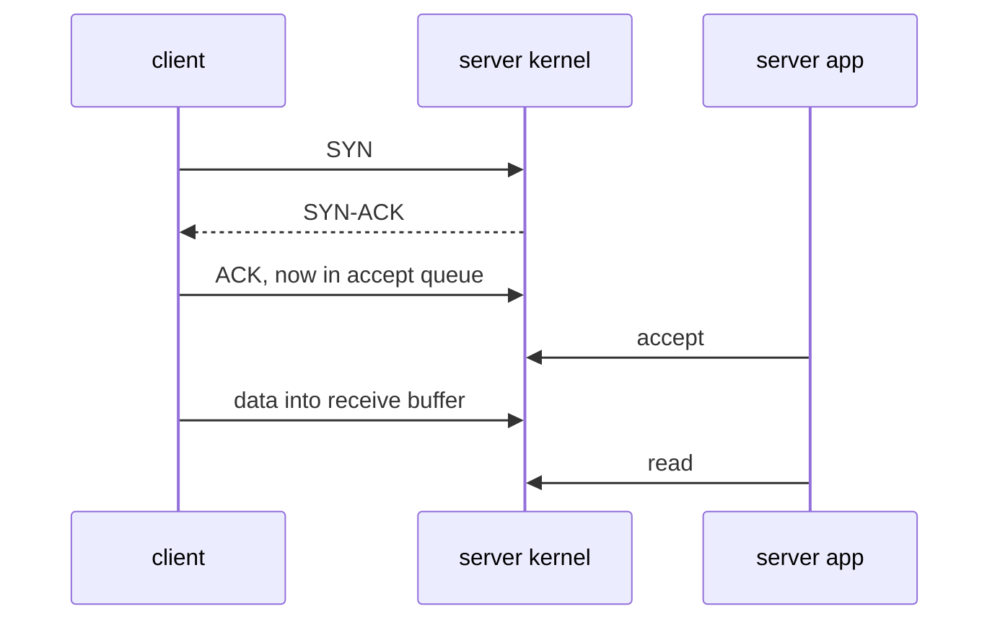

# TCP Sockets & The Kernel

A **socket** is the kernel's handle for one end of a network connection. Your program sees
only a file descriptor. The kernel does the real work: the handshake, retransmits, ordering,
and buffering in both directions.

Analogy: the kernel is a post office. You drop letters in its box (`write`) and pick them up
from your PO box (`read`). The post office handles delivery, but a letter being "accepted at
the counter" does not mean the recipient has read it.

The life of a connection:

Key points:

- The handshake is done by the kernel **before** the app calls `accept`. A frozen app still
  completes handshakes.
- `write` returns when data is copied into the kernel send buffer, not when the peer got it.
- If the peer's receive buffer is full, `write` eventually blocks.

## How swarm-net uses it

- `Listen` and `acceptLoop` in `backend/pkg/network/server.go` accept connections and hand
  each one to its own goroutine, so the accept queue drains quickly.
- `Pool.Connect` (`backend/pkg/network/pool.go`) dials peers with backoff
  (`backend/pkg/network/dial.go`). The mesh is full, so each node holds $N-1$ connections.
- Right after connecting, both sides exchange `HELLO` / `HELLO_ACK`
  (`backend/pkg/network/handshake.go`) to learn each other's node ID.
- TCP keep-alive is deliberately **not** enabled. A per-frame read deadline
  (`backend/pkg/network/conn.go`) detects dead peers much faster.
- Health is measured with PING/PONG over the connection (`backend/pkg/network/prober.go`), not
  with connect time, because the kernel answers SYNs even when the app is stuck.

## Common pitfalls

- **Treating a fast connect as "healthy".** It only proves the peer's kernel is alive.
- **Assuming `write` success means delivery.** The data may still be in a buffer when the peer dies.
- **No write timeout.** A peer that stops reading fills its buffer, and your writer blocks
  forever. swarm-net bounds each write (`WriteTimeout`).
- **Leaking sockets on error paths.** Every failed handshake must close the socket, or file
  descriptors run out.

## Further reading

- [TCP Teardown & Half-Open Sockets](./tcp-teardown-and-half-open-sockets)
- [Non-Blocking I/O](./nonblocking-io-and-epoll)
- [Deadlines & I/O Timeouts](./deadlines-and-io-timeouts)
