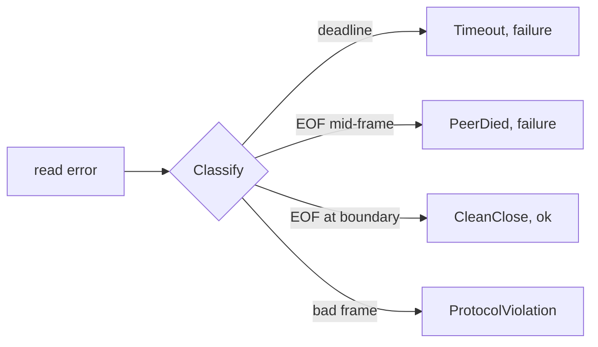

# TCP Teardown & Half-Open Sockets

A TCP connection can end three ways:

- **FIN:** a polite goodbye. The reader gets `io.EOF`.
- **RST:** an abrupt reset. The reader gets "connection reset by peer".
- **Nothing:** the peer's machine froze, lost network, or was paused. No packet is sent.

The third case is the dangerous one. Your side still shows the socket as `ESTABLISHED`, and a
read just waits forever. This is a **half-open** connection.

Analogy: a phone call where the other person walks away without hanging up. The line still
looks connected. The only way to notice is "nobody has said anything for a while".

Note: when a process is killed with `SIGKILL`, its kernel usually still closes the sockets. But
a paused container, a frozen host or a cut network produces pure silence.

## How swarm-net uses it

- Every read has a deadline. `readLoop` in `backend/pkg/network/conn.go` calls
  `SetReadDeadline` before each frame (15 s idle timeout by default).
- `Classify` turns the read error into a `Disposition`:
  - `DispositionCleanClose`: EOF at a frame boundary. Not a failure.
  - `DispositionPeerDied`: EOF in the middle of a frame. A failure.
  - `DispositionProtocolViolation`: bad frame. Not a failure, but the link is closed.
  - `DispositionTimeout`: silence past the deadline. A failure.
- Only `PeerDied` and `Timeout` count as failures (`IsFailure`), so a graceful shutdown does
  not trigger re-elections.
- The listener skips TCP keep-alive (`backend/pkg/network/server.go`). Its timers run in
  minutes, far slower than the deadline.
- Closing the socket wakes any goroutine blocked in a read or write, so shutdown does not wait
  for timeouts.

## Common pitfalls

- **Reads with no deadline.** A frozen peer hangs the reader forever.
- **Idle timeout shorter than the heartbeat or keep-alive.** Healthy quiet peers get cut.
- **Testing only with `docker stop`.** It sends SIGTERM, so peers get a tidy EOF. Use
  `docker pause` or `docker network disconnect` to test the silent case.
- **Trusting `ss` output.** `ESTABLISHED` on both ends does not mean the peer is alive.

## Further reading

- [TCP Sockets & The Kernel](./tcp-sockets-and-the-kernel)
- [Deadlines & I/O Timeouts](./deadlines-and-io-timeouts)
- [Stream Framing](./stream-framing)
