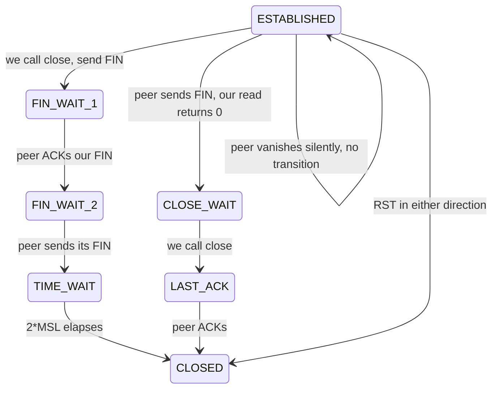

# TCP Teardown & Half-Open Sockets

Every page in this curriculum that mentions failover says the same thing in passing: "a killed
peer's socket stays open". This page is where that claim is made precise. It matters because the
`Disposition` taxonomy in `pkg/network/conn.go` -- the thing Phase 4 failover branches on -- is a
direct encoding of the three ways a TCP connection can end.

Prerequisites: [TCP Sockets & The Kernel](./tcp-sockets-and-the-kernel) for the socket buffers,
[Stream Framing](./stream-framing) for what "mid-frame" means.

## Core Mental Model

A TCP connection ends in one of three ways, and only two of them send a packet.

| How it ends | What crosses the wire | What the local `read` returns | Who you learn about |
|---|---|---|---|
| Graceful close: `close(fd)` or process exit with the kernel alive | `FIN` | `0` bytes (`io.EOF`) | the peer *chose* to leave |
| Abortive close: `SO_LINGER{0}`, unread data at close, or a segment to a closed port | `RST` | `ECONNRESET` | the peer *is* gone, or refuses you |
| Silence: power loss, network namespace torn down, partition, wedged process | nothing | nothing, ever | nobody, unless *you* set a timer |

The third row is the one that breaks intuition. A socket in `ESTABLISHED` is a kernel data
structure on *your* host. It says the last thing the kernel heard was consistent with a live
peer. It does not say the peer exists.



## Under the Hood

### FIN is sent by a kernel, not a process

`close(fd)` on the last reference to a socket makes the kernel queue a `FIN` after any unsent
data. Crucially, **process death is also a close**: when a process exits, for any reason including
`SIGKILL`, the kernel walks its file table and closes every descriptor. So `docker kill` on an
ordinary host *does* produce a `FIN` (or `RST` if there was unread data in the receive queue).

The exception is when the kernel-side socket goes away with the process. In Docker, a container's
sockets live in its network namespace. Two sequences produce silence:

1. The container is removed and its `veth` pair is torn down before the `FIN` retransmission
   schedule completes. The first `FIN` may be sent and lost, or the socket may be destroyed with
   the namespace.
2. The process is not dead but wedged: a stop-the-world GC pause, a deadlock, `SIGSTOP`, or a cgroup
   freeze. The kernel keeps ACKing your segments on its behalf. `ESTABLISHED` on both ends, and
   nothing will ever arrive.

Case 2 is why even a perfectly delivered `FIN` on death is not enough: the failures that matter for
leader election are the ones where the peer is *alive and useless*.

### What the survivor's kernel does with a silent peer

Nothing, unless it has something to send. TCP's retransmission timer only runs for unacknowledged
data. A connection with an empty send queue has no timer running and no reason to suspect anything.
With `tcp_retries2 = 15` (Linux default), a connection that *is* sending gives up after roughly
15 minutes. With `SO_KEEPALIVE` at defaults it takes `tcp_keepalive_time = 7200` seconds to send
the first probe.

```
$ ss -tan state established '( sport = :7000 )'
Recv-Q Send-Q  Local Address:Port   Peer Address:Port
0      0       172.28.0.4:7000      172.28.0.7:41822
```

That line looks identical whether `172.28.0.7` is alive, frozen, or a namespace that was deleted
three minutes ago. `ss` reports the local kernel's belief, which is all it has.

### Half-open, half-closed, and CLOSE_WAIT

- **Half-closed** is legitimate: one side sent `FIN` and can still receive. `shutdown(fd, SHUT_WR)`.
  This protocol never uses it -- every frame is a full-duplex exchange, and a `FIN` means "gone".
- **Half-open** is the fault: one side thinks the connection exists, the other has no record of it.
  The first segment the live side sends gets an `RST` back, *if* something is listening at that
  IP. If the IP is dark, the segment is retransmitted into the void.
- **`CLOSE_WAIT`** piling up is an application bug: the peer sent `FIN`, `read` returned `0`, and
  the application never called `close`. `pkg/network` cannot accumulate these because a reader
  error always leads to `closeWith`, which closes the socket (`pkg/network/conn.go:350`).

### The read deadline is the failure detector

Given the above, the only thing that reliably converts silence into an error is a timer the
application arms itself. `readLoop` sets a fresh deadline before every frame
(`pkg/network/conn.go:368`); when it fires, `ReadFrame` returns an error wrapping
`os.ErrDeadlineExceeded` and the loop classifies it (`pkg/network/conn.go:375`). The package-level
invariant is stated at `pkg/network/doc.go:10`: no unbounded read, ever. Deadline mechanics are
in [Deadlines & I/O Timeouts](./deadlines-and-io-timeouts).

The listener deliberately does not enable keep-alive (`pkg/network/server.go:28`). A kernel probe
schedule measured in minutes would be a second, slower detector disagreeing with the first, and it
detects a dead *path*, not a wedged *process* -- a frozen peer's kernel answers keep-alive probes
happily.

### The four-way Disposition

`Classify` (`pkg/network/conn.go:73`) maps the error that ended a read loop onto the way the
connection ended:

```go
func Classify(err error) Disposition {
	switch {
	case err == nil:
		return DispositionOther
	case errors.Is(err, os.ErrDeadlineExceeded):
		return DispositionTimeout
	case errors.Is(err, io.ErrUnexpectedEOF):
		return DispositionPeerDied
	case errors.Is(err, io.EOF):
		return DispositionCleanClose
	case protocol.IsProtocolViolation(err):
		return DispositionProtocolViolation
	default:
		return DispositionOther
	}
}
```

| Disposition | Wire event | Meaning | `IsFailure()` |
|---|---|---|---|
| `CleanClose` (`pkg/network/conn.go:30`) | `FIN` at a frame boundary | the peer finished its frame and left | no |
| `PeerDied` (`pkg/network/conn.go:33`) | `FIN`/`RST` mid-frame | the peer vanished holding the pen | **yes** |
| `ProtocolViolation` (`pkg/network/conn.go:37`) | a frame this codec refuses | the peer is speaking nonsense, not dead | no |
| `Timeout` (`pkg/network/conn.go:41`) | nothing | silence past `IdleTimeout` | **yes** |

Only two count as evidence of an unhealthy peer (`pkg/network/conn.go:64`). A clean close is a
node leaving; counting it would turn a graceful scale-down into a swarm-wide re-election. A
protocol violation is a version skew; counting it would evict a node for being upgraded.

Order matters in `Classify`: the deadline check runs first (`pkg/network/conn.go:77`) because a
deadline firing mid-frame surfaces as a read error that could otherwise be mistaken for
truncation.

## Why It Matters in This Swarm

- **Failover decisions consume `Disposition`, not the raw error.** The `PeerDown` event carries
  it (`pkg/network/transport.go:44`), and the comment at `pkg/network/conn.go:20` says why: a
  clean shutdown conflated with a death means every `docker compose down` looks like a mass
  casualty.
- **A failed write is terminal too.** The writer closes the connection on any write error
  (`pkg/network/conn.go:415`), because the peer is now holding a length prefix for a frame that
  will never arrive. The stream cannot be resynchronised.
- **`Close` unblocks parked goroutines.** Closing the socket is what wakes a reader parked in
  `ReadFull` and a writer parked in `Write` (`pkg/network/conn.go:303`). Without it, shutdown would
  wait out `IdleTimeout` on every connection.
- **Chaos testing must use `docker kill`, not `docker stop`.** `stop` sends `SIGTERM`, the process
  closes its sockets, and every peer gets a tidy `io.EOF`. Only `kill` (and `pause`, and
  `network disconnect`) exercise the silent path that the deadline exists for.

## Common Failure Modes & Edge Cases

**Peer frozen, connection "healthy".** *Symptom:* `ss` shows `ESTABLISHED` on both ends, the
dashboard shows the node as up, but no telemetry has arrived in a minute. *Cause:* `docker pause`,
a long GC, or a CPU-quota freeze. *Detection:* `DispositionTimeout` after `IdleTimeout`. Nothing
faster exists at the transport layer, which is why the cluster layer also runs heartbeats with a
tighter budget.

**`FIN` lost, `RST` never comes.** *Symptom:* a killed container is only noticed after
`IdleTimeout`, not immediately. *Cause:* the namespace was torn down before the `FIN` retransmit.
This is normal, not a bug. The deadline is the fallback for exactly this case.

**Reading `ECONNRESET` as "peer died".** *Symptom:* a node that was told "you are already
connected to me" during a simultaneous dial gets counted as a failure. *Cause:* an `RST` can arrive
when the peer closes a socket with unread data in its receive queue -- which is what the tie-break
loser's close does. `Classify` returns `DispositionOther` for a raw `ECONNRESET` (it matches
neither EOF sentinel), so it is *not* counted. The `PeerDown` for a tie-break loser is suppressed
entirely by the registry -- see [The Mesh and the Handshake](/architecture/mesh-and-handshake).

**Idle timeout shorter than the heartbeat interval.** *Symptom:* every connection in the swarm
dies and redials on a fixed period, with `disposition=timeout` in the logs and no actual outage.
*Cause:* `ConnConfig.IdleTimeout` (`pkg/network/conn.go:107`) set below the interval at which
peers actually send. Healthy quiet peers are reaped for being quiet.

**`CLOSE_WAIT` accumulating in `ss` output.** *Symptom:* `ss -tan | grep CLOSE-WAIT | wc -l`
climbs; eventually `EMFILE`. *Cause:* some code path reads `0` and does not close. Not possible
through `Conn`, but possible in any hand-rolled reader added later. `pkg/network/conn.go:159`
states the guarantee to preserve: the reader returns on any read error, and every return closes.
