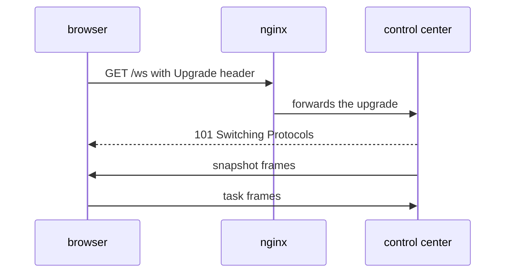

# WebSocket Framing & The HTTP Upgrade

Browsers cannot open raw TCP sockets. A **WebSocket** gives them the next best thing: a
long-lived, two-way connection that carries whole messages. It starts as a normal HTTP request
with an `Upgrade: websocket` header. The server answers `101 Switching Protocols`, and from
then on the same TCP connection carries WebSocket **frames** instead of HTTP.

Analogy: you walk into a shop (HTTP), and the clerk says "let's switch to walkie-talkies"
(the upgrade). Now either side can talk at any time.

Each frame has a small header with an opcode (text, binary, ping, pong, close) and a length.
Browser-to-server frames are masked. This is the same framing idea as the mesh protocol, with
a different header.

## How swarm-net uses it

- The dashboard in `frontend/` is served by nginx, which proxies `/ws` (and `/api`) to the
  control center.
- `handleWS` in `backend/pkg/controlcenter/http.go` accepts the upgrade with
  `github.com/coder/websocket`. Default options allow same-origin browsers only.
- `SetReadLimit` caps incoming messages at 64 KiB.
- One goroutine writes (snapshots, about every second) and one reads. The reader is required:
  the library only handles ping and close frames while something is reading.
- Each browser has a bounded outgoing buffer (`DefaultClientBuffer` in
  `backend/pkg/controlcenter/server.go`). Each write is bounded by `WSWriteTimeout` (5 s).

## Common pitfalls

- **Proxy drops the upgrade.** nginx must forward the `Upgrade` and `Connection` headers, or
  the browser gets a plain HTTP response and never connects.
- **Proxy idle timeout.** A quiet WebSocket is closed by the proxy after its read timeout.
  Regular traffic or pings keep it open.
- **No reader goroutine.** Pings and close frames are never processed, and the connection
  looks stuck.
- **A slow browser blocking everyone.** Without a bounded per-client buffer, one slow tab stalls
  the broadcast for all tabs.

## Further reading

- [Backpressure & Bounded Queues](./backpressure-and-bounded-queues)
- [Stream Framing](./stream-framing)
- [RFC 6455: The WebSocket Protocol](https://www.rfc-editor.org/rfc/rfc6455)
