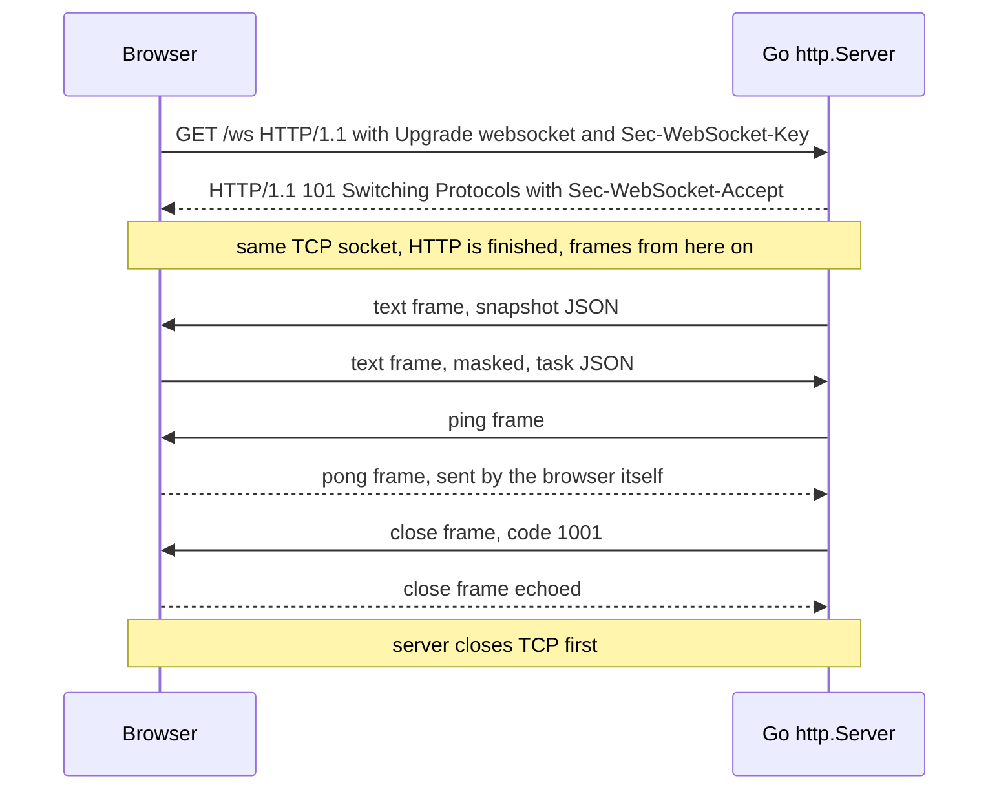

# WebSocket Framing & The HTTP Upgrade

The dashboard talks to the Control Center over one WebSocket. This page explains
what that is at the byte level, and why the server code in
`pkg/controlcenter/http.go` looks the way it does.

Prerequisites: [TCP Sockets & The Kernel](./tcp-sockets-and-the-kernel),
[Stream Framing](./stream-framing).

## Core Mental Model

A WebSocket is **a TCP connection that started life as an HTTP request**. After
one request and one `101` response, HTTP is gone. What remains is a
bidirectional stream of **framed messages** -- the same problem our own wire
protocol solves with a length prefix, solved by RFC 6455 with a small header.



| Compared with | WebSocket |
|---|---|
| Raw TCP | Adds message boundaries, text vs binary, ping/pong, close codes |
| HTTP polling | One socket, server can push, no per-message headers |
| Our mesh protocol | Same idea (framing), different header, runs through browsers and proxies |

## Under the Hood

### 1. The upgrade handshake

The browser sends an ordinary `GET`:

```
GET /ws HTTP/1.1
Host: localhost:8080
Upgrade: websocket
Connection: Upgrade
Sec-WebSocket-Key: dGhlIHNhbXBsZSBub25jZQ==
Sec-WebSocket-Version: 13
Origin: http://localhost:8080
```

The server proves it understood by hashing the key with a fixed GUID:

```go
const wsGUID = "258EAFA5-E914-47DA-95CA-C5AB0DC85B11" // RFC 6455, fixed

func acceptKey(clientKey string) string {
	sum := sha1.Sum([]byte(clientKey + wsGUID))
	return base64.StdEncoding.EncodeToString(sum[:])
}
// acceptKey("dGhlIHNhbXBsZSBub25jZQ==") == "s3pPLMBiTxaQ9kYGzzhZRbK+xOo="
```

```
HTTP/1.1 101 Switching Protocols
Upgrade: websocket
Connection: Upgrade
Sec-WebSocket-Accept: s3pPLMBiTxaQ9kYGzzhZRbK+xOo=
```

This is not security. It only stops a non-WebSocket server (or a cache) from
accidentally "accepting". Access control is the `Origin` check (below).

### 2. Hijacking: leaving `net/http`

To write the `101` and keep the socket, the server calls
`http.Hijacker.Hijack()`. From that point:

- `net/http` no longer owns the `net.Conn`. It will not read, time out or close it.
- `http.Server.Shutdown` **does not close or wait for** hijacked connections.
- The request's `r.Context()` is no longer a reliable "client went away" signal.

The library (`github.com/coder/websocket`) does the hijack inside
`websocket.Accept` (`pkg/controlcenter/http.go:163`).

### 3. The frame header

| Field | Size | Meaning |
|---|---|---|
| `FIN` | 1 bit (byte 0) | last fragment of this message |
| `RSV1..3` | 3 bits | extensions only, otherwise 0 |
| `opcode` | 4 bits | frame type (table below) |
| `MASK` | 1 bit (byte 1) | payload is masked |
| `len` | 7 bits | 0-125 = length, 126 = 16-bit length follows, 127 = 64-bit length follows |
| extended length | 0, 2 or 8 bytes | big-endian |
| masking key | 0 or 4 bytes | present only if `MASK` = 1 |
| payload | `len` bytes | -- |

| Opcode | Meaning | Notes |
|---|---|---|
| `0x0` | continuation | later fragments of a message |
| `0x1` | text | payload must be valid UTF-8 |
| `0x2` | binary | any bytes |
| `0x8` | close | 2-byte code + reason, at most 125 bytes total |
| `0x9` | ping | at most 125 bytes, never fragmented |
| `0xA` | pong | echoes the ping payload |

Length encoding, as real bytes (checked with the builder below):

| Payload | Header bytes |
|---|---|
| `"hi"` (2 bytes) | `81 02` then `68 69` |
| 300 bytes | `81 7e 01 2c` (126 means "next 2 bytes are the length") |
| over 65535 bytes | `81 7f` + 8-byte length |

```go
// textFrame builds one unmasked, unfragmented server-to-client text frame.
func textFrame(payload []byte) []byte {
	const finText = 0x81 // FIN=1, opcode=0x1
	n := len(payload)
	var hdr []byte
	switch {
	case n <= 125:
		hdr = []byte{finText, byte(n)}
	case n <= 0xFFFF:
		hdr = []byte{finText, 126, byte(n >> 8), byte(n)}
	default:
		hdr = []byte{finText, 127, 0, 0, 0, 0, byte(n >> 24), byte(n >> 16), byte(n >> 8), byte(n)}
	}
	return append(hdr, payload...)
}
```

A small snapshot uses the 2-byte extended length. A snapshot carrying the full 200-task table can pass 65535 bytes and switch to the 8-byte form.

### 4. Masking

- Client to server frames **must** be masked: `payload[i] ^= key[i%4]`.
- Server to client frames **must not** be masked.

Masking is not encryption; the key is in the frame. It exists so that a
malicious page cannot make the browser emit bytes that a naive proxy would
parse as an HTTP request and cache. A server must reject unmasked client
frames, and the library does.

### 5. Control frames and who answers them

- The browser answers a server `ping` with a `pong` automatically. JavaScript
  cannot send pings at all.
- On the Go side, control frames are processed **only while some goroutine is
  inside `Read`**. A server that only writes never sees a pong or a close frame.
- A close is a handshake: one side sends `close(code)`, the other echoes it,
  then the server closes TCP.

| Code | Meaning | Used here |
|---|---|---|
| 1000 | normal | -- |
| 1001 | going away | CC shutting down (`http.go:218`) |
| 1006 | abnormal, TCP died with no close frame | seen by the browser, never sent |
| 1008 | policy violation | slow client dropped (`http.go:220`) |
| 1011 | internal error | write failed (`http.go:227`) |
| 1013 | try again later | hub not running at connect (`http.go:180`) |

### 6. Origin

Browsers attach `Origin` to every WebSocket request and do **not** apply the
same-origin policy to WebSockets. Any page you visit could open
`ws://localhost:8080/ws`. The server must check `Origin` itself.
`websocket.Accept(w, r, nil)` rejects an `Origin` whose host differs from the
request `Host` with `403`.

## Why It Matters in This Swarm

- **One reader, one writer per browser.** `handleWS` is the writer and starts a
  reader (`pkg/controlcenter/http.go:160`). Without the reader, pings and close
  frames from the browser would never be processed.
- **Reader context is detached.** In `coder/websocket`, cancelling the context
  passed to `Read` closes the connection. The reader therefore runs on
  `context.WithoutCancel(ctx)` (`http.go:194`), so dropping a client lets the
  writer send a proper `1008` first.
- **Close codes carry meaning.** `writeWS` returns `1001` on shutdown and
  `1008` for a slow client (`http.go:212-220`). They show up in the browser devtools and in `ev.code` of `onclose` (the dashboard logs only "connection lost").
- **Limits.** `SetReadLimit(64 KiB)` bounds what a browser can make the server
  buffer (`http.go:17`, `http.go:168`).
- **Hijacked means invisible to Shutdown.** The CC drops every browser from the
  hub before calling `http.Server.Shutdown`
  (`cmd/control-center/main.go:78-81`). See
  [Graceful Shutdown & Teardown Ordering](./graceful-shutdown-and-teardown-ordering).
- **Same-origin only.** Chaos can kill nodes; the default origin check keeps
  other websites from doing it through your browser (`http.go:163`).

## Common Failure Modes & Edge Cases

| Symptom | Cause |
|---|---|
| Browser: `WebSocket connection failed`, server log `403` | `Origin` host differs from `Host`, for example a reverse proxy rewriting `Host` |
| Connection drops every 60s behind nginx | Proxy `proxy_read_timeout` on a quiet socket. The CC sends a snapshot every 1s, which avoids it. |
| `400` on upgrade behind a proxy | Proxy strips `Upgrade` and `Connection` (hop-by-hop headers) unless told to forward them |
| Server never notices a closed tab | No goroutine is reading, so the close frame is never processed. The next write fails instead, up to the write timeout later. |
| Browser `onclose` with code 1006 | TCP ended with no close frame: server crash, `CloseNow`, or a network cut |
| Server shutdown hangs for the full grace period | WebSockets left for `http.Server.Shutdown`, which ignores hijacked connections |
| Text message rejected | Payload is not valid UTF-8. Send JSON as text, raw bytes as binary. |
| Memory grows with slow clients | Unbounded per-client queue. Bound it and drop, as `hub.sendTo` does. See [Backpressure & Bounded Queues](./backpressure-and-bounded-queues). |

## Related

- [The Control Center](/architecture/control-center)
- [Stream Framing](./stream-framing) -- the same problem, solved for the mesh.
- [Context & Cancellation Propagation](./context-cancellation)
