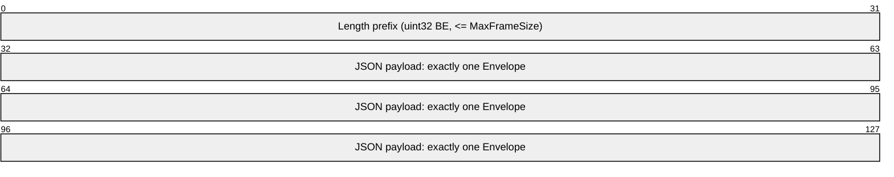
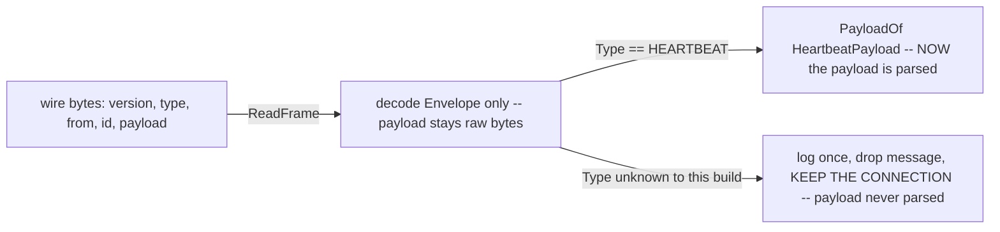
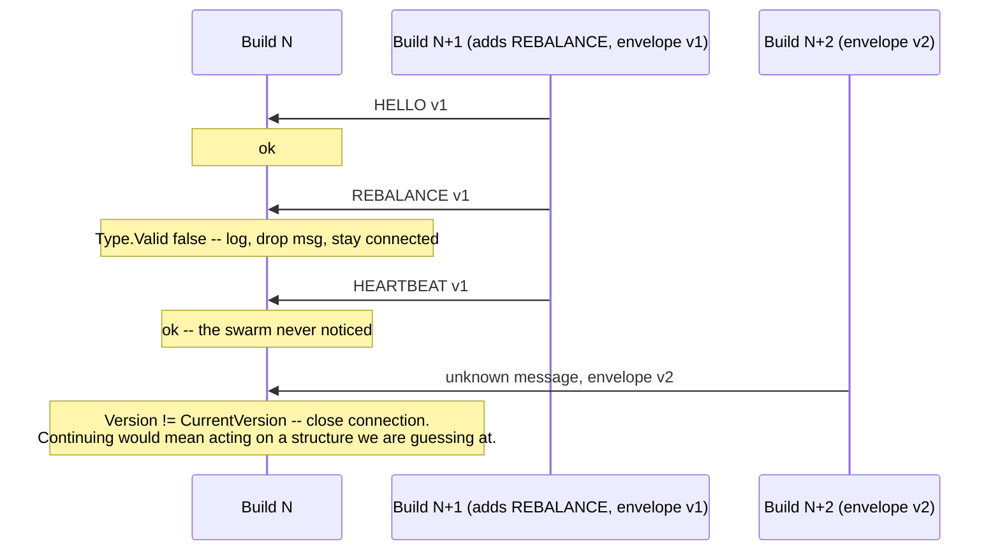
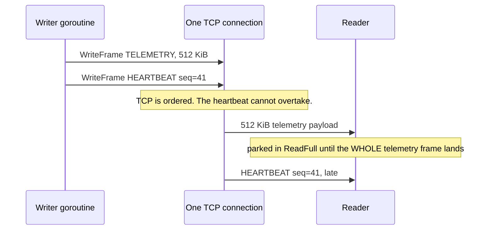
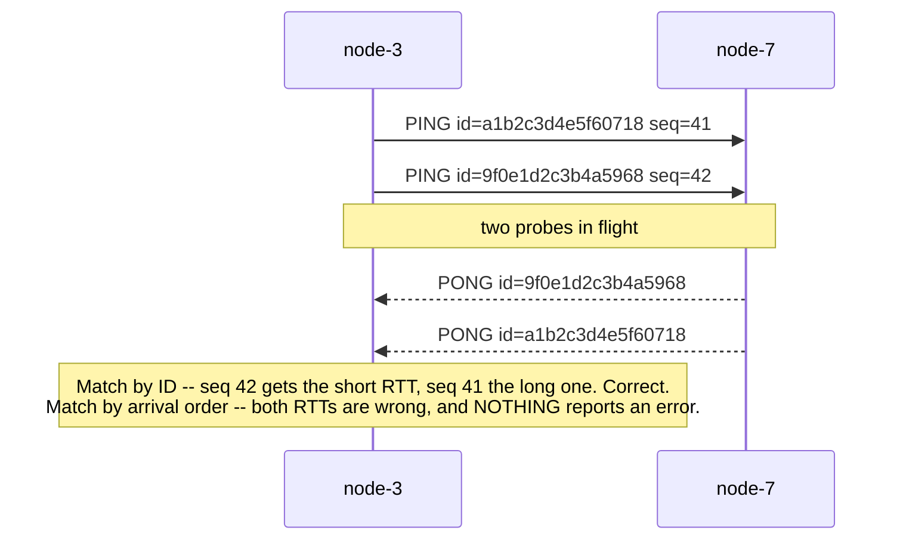
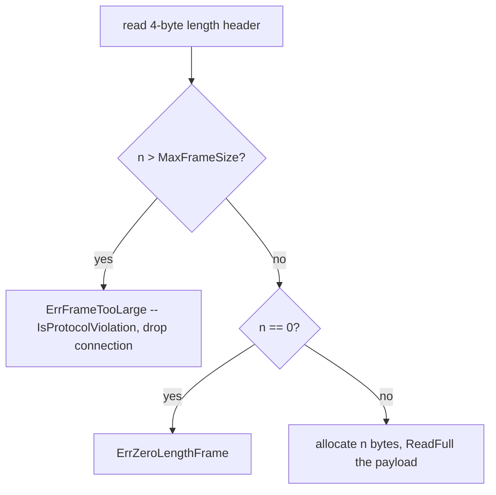

# Wire Protocol Design: Envelopes, Versions & Identity

This page is about the *shape of the bytes*: the schema, the version axis, the identity model, the
correlation model. It is not about how a frame is delimited on a TCP stream -- that is
[Stream Framing](./stream-framing), and you should read it first. Everything here assumes some
layer below has already handed you one complete blob of JSON and told you where it ended.

On the wire, one frame looks like this:



The division of labour between the two layers:

| Layer | Question it answers | Mechanism | Knows nothing about |
|---|---|---|---|
| `pkg/protocol/framing.go` | "where does this message END?" | 4-byte big-endian length prefix, bounds check, `io.ReadFull` | what the bytes mean |
| `pkg/protocol/message.go` | "what IS this message, and may I act on it?" | `Envelope{Version, Type, From, To, ID, SentAtUnixNano, Payload}` | sockets |

Two layers, two vocabularies of failure. Confusing them is how protocols rot.

---

## 1. Core Mental Model

### 1.1 The envelope pattern

Every frame decodes into exactly one `Envelope` (`pkg/protocol/message.go:175`): a small,
fixed, *always-parseable* header struct plus one field whose bytes the envelope decoder refuses to
look at.

```go
type Envelope struct {
    Version        uint8           `json:"version"`
    Type           MessageType     `json:"type"`
    From           NodeID          `json:"from"`
    To             NodeID          `json:"to,omitempty"`
    ID             string          `json:"id,omitempty"`
    SentAtUnixNano int64           `json:"sent_at_unix_nano"`
    Payload        json.RawMessage `json:"payload,omitempty"`
}
```

`json.RawMessage` (`message.go:225`) is the load-bearing type: `[]byte` with marshal methods that
copy raw bytes verbatim. When `json.Unmarshal` reaches `"payload"` it does not recurse into the
sub-object; it captures the byte span and moves on. The payload is decoded later, by the handler
that already knows what `Type` means, via `PayloadOf[T]` (`message.go:375`).

That is **deferred decoding**:



Two alternatives you might reach for instead:

- **A single flat struct**, every field of every message type hoisted into one giant struct with
  `omitempty`. This breaks the moment two message types want a field with the same name and
  different semantics, and it destroys the "I can route this without understanding it" property:
  with no opaque region, the decoder must parse everything in order to parse anything.
- **A type switch over concrete Go types.** This cannot work over a wire at all, because JSON has
  no type tags. Something must tell the decoder which concrete type to allocate *before* it
  decodes, and that something is exactly `Envelope.Type`. You have moved the discriminator, not
  removed it.

The third property the envelope buys is **uniform routing metadata**. `From`, `To` and `ID` are
present on every message regardless of type, so a relay, logger, dashboard tap or metrics counter
can do useful work on a message whose payload it has no schema for. `DumpStream` in `framing.go`
is a direct beneficiary: it prints a legible trace of a connection carrying message types it was
never taught.

### 1.2 One envelope per frame, never a batch

The comment at `message.go:172` states the rule: exactly one `Envelope` per frame, no batching.
That is a latency decision, not a simplicity decision. A batching encoder necessarily holds the
first message while it waits to see whether a second arrives. On the control plane -- where a
`HEARTBEAT` arriving 200 ms late is operationally identical to a node that died -- an encoder that
voluntarily delays messages to improve throughput trades a correctness property for a bandwidth
property. In a swarm of a dozen containers on one bridge network, there was never a bandwidth
problem to trade for.

---

## 2. Under the Hood

### 2.1 Why `encoding/json` ignores unknown fields

`json.Unmarshal` iterates the *input* object's keys and looks for a matching struct field by tag,
then exact name, then case-insensitively. A key with no matching field is not an error: the
decoder parses the value to find where it ends, skips it, and continues. This is the default, and
it is the single most important forward-compatibility property in the standard library.

The opposite behaviour is opt-in:

```go
dec := json.NewDecoder(r)
dec.DisallowUnknownFields() // now an unrecognised key is an error
```

`DisallowUnknownFields` is right for a *configuration file authored by a human*: a typo'd key that
silently does nothing is a support ticket, and failing loudly at start-up is a gift. It is
**wrong on a wire between peers of different versions**, which is what this mesh is. A node
running build N+1 that adds an optional `region` field to `HelloPayload` must still be able to
talk to build N. With the default, build N skips `region` and keeps working. With
`DisallowUnknownFields`, build N rejects the HELLO and the new node cannot join the swarm it is
rolling into. `framing.go` uses plain `json.Unmarshal`, and that is a decision, not an omission.

Two schema-evolution rules follow:

> **Must-ignore-unknown-fields.** A receiver silently discards fields it does not know. A sender
> may therefore add fields without coordinating a flag day.

> **Additive-only within a version.** You may add an optional field or a message type. You may
> *not* change the meaning, type or units of an existing field, remove a field a peer may depend
> on, or make a previously-optional field required. Those require a version bump, because
> must-ignore cannot save you from a field that is present but means something else.

The sharp edge in rule two is "change the units", because it produces no decode error anywhere. A
build that reinterprets `HeartbeatPayload.ClusterSize` as a byte count will decode perfectly and
be wrong.

### 2.2 The asymmetry: unknown *type* is ignorable, unknown *version* is fatal

This is the subtlest decision in `message.go`; the policy is written out at `message.go:27`.

| The receiver does not recognise... | Response | Why |
|---|---|---|
| `Envelope.Type` | log once, drop message, **keep connection** | The frame decoded cleanly. Recoverable. |
| `Envelope.Version` | **drop the connection** | The layout itself is in question. Unrecoverable. |
| a field inside the payload | ignore it | Must-ignore-unknown-fields. |
| the payload's *shape* for a known type | drop connection (`ErrMalformedFrame`) | Peer claims a type it did not send. |

Row one is a direct consequence of gossip discovery. Peers learn about each other transitively;
no central registry decides who may speak to whom. So during any rolling upgrade -- including the
ordinary case of restarting containers one at a time -- a build-N+1 node *will* send a build-N
node a message type that did not exist when build N was compiled. That is not an anomaly; it is
the designed-for consequence of upgrading a distributed system incrementally. If an unknown type
killed the connection, a rolling upgrade would manifest as connection churn across the mesh, which
the failure detector would read as a partition, which would trigger elections. The upgrade would
look exactly like an outage.

Crucially, **nothing is lost by continuing.** The framing layer already told us where the frame
ended, so the stream is still exactly on a frame boundary and the next `io.ReadFull` lands on the
next length header. The only casualty is one message we could not act on.

Row two holds none of that. If the envelope layout changed -- a field became a different JSON
type, the payload moved, a new required discriminator appeared -- the receiver does not know what
it is holding. It may have decoded *something*, because JSON is permissive, but it cannot know
whether `From` still means what it used to. Acting on a misunderstood message is worse than not
acting: a misparsed `ELECTION_RESULT` could install a leader that was never elected.
`CurrentVersion` (`message.go:18`) sits on a deliberately separate axis from `MessageType`
precisely so that adding a type -- a backward-compatible change -- does not force a version bump
that would sever every connection to an older node.



### 2.3 `knownTypes`, and a synchronisation story that is "there is none"

`Valid()` (`message.go:157`), `IsControlPlane()` (`message.go:164`) and `IsDataPlane()`
(`message.go:168`) are each one map lookup into `knownTypes` (`message.go:127`), a package-level
`map[MessageType]plane`.

Every goroutine on every connection reads that map concurrently, with no mutex and no `sync.Map`.
That is safe for the reason stated at `message.go:121`: the map is written exactly once, by its
composite literal, during package initialisation, and never mutated again.

This is a specific property of the Go memory model. Package-level variable initialisation
happens-before any `init` function, which happens-before `main`, which happens-before any
goroutine `main` starts. Every subsequent read is therefore ordered after the single write by a
chain of happens-before edges, and a data race requires two *unsynchronised* accesses of which at
least one is a write. There is only one write, and it is ordered before everything.

`go test -race` would fire immediately if a runtime registration API were added -- which is exactly
why `message.go:124` records that adding one is deliberately declined. A `RegisterType()` would
introduce a second write, concurrent with live reads, and the fix would be a mutex on the hottest
path in the protocol package.

Note the return of `IsControlPlane` for an unknown type: `knownTypes[t]` on a missing key yields
the zero value of `plane`, which is `planeUnknown` (`message.go:148`), so an unknown type reports
`false` for both planes. That zero value was placed first in the `iota` block for this reason.

### 2.4 `MessageType` is a string, on purpose

`type MessageType string` (`message.go:45`) with values like `"HEARTBEAT"`, rather than a `uint8`
enum. The comment at `message.go:20` gives the trade: the frames are JSON, the whole point of
choosing JSON was that a human with `DumpStream` or a packet capture can read a live connection,
and `"HEARTBEAT"` is legible where `0x07` is not. The cost is a handful of bytes per frame at
heartbeat rates, negligible against the JSON object that follows.

There is a second benefit. Integer enums invite *reuse of retired numbers*: when type `7` is
removed in build N+1 and a different type takes `7` in build N+3, a build-N node still in the
swarm decodes the new message as the old one and acts on it. String type names are effectively
never recycled by accident.

---

## 3. Why It Matters in This Swarm

### 3.1 Two traffic planes sharing one mesh

The type constants are split into two blocks, control plane at `message.go:47` and data plane at
`message.go:98`.

| | Control plane | Data plane |
|---|---|---|
| Profile | small, constant-rate, latency-critical | bursty, large, throughput-oriented |
| Types | `HELLO` / `HELLO_ACK` (`:61`, `:64`), `PING` / `PONG` (`:69`, `:71`), `HEARTBEAT` / `HB_ACK` (`:75`, `:78`), `MEMBERSHIP_DELTA` (`:82`), `ELECTION_RESULT` (`:84`), `JOIN_CLUSTER` / `JOIN_ACK` (`:88`, `:90`), `LEAVE` (`:95`) | `TASK` (`message.go:110`), `TASK_RESULT` (`message.go:112`), `TELEMETRY` (`message.go:116`) |
| Cost of a drop | a spurious failover | a gap in a dashboard |

That asymmetry in the cost of delay is the whole reason the planes are labelled in the type system
rather than left as an implicit convention.

### 3.2 Head-of-line blocking -- the load-bearing hazard

A single TCP connection is a single ordered byte stream. Bytes are delivered in the order written
and cannot overtake one another. If a 512 KiB `TELEMETRY` frame is written and a `HEARTBEAT` is
written immediately behind it, the heartbeat cannot begin transmission until the last telemetry
byte has been handed to the socket, and cannot be *read* by the peer until the telemetry frame has
been fully received -- because `ReadFrame` is a blocking `io.ReadFull` of the declared length.



The arithmetic, on a link momentarily delivering about 5 MB/s:

- 512 KiB is roughly 100 ms of pure transmission time.
- A retransmit after a loss costs at least another 200 ms, since `TCP_RTO_MIN` on Linux is 200 ms.
  Nothing behind it moves during that window.
- Heartbeat interval 250 ms with $K = 3$ missed beats gives a budget before eviction of about
  750 ms. One unlucky burst plus one retransmit can consume most of it.

Result: a perfectly healthy leader is declared dead and the swarm re-elects. The leader was never
sick; the connection was busy. The failure detector cannot tell those apart, because from inside
`ReadFrame` they are the same observation -- no heartbeat arrived.

This is why `IsControlPlane()` and `IsDataPlane()` exist now, before anything consumes them. They
are the seam along which a Phase 3/4 change can split the two planes onto **separate TCP
connections** to the same peer, so a large task payload occupies its own stream and its own send
buffer and cannot enqueue ahead of a heartbeat. Two connections do not eliminate contention -- they
still share a NIC, a qdisc and a bridge -- but they eliminate *head-of-line* blocking, which is the
part that turns a throughput event into a false-failure event. It is the same problem HTTP/2
solved with streams and then re-encountered at the TCP layer, which is why HTTP/3 moved to QUIC.
See [Architecture Overview](../architecture/overview) for where this sits in the roadmap, and
[TCP Sockets & The Kernel](./tcp-sockets-and-the-kernel) for what "handed to the socket" means in
terms of `SO_SNDBUF` and the congestion window.

### 3.3 Correlation IDs over a multiplexed stream

`Envelope.ID` (`message.go:198`) is 16 hex characters minted by `NewMessageID`
(`message.go:400`). It exists because one connection carries many concurrent request/response
exchanges, and responses are not required to arrive in request order.



The reply **echoes** the request's ID; it does not mint a new one. `NewEnvelope`
(`message.go:322`) always mints a fresh ID, which is right for a request and wrong for a response,
so `NewReply` (`message.go:342`) exists specifically to build the reply and then overwrite
`e.ID = req.ID`. That function exists because this is an easy mistake with an expensive, *silent*
failure mode: a PONG with a fresh ID matches no outstanding PING, so either the sample is dropped
(latency data quietly thins out) or a naive matcher falls back to "most recent outstanding probe"
and attributes the RTT to the wrong one.

**Why `crypto/rand` and not `math/rand`.** The comment at `message.go:386` gives the scenario:
these IDs are compared for equality across a network by nodes started simultaneously from an
identical container image. Go 1.20+ auto-seeds the global `math/rand` source, but relying on that
for a correctness property across identical processes is precisely the assumption that breaks when
someone calls `rand.Seed(1)` for reproducible tests, or when a deterministic-simulation mode is
added later. `crypto/rand.Read` draws from the kernel CSPRNG via `getrandom(2)`, which has no
per-process seed to collide on.

Note what a collision *costs*. Not an error: a PONG credited to the wrong PING, producing a
wrong-but-plausible RTT that feeds the EWMA in `pkg/health` and then leader election. **A
silently-wrong measurement is worse than a dropped message**, because a dropped message is visible
as a gap and every layer above knows how to handle absence, whereas a wrong measurement is
indistinguishable from a real one and propagates into a decision. Eight bytes is ample, because
uniqueness only has to hold within one connection's in-flight window, not globally or forever.

`PingPayload.Nonce` (`message.go:268`) is a second, payload-level guard on the same property, so a
replayed or mis-routed PONG is detectable even if the envelope IDs happened to line up.

### 3.4 Identity: `NodeID` is not an address

`pkg/protocol/identity.go:10` defines `NodeID` as a stable, human-meaningful name chosen at
start-up and never changed for the lifetime of a process. `identity.go:19` defines `NodeAddress`
as a dialable `host:port`.

`Envelope.From` (`message.go:186`) and `Envelope.To` (`message.go:191`) are both `NodeID`, never
`NodeAddress`, and the reason is the chaos controls. Kill a container and restart it: it keeps its
`NodeID` and, because Docker assigns from a pool, it almost certainly gets a **different IP**.
Membership state, missed-beat counters, election terms and affinity assignments are all keyed to
the identity, so all of them survive the restart and none need rewriting when the address changes.

The converse hazard is why `identity.go:19` insists an address is resolved at dial time and never
cached as an IP. Docker *recycles* container IPs. An IP cached before a chaos kill can, seconds
later, resolve to a different, live container -- so a heartbeat intended for `node-4` lands on
`node-9`, which answers it. Nothing errors. You have built a failure detector that reports a dead
node as healthy, which is strictly worse than a connection refused. See
[Docker Bridge Networking](./docker-bridge-networking) for the embedded resolver at `127.0.0.11`
that makes dial-time resolution cheap.

`HelloPayload.Advertise` (`message.go:238`) closes the loop: a node states the address peers should
dial, rather than letting the accepting side infer it from the connection's remote address. That
inference is a classic bug -- the remote address of an accepted connection carries the peer's
*ephemeral source port*, not its listening port, so the inferred address is dialable approximately
never. `HelloPayload.Incarnation` (`message.go:244`) then distinguishes *this* process from a
previous process wearing the same `NodeID`, so membership state about the dead incarnation is not
applied to the fresh one.

### 3.5 Frame bounds as a protocol-design concern -- stated honestly

`MaxFrameSize` (`pkg/protocol/framing.go:58`) is 1 MiB, and the bounds check at `framing.go:334`
runs against the decoded length header *before* a single payload byte is allocated.



The generalisable discipline is **validate before allocate**: any time a peer's bytes determine an
allocation size, the bound is checked first, because the alternative is that a 4-byte header --
four bytes! -- instructs you to `make([]byte, 4294967295)`.

That discipline matters far beyond adversaries. The overwhelmingly likely cause of an absurd
length header here is not an attacker but **a bug or a truncation**: a desynchronised stream where
a reader is a few bytes off a frame boundary and is interpreting the middle of a UTF-8 string as a
length prefix. Without the bound that presents as an OOM kill of the container; with it, it
presents as `ErrFrameTooLarge`, which `IsProtocolViolation` (`framing.go:112`) classifies as "this
peer is not speaking our protocol", and the connection is dropped and re-established.

Now the honest part, because overselling a mitigation is how it stops being maintained.

**What the bound does not cover:**

- *It is per-frame, not per-connection.* A peer may send unlimited 1 MiB frames back to back. The
  bound caps a single allocation, not sustained memory pressure or bandwidth.
- *It is per-connection, not per-fan-in.* With N peers each holding a decoder with a 1 MiB scratch
  buffer, worst-case resident buffer memory is $N \times 1\ \text{MiB}$. At $N = 10$ that is 10 MiB
  and nobody cares; at $N = 5000$ it is the memory budget. The bound must be reasoned about against
  the fan-out, not in isolation.
- *It does nothing about slowloris-style partial frames.* A peer that writes a valid length header
  declaring 1 MiB, then sends one byte a minute, holds a file descriptor, a goroutine parked in
  `io.ReadFull`, and a 1 MiB buffer -- indefinitely, while committing no protocol violation. The
  only defence is a read deadline on the connection, which belongs in the connection layer, not in
  the framing bounds check. See [I/O Reader & Writer Contracts](./io-reader-writer-contracts) for
  why a partial read is not an error and [Context & Cancellation](./context-cancellation) for how
  a deadline unparks that goroutine.

**What this codebase actually assumes:** the mesh runs on a private Docker bridge network with no
external ingress ([Architecture Overview](../architecture/overview)), and every peer is trusted.
The frame bound is not an anti-adversary control and should not be described as one; it is a
**blast radius limiter for bugs, truncation and desynchronisation**, and it is worth having for
exactly that. If this protocol were ever exposed beyond the bridge, the bound would be the *first*
of several controls needed, not the last -- per-connection read deadlines, a total in-flight
budget, and authenticated handshakes would all have to land before it meant anything against an
attacker.

### 3.6 Wall-clock timestamps: what `SentAtUnixNano` is for, and what it is not

`Envelope.SentAtUnixNano` (`message.go:219`) carries the sender's wall-clock reading at encode
time, taken in exactly one place -- `nowUnixNano` (`message.go:416`) -- so that the warning at
`message.go:202` has a single home.

The rule is absolute: **never subtract one node's timestamp from another's to compute a
duration.** There is no clock synchronisation in this swarm. Two containers' wall clocks can
differ by seconds and can each be stepped backwards at any moment by the host's time discipline,
so the difference is not merely imprecise -- it can be *negative*, and a latency-derived election
that ingests a negative sample will confidently promote the node with the worst-skewed clock.

RTT is measured only by the sender of a PING, locally, from a monotonic source, with the matching
PONG identified by `Envelope.ID`. `PongPayload` (`message.go:276`) deliberately carries no
timestamp at all, so there is nothing tempting to subtract. The legitimate uses of
`SentAtUnixNano` are display in the dashboard and a weak ordering hint between messages from the
*same* sender. That is the complete list.

The full treatment of why `time.Now().UnixNano()` strips the monotonic reading, what a monotonic
clock reads on Linux, and how NTP steps and slews differ, lives in
[Monotonic vs Wall Clocks](./monotonic-vs-wall-clocks).

---

## 4. Common Failure Modes & Edge Cases

### 4.1 Unknown type treated as a connection error

**Symptom.** A rolling upgrade looks like an outage. Connection counts drop across the mesh, logs
fill with reconnects, elections fire on healthy clusters, and it resolves by itself once the last
container is upgraded -- which makes it look like a transient network fault and sends you
debugging the wrong layer.

**Cause.** A handler that treats `!Type.Valid()` as fatal. The policy at `message.go:27` is: log
once, drop the message, keep the connection. "Log once" matters too -- logging every unknown
heartbeat-rate message from a newer peer produces megabytes of identical lines during an upgrade
window, which is its own incident.

### 4.2 Malformed envelope treated as ignorable

**Symptom.** Far stranger: a node reading from a desynchronised stream produces nonsense. Random
`ErrFrameTooLarge`, random `ErrZeroLengthFrame` (`framing.go:77`), occasionally a frame that
parses into a *valid-looking* envelope from a plausible node with a garbage payload. Acting on any
of those is unbounded.

**Cause.** Once a decode fails, the reader no longer knows where the current frame ended, so it no
longer knows where the next one begins. There is no resynchronisation primitive in a
length-prefixed protocol -- no magic byte to scan forward to. The only correct response is to
close the connection and restart from a known-good state. This is why `PayloadOf`
(`message.go:375`) wraps its unmarshal failure with `ErrMalformedFrame` (`message.go:381`): a peer
that claims `HEARTBEAT` and sends something that is not a `HeartbeatPayload` is not speaking this
protocol, and is classified with the same predicate as framing-level garbage.

### 4.3 A reply that mints a fresh ID

**Symptom.** Latency measurements become sparse or systematically wrong, with no error anywhere.
Election outcomes drift in a way that correlates with nothing measurable. Under low probe
concurrency it may be *entirely invisible*, because with one probe in flight, order matching and
ID matching agree -- so the bug ships and surfaces only under load.

**Cause.** `NewEnvelope` used where `NewReply` (`message.go:342`) was needed. The rule: if the
message you are constructing is an answer to another message, it goes through `NewReply`.

### 4.4 `DisallowUnknownFields` added "for safety"

**Symptom.** A newly-built node cannot join the swarm. Its HELLO is rejected by every older peer
with a decode error naming a field the new build added. It retries forever, and because it never
completes a handshake it never appears in any membership view -- so the dashboard shows a swarm
that looks entirely healthy while one container restarts in a loop.

**Cause.** Strictness applied at the wrong boundary. Strict at a config file's edge, permissive at
a peer's edge.

### 4.5 A field's meaning changed without a version bump

**Symptom.** No decode error anywhere. Two builds coexist, each internally consistent, disagreeing
about reality. If the field is `HeartbeatPayload.Term` (`message.go:290`), you get the textbook
split-brain: two nodes each believing they hold leadership, each beating at overlapping worker
sets.

**Cause.** Rule two of schema evolution violated. `Term` exists in the payload specifically so a
worker can *detect* a leader that has not learned it was replaced -- but that detection only works
if both sides agree what a term is. Semantic changes need a `CurrentVersion` bump
(`message.go:18`), which severs old connections deliberately and loudly rather than letting two
incompatible interpretations coexist silently.

### 4.6 An IP cached across a container restart

**Symptom.** A node reports a peer as healthy that is provably dead -- you killed the container
yourself. Or a heartbeat is answered by a node that has no idea why it is being beaten at.

**Cause.** A `NodeAddress` resolved once and the resulting IP stored. Docker recycled it. See
`identity.go:19` and [Docker Bridge Networking](./docker-bridge-networking). Resolve at dial time,
every time; the embedded resolver is a loopback query and costs nothing worth optimising.

### 4.7 A cross-node timestamp subtraction sneaks in

**Symptom.** Occasional negative or wildly implausible latencies. In the worst case, latencies that
are *plausible but consistently biased* by one node's clock offset -- undetectable by inspection,
and systematically handing leadership to whichever node's clock is skewed the right way.

**Cause.** `received.SentAtUnixNano` subtracted from a local `time.Now().UnixNano()`. The warning
at `message.go:202` exists because this is an easy, natural-looking line to write. Guard it in
review, and treat any duration computed from two different machines' readings as a bug regardless
of how reasonable the number looks.

---

## See Also

- [Stream Framing](./stream-framing) -- how a frame is delimited, and why the layer below must
  answer "where does it end?" before this one can answer "what is it?"
- [I/O Reader & Writer Contracts](./io-reader-writer-contracts) -- partial reads, `io.ReadFull`,
  and why a short read is not an error.
- [Error Wrapping & Classification](./error-wrapping-and-classification) -- how
  `ErrMalformedFrame` and `IsProtocolViolation` turn these decisions into branchable errors.
- [Monotonic vs Wall Clocks](./monotonic-vs-wall-clocks) -- the full treatment of why
  `SentAtUnixNano` must never be subtracted across nodes.
- [Interface Polymorphism](./interface-polymorphism) -- the same seam-design instinct applied to
  `HealthStrategy`.
- [Docker Bridge Networking](./docker-bridge-networking) -- IP recycling, the embedded resolver,
  and why the mesh is trusted.
- [TCP Sockets & The Kernel](./tcp-sockets-and-the-kernel) -- send buffers, ordering, and what
  head-of-line blocking costs at the kernel level.
- [Architecture Overview](../architecture/overview) -- where the two planes sit in the system.
