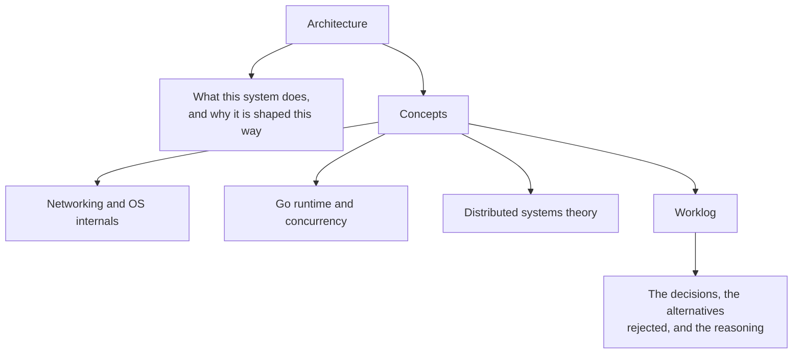

## What this repository is

Two things at once.

**A system.** A peer-to-peer swarm of Go processes that finds its own peers, measures their health,
elects a dynamic number of leaders, partitions itself into latency-affine clusters, detects leader
death through missed heartbeats, promotes a replacement, and keeps serving work while it happens.
It runs under one `docker compose up`, and you can watch it heal in a browser.

**A curriculum.** The system is an excuse to go all the way down. TCP does not have messages, so we
explain framing. A goroutine per connection only works because of the netpoller, so we explain
epoll. A membership table read by one goroutine and written by another is a data race, so we explain
the Go memory model. Every guide points back at the code that depends on it.

## How to read it

If you are here to learn rather than to operate, read the Architecture overview first for the map,
then work through Concepts in sidebar order. The concept pages are written to stand alone, but they
cross-link heavily, and they get more out of you if read in order.

## Status

Phase 1 complete: scaffolding, agent definitions, documentation framework, and the first Concept
Discovery pass. The Go implementation begins in Phase 2 with the wire protocol and the
`HealthStrategy` interface. Concept pages written before the code exists state their code
references as forward commitments; they are rewritten to cite real `file.go:line` locations as each
phase lands.
